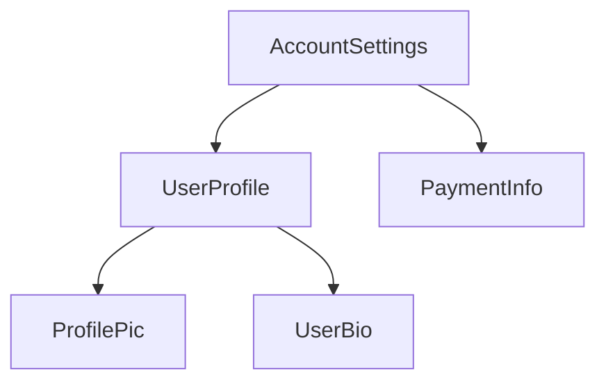

<!--
<docs-decorative-header title="Anatomy of a component" imgSrc="adev/src/assets/images/components.svg"> <!- markdownlint-disable-line ->
</docs-decorative-header>
-->
<docs-decorative-header title="컴포넌트 분석하기" imgSrc="adev/src/assets/images/components.svg"> <!-- markdownlint-disable-line -->
</docs-decorative-header>

<!--
TIP: This guide assumes you've already read the [Essentials Guide](essentials). Read that first if you're new to Angular.

Every component must have:

* A TypeScript class with _behaviors_ such as handling user input and fetching data from a server
* An HTML template that controls what renders into the DOM
* A [CSS selector](https://developer.mozilla.org/docs/Learn/CSS/Building_blocks/Selectors) that defines how the component is used in HTML

You provide Angular-specific information for a component by adding a `@Component` [decorator](https://www.typescriptlang.org/docs/handbook/decorators.html) on top of the TypeScript class:

<docs-code language="angular-ts" highlight="[1, 2, 3, 4]">
@Component({
  selector: 'profile-photo',
  template: ``,
})
export class ProfilePhoto { }
</docs-code>

For full details on writing Angular templates, including data binding, event handling, and control flow, see the [Templates guide](guide/templates).

The object passed to the `@Component` decorator is called the component's **metadata**. This includes the `selector`, `template`, and other properties described throughout this guide.

Components can optionally include a list of CSS styles that apply to that component's DOM:

<docs-code language="angular-ts" highlight="[4]">
@Component({
  selector: 'profile-photo',
  template: ``,
  styles: `img { border-radius: 50%; }`,
})
export class ProfilePhoto { }
</docs-code>

By default, a component's styles only affect elements defined in that component's template. See [Styling Components](guide/components/styling) for details on Angular's approach to styling.

You can alternatively choose to write your template and styles in separate files:

<docs-code language="angular-ts" highlight="[3, 4]">
@Component({
  selector: 'profile-photo',
  templateUrl: 'profile-photo.html',
  styleUrl: 'profile-photo.css',
})
export class ProfilePhoto { }
</docs-code>

This can help separate the concerns of _presentation_ from _behavior_ in your project. You can choose one approach for your entire project, or you decide which to use for each component.

Both `templateUrl` and `styleUrl` are relative to the directory in which the component resides.
-->
팁: 이 문서는 [핵심 가이드](essentials) 이후 내용을 다룹니다. Angular에 익숙하지 않다면 핵심 가이드를 먼저 읽어보세요.

컴포넌트는 다음 구성요소를 반드시 갖습니다:

* TypeScript 클래스 &mdash; 사용자 입력을 다루거나 서버에서 데이터를 받아오는 등 _동작_ 을 정의합니다.
* HTML 템플릿 &mdash; DOM에 렌더링 될 HTML 구조를 구성합니다.
* [CSS 셀렉터](https://developer.mozilla.org/docs/Learn/CSS/Building_blocks/Selectors) &mdash; 컴포넌트가 HTML 문서에 적용될 이름을 지정합니다.

TypeScript 클레스 위에 `@Component` [데코레이터](https://www.typescriptlang.org/docs/handbook/decorators.html)를 붙이면 이 클래스가 Angular 컴포넌트라고 지정할 수 있습니다.

<docs-code language="angular-ts" highlight="[1, 2, 3, 4]">
@Component({
  selector: 'profile-photo',
  template: ``,
})
export class ProfilePhoto { }
</docs-code>

데이터 바인딩, 이벤트 처리, 컨트롤 흐름 제어 등 Angular 템플릿이 제공하는 기능을 자세하게 알아보려면 [템플릿 가이드](guide/templates) 문서를 참고하세요.

`@Component` 데코레이터에는 객체를 전달할 수 있는데, 이 객체는 컴포넌트 **메타데이터** 라고 합니다.
이 객체에는 `selector`나 `template`, 그밖의 컴포넌트 설정을 지정합니다.

컴포넌트는 컴포넌트 DOM에 적용될 CSS 스타일을 옵션으로 지정할 수 있습니다:

<docs-code language="angular-ts" highlight="[4]">
@Component({
  selector: 'profile-photo',
  template: ``,
  styles: `img { border-radius: 50%; }`,
})
export class ProfilePhoto { }
</docs-code>

기본적으로 컴포넌트의 스타일은 컴포넌트 템플릿에 존재하는 엘리먼트에만 적용됩니다.
스타일이 적용되는 구조를 자세하게 알아보려면 [컴포넌트 스타일 지정하기](guide/components/styling) 문서를 참고하세요.

아니면 별도 스타일 파일을 만들어서 템플릿에 적용할 수도 있습니다:

<docs-code language="angular-ts" highlight="[3, 4]">
@Component({
  selector: 'profile-photo',
  templateUrl: 'profile-photo.html',
  styleUrl: 'profile-photo.css',
})
export class ProfilePhoto { }
</docs-code>

이렇게 구성하면 스타일 파일에서는 컴포넌트의 스타일만 신경쓰면 되고 TypeScript 파일에서는 컴포넌트의 동작만 신경쓸 수 있어서 좋습니다.
어떤 방식을 선택하든 전체 프로젝트에 적용할 수도 있고, 개별 컴포넌트마다 적용할 수도 있습니다.

`templateUrl`과 `styleUrl`은 모두 컴포넌트 클래스 파일이 존재하는 경로의 상대 주소로 지정합니다.


<!--
## Using components
-->
## 컴포넌트 사용하기

<!--
### Imports in the `@Component` decorator
-->
### `@Component` 데코레이터 불러오기

<!--
To use a component, [directive](guide/directives), or [pipe](guide/templates/pipes), you must add
it to the `imports` array in the `@Component` decorator:

```angular-ts
import {ProfilePhoto} from './profile-photo';

@Component({
  // Import the `ProfilePhoto` component in
  // order to use it in this component's template.
  imports: [ProfilePhoto],
  /* ... */
})
export class UserProfile { }
```

By default, Angular components are *standalone*, meaning that you can directly add them to the `imports` array of other components. Components created with an earlier version of Angular may instead specify `standalone: false` in their `@Component` decorator. For these components, you instead import the `NgModule` in which the component is defined. See the full [`NgModule` guide](guide/ngmodules) for details.

Important: In Angular versions before 19.0.0, the `standalone` option defaults to `false`.
-->
컴포넌트나 [디렉티브](guide/directives), [파이프](guide/templates/pipes)를 사용하려면 `@Component` 데코레이터의 `imports` 배열에 로드해야 합니다.

```angular-ts
import {ProfilePhoto} from './profile-photo';

@Component({
  // 컴포넌트 템플릿에 사용하기 위해 `ProfilePhoto` 컴포넌트를 불러옵니다.
  imports: [ProfilePhoto],
  /* ... */
})
export class UserProfile { }
```

기본적으로 Angular 컴포넌트는 *독립(standalone) 컴포넌트* 입니다.
그래서 컴포넌트의 `imports` 배열에 다른 컴포넌트를 자유롭게 추가할 수 있습니다.
이전 방식으로 만든 컴포넌트는 `Component` 데코레이터에 `standalone: false`를 지정할 수 있습니다.
이런 종류의 컴포넌트는 컴포넌트를 등록=할 때 `NgModule`을 사용해야 합니다.
자세한 내용은 [`NgModule` 가이드](guide/ngmodules) 문서를 참고하세요.

중요: Angular 19.0.0 이전 버전에서 `standalone` 옵션의 기본값은 `false` 입니다.


<!--
### Showing components in a template
-->
## 템플릿에 컴포넌트 사용하기

<!--
Every component defines a [CSS selector](https://developer.mozilla.org/docs/Learn/CSS/Building_blocks/Selectors):

<docs-code language="angular-ts" highlight="[2]">
@Component({
  selector: 'profile-photo',
  ...
})
export class ProfilePhoto { }
</docs-code>

See [Component Selectors](guide/components/selectors) for details about which types of selectors Angular supports and guidance on choosing a selector.

You show a component by creating a matching HTML element in the template of _other_ components:

<docs-code language="angular-ts" highlight="[8]">
@Component({
  selector: 'profile-photo',
})
export class ProfilePhoto { }

@Component({
  imports: [ProfilePhoto],
  template: `<profile-photo />`
})
export class UserProfile { }
</docs-code>

Angular creates an instance of the component for every matching HTML element it encounters. The DOM element that matches a component's selector is referred to as that component's **host element**. The contents of a component's template are rendered inside its host element.

The DOM rendered by a component, corresponding to that component's template, is called that
component's **view**.

In composing components in this way, **you can think of your Angular application as a tree of components**.
-->
컴포넌트에는 [CSS 셀렉터](https://developer.mozilla.org/docs/Learn/CSS/Building_blocks/Selectors)를 지정해야 합니다:

<docs-code language="angular-ts" highlight="[2]">
@Component({
  selector: 'profile-photo',
  ...
})
export class ProfilePhoto { }
</docs-code>

Angular가 지원하는 셀렉터 종류와 셀렉터 선택에 대해 자세하게 알아보려면 [컴포넌트 셀렉터](guide/components/selectors) 문서를 참고하세요.

HTML 엘리먼트 중 컴포넌트 셀렉터와 매칭되는 곳에 컴포넌트가 표시됩니다:

<docs-code language="angular-ts" highlight="[8]">
@Component({
  selector: 'profile-photo',
})
export class ProfilePhoto { }

@Component({
imports: [ProfilePhoto],
template: `<profile-photo />`
})
export class UserProfile { }
</docs-code>

Angular는 컴포넌트 셀렉터와 매칭되는 모든 HTML 엘리먼트에 컴포넌트 인스턴스를 생성합니다.
이 때 컴포넌트 셀렉터와 매칭된 DOM 엘리먼트를 컴포넌트의 **호스트 엘리먼트(host element)** 라고 합니다.
컴포넌트 템플릿 안에 있는 내용은 호스트 엘리먼트 안에 렌더링됩니다.

컴포넌트가 렌더링하는 DOM은 컴포넌트 템플릿으로 결정되며, 이것을 컴포넌트의 **뷰(view)** 라고 합니다.

이런 방식으로 컴포넌트를 구성하기 때문에, **Angular 애플리케이션을 만든다는 것은 컴포넌트 트리를 구성하는 것이라고 이해해도 좋습니다**.



<!--
This tree structure is important to understanding several other Angular concepts, including [dependency injection](guide/di) and [child queries](guide/components/queries).
-->
[의존성 주입](guide/di)이나 [자식 쿼리](guide/components/queries)와 같은 Angular의 중요 개념을 이해하기 위해 트리 구조를 정확하게 파악하는 것이 중요합니다.
