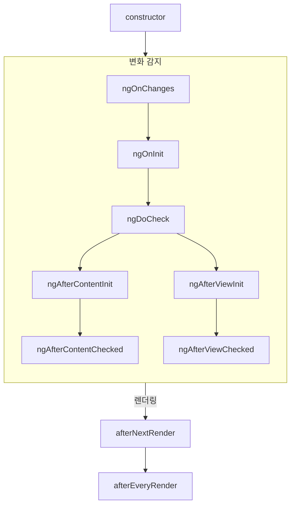
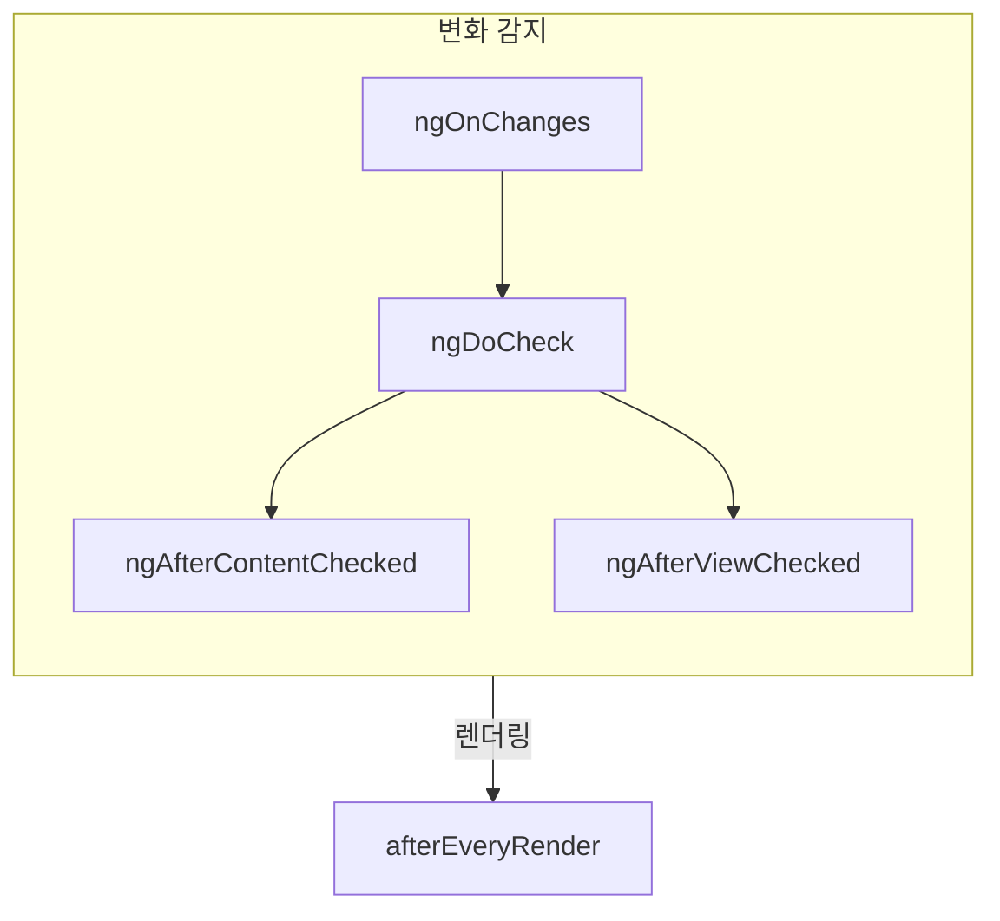

<!--
# Component Lifecycle
-->
# 컴포넌트 라이프싸이클

<!--
TIP: This guide assumes you've already read the [Essentials Guide](essentials). Read that first if you're new to Angular.

A component's **lifecycle** is the sequence of steps that happen between the component's creation
and its destruction. Each step represents a different part of Angular's process for rendering
components and checking them for updates over time.

In your components, you can implement **lifecycle hooks** to run code during these steps.
Lifecycle hooks that relate to a specific component instance are implemented as methods on your
component class. Lifecycle hooks that relate the Angular application as a whole are implemented
as functions that accept a callback.

A component's lifecycle is tightly connected to how Angular checks your components for changes over
time. For the purposes of understanding this lifecycle, you only need to know that Angular walks
your application tree from top to bottom, checking template bindings for changes. The lifecycle
hooks described below run while Angular is doing this traversal. This traversal visits each
component exactly once, so you should always avoid making further state changes in the middle of the
process.
-->
팁: 이 가이드 문서는 [핵심 가이드](essentials) 이후 내용을 다룹니다. 아직 Angular에 익숙하지 않다면 해당 문서를 먼저 읽어보세요.

컴포넌트의 **라이프싸이클** 은 컴포넌트가 생성되면서 종료될 때까지 진행되는 각 단계를 의미합니다.
각 단계마다 Angular는 컴포넌트를 렌더링하거나 갱신 내용을 화면에 반영하는 등 필요한 동작을 수행합니다.

이런 단계마다 어떤 코드를 실행하려면 **라이프싸이클 후킹 함수(lifecycle hooks)** 를 구현하면 됩니다.
컴포넌트 인스턴스와 관련된 라이프싸이클 후킹 함수는 컴포넌트 클래스 메서드로 구현합니다.
그리고 Angular 애플리케이션 전체와 관련된 라이프싸이클 후킹 함수는 콜백 함수로 구현합니다.

컴포넌트 라이프싸이클은 시간 흐름에 따라 Angular가 컴포넌트의 변경 사항을 확인하는 동작과 밀접하게 관련되어 있습니다.
라이프싸이클 각 단계의 목적을 제대로 이해하려면 Angular가 애플리케이션 트리를 맨 윗단계부터 아래 방향으로 탐색하며 템플릿에 바인딩 된 내용을 확인한다는 것을 명심하면 됩니다.
이렇게 변경 사항을 확인하는 동안 Angular는 전체 컴포넌트 트리를 순회하고, 필요한 단계마다 라이프싸이클 함수가 실행됩니다.
이 작업이 진행되는 동안 Angular는 컴포넌트를 한 번만 확인하기 때문에, 변경사항이 반영되는 중에 상태를 다시 바꾸는 작업은 피해야 합니다.


<!--
## Summary
-->
## 요약

<!--
<div class="docs-table docs-scroll-track-transparent">
  <table>
    <tr>
      <td><strong>Phase</strong></td>
      <td><strong>Method</strong></td>
      <td><strong>Summary</strong></td>
    </tr>
    <tr>
      <td>Creation</td>
      <td><code>constructor</code></td>
      <td>
        <a href="https://developer.mozilla.org/docs/Web/JavaScript/Reference/Classes/constructor" target="_blank">
          Standard JavaScript class constructor
        </a>. Runs when Angular instantiates the component.
      </td>
    </tr>
    <tr>
      <td rowspan="7">Change<p>Detection</td>
      <td><code>ngOnInit</code>
      </td>
      <td>Runs once after Angular has initialized all the component's inputs.</td>
    </tr>
    <tr>
      <td><code>ngOnChanges</code></td>
      <td>Runs every time the component's inputs have changed.</td>
    </tr>
    <tr>
      <td><code>ngDoCheck</code></td>
      <td>Runs every time this component is checked for changes.</td>
    </tr>
    <tr>
      <td><code>ngAfterContentInit</code></td>
      <td>Runs once after the component's <em>content</em> has been initialized.</td>
    </tr>
    <tr>
      <td><code>ngAfterContentChecked</code></td>
      <td>Runs every time this component content has been checked for changes.</td>
    </tr>
    <tr>
      <td><code>ngAfterViewInit</code></td>
      <td>Runs once after the component's <em>view</em> has been initialized.</td>
    </tr>
    <tr>
      <td><code>ngAfterViewChecked</code></td>
      <td>Runs every time the component's view has been checked for changes.</td>
    </tr>
    <tr>
      <td rowspan="2">Rendering</td>
      <td><code>afterNextRender</code></td>
      <td>Runs once the next time that <strong>all</strong> components have been rendered to the DOM.</td>
    </tr>
    <tr>
      <td><code>afterEveryRender</code></td>
      <td>Runs every time <strong>all</strong> components have been rendered to the DOM.</td>
    </tr>
    <tr>
      <td>Destruction</td>
      <td><code>ngOnDestroy</code></td>
      <td>Runs once before the component is destroyed.</td>
    </tr>
  </table>
</div>
-->
<div class="docs-table docs-scroll-track-transparent">
  <table>
    <tr>
      <td><strong>단계</strong></td>
      <td><strong>메서드</strong></td>
      <td><strong>요약</strong></td>
    </tr>
    <tr>
      <td>생성</td>
      <td><code>constructor</code></td>
      <td>
        <a href="https://developer.mozilla.org/docs/Web/JavaScript/Reference/Classes/constructor" target="_blank">
          JavaScript 클래스 표준 생성자
        </a>. Angular가 컴포넌트 인스턴스를 생성할 때 실행됩니다.
      </td>
    </tr>
    <tr>
      <td rowspan="7">변화<p>감지</td>
      <td><code>ngOnInit</code>
      </td>
      <td>Angular가 컴포넌트의 입력 프로퍼티를 초기화 한 이후 한 번 실행됩니다.</td>
    </tr>
    <tr>
      <td><code>ngOnChanges</code></td>
      <td>컴포넌트 입력 프로퍼티가 변경될 때마다 실행됩니다.</td>
    </tr>
    <tr>
      <td><code>ngDoCheck</code></td>
      <td>컴포넌트가 변화를 감지할 때마다 실행됩니다.</td>
    </tr>
    <tr>
      <td><code>ngAfterContentInit</code></td>
      <td>컴포넌트의 <em>내용물(content)</em>이 초기화 된 후 한 번 실행됩니다.</td>
    </tr>
    <tr>
      <td><code>ngAfterContentChecked</code></td>
      <td>컴포넌트의 내용물에서 변화가 감지될 때마다 실행됩니다.</td>
    </tr>
    <tr>
      <td><code>ngAfterViewInit</code></td>
      <td>컴포넌트의 <em>뷰(view)</em>가 초기화 된 후 한 번 실행됩니다.</td>
    </tr>
    <tr>
      <td><code>ngAfterViewChecked</code></td>
      <td>컴포넌트의 뷰에서 변화가 감지될 때마다 실행됩니다.</td>
    </tr>
    <tr>
      <td rowspan="2">렌더링</td>
      <td><code>afterNextRender</code></td>
      <td>컴포넌트가 DOM에 완전히 렌더링 된 후에 한 번 실행됩니다.</td>
    </tr>
    <tr>
      <td><code>afterEveryRender</code></td>
      <td>컴포넌트가 DOM에 렌더링 될 때마다 실행됩니다.</td>
    </tr>
    <tr>
      <td>종료</td>
      <td><code>ngOnDestroy</code></td>
      <td>컴포넌트가 종료되기 전에 한 번 실행됩니다.</td>
    </tr>
  </table>
</div>


### ngOnInit

<!--
The `ngOnInit` method runs after Angular has initialized all the components inputs with their
initial values. A component's `ngOnInit` runs exactly once.

This step happens _before_ the component's own template is initialized. This means that you can
update the component's state based on its initial input values.
-->
`ngOnInit` 메서드는 Angular가 컴포넌트의 입력 프로퍼티를 초기값과 함께 초기화 한 후에 실행됩니다.
이 함수는 한 번만 실행됩니다

이 메서드는 컴포넌트의 템플릿이 초기화되기 *전에* 실행되빈다.
그래서 컴포넌트의 입력 프로퍼티 초기값이 템플릿에 반영되기 전에 값을 수정할 수 있습니다.


### ngOnChanges

<!--
The `ngOnChanges` method runs after any component inputs have changed.

This step happens _before_ the component's own template is checked. This means that you can update
the component's state based on its initial input values.

During initialization, the first `ngOnChanges` runs before `ngOnInit`.
-->
`ngOnChanges` 메서드는 컴포넌트의 입력 프로퍼티 값이 변경된 이후에 실행됩니다.

이 메서드는 컴포넌트 템플릿을 검사하기 _전에_ 실행됩니다.
그래서 컴포넌트의 입력 프로퍼티 값이 템플릿에 반영됙 ㅣ전에 값을 수정할 수 있습니다.

컴포넌트 초기화 시점에는 `ngOnInit`이 실행되기 전에 첫번째 `ngOnChanges` 메서드가 실행됩니다.


<!--
#### Inspecting changes
-->
#### 변경사항 확인하기

<!--
The `ngOnChanges` method accepts one `SimpleChanges` argument. This object is
a [`Record`](https://www.typescriptlang.org/docs/handbook/utility-types.html#recordkeys-type)
mapping each component input name to a `SimpleChange` object. Each `SimpleChange` contains the
input's previous value, its current value, and a flag for whether this is the first time the input
has changed.

```ts
@Component({
  /* ... */
})
export class UserProfile {
  name = input('');

  ngOnChanges(changes: SimpleChanges) {
    for (const inputName in changes) {
      const inputValues = changes[inputName];
      console.log(`Previous ${inputName} == ${inputValues.previousValue}`);
      console.log(`Current ${inputName} == ${inputValues.currentValue}`);
      console.log(`Is first ${inputName} change == ${inputValues.firstChange}`);
    }
  }
}
```

If you provide an `alias` for any input properties, the `SimpleChanges` Record still uses the
TypeScript property name as a key, rather than the alias.
-->
`ngOnChanges` 메서드는 `SimpleChanges` 인자를 받습니다.
이 객체는 컴포넌트 입력 프로퍼티 이름마다 `SimpleChange` 객체로 값을 표현하는  [`Record`](https://www.typescriptlang.org/docs/handbook/utility-types.html#recordkeys-type) 객체입니다.
개별 `SimpleChange` 객체는 입력 프로퍼티의 이전 값과 현재값, 이 값이 처음 변경된 것인지 표시하는 플래그 값을 갖습니다.

```ts
@Component({
  /* ... */
})
export class UserProfile {
  name = input('');

  ngOnChanges(changes: SimpleChanges) {
    for (const inputName in changes) {
      const inputValues = changes[inputName];
      console.log(`Previous ${inputName} == ${inputValues.previousValue}`);
      console.log(`Current ${inputName} == ${inputValues.currentValue}`);
      console.log(`Is first ${inputName} change == ${inputValues.firstChange}`);
    }
  }
}
```

입력 프로퍼티에 `alias`를 지정했어도 `SimpleChange` 레코드는 TypeScript 프로퍼티 이름으로 키 값을 갖습니다.


### ngOnDestroy

<!--
The `ngOnDestroy` method runs once just before a component is destroyed. Angular destroys a
component when it is no longer shown on the page, such as being hidden by `@if` or upon navigating
to another page.
-->
`ngOnDestroy` 메서드는 컴포넌트가 종료되기 전에 한 번 실행됩니다.
Angular는 `@if` 등으로 컴포넌트가 화면에 표시되지 않을 때 인스턴스를 종료합니다.


#### DestroyRef

<!--
As an alternative to the `ngOnDestroy` method, you can inject an instance of `DestroyRef`. You can
register a callback to be invoked upon the component's destruction by calling the `onDestroy` method
of `DestroyRef`.

```ts
@Component({
  /* ... */
})
export class UserProfile {
  constructor() {
    inject(DestroyRef).onDestroy(() => {
      console.log('UserProfile destruction');
    });
  }
}
```

You can pass the `DestroyRef` instance to functions or classes outside your component. Use this
pattern if you have other code that should run some cleanup behavior when the component is
destroyed.

You can also use `DestroyRef` to keep setup code close to cleanup code, rather than putting
all cleanup code in the `ngOnDestroy` method.
-->
`ngOnDestroy` 메서드 대신 `DestroyRef` 인스턴스를 의존성 객체로 주입받아 활용할 수도 있습니다.
컴포넌트가 종료될 때 실행해야 하는 코드가 있다면 `DestroyRef`의 `onDestroy` 메서드로 등록하면 됩니다.

```ts
@Component({
  /* ... */
})
export class UserProfile {
  constructor() {
    inject(DestroyRef).onDestroy(() => {
      console.log('UserProfile destruction');
    });
  }
}
```

`DestroyRef` 인스턴스는 컴포넌트 밖에 있는 함수나 다른 클래스로 전달할 수 있습니다.
이 방식은 어떤 컴포넌트가 종료될 때 해당 컴포넌트 외부에서 무언가 실행해야 할 때 사용합니다.

그리고 컴포넌트를 종료하는 코드를 `ngOnDestroy` 메서드 밖에 두고 사용할 때도 활용할 수 있습니다.


### ngDoCheck

<!--
The `ngDoCheck` method runs before every time Angular checks a component's template for changes.

You can use this lifecycle hook to manually check for state changes outside of Angular's normal
change detection, manually updating the component's state.

This method runs very frequently and can significantly impact your page's performance. Avoid
defining this hook whenever possible, only using it when you have no alternative.

During initialization, the first `ngDoCheck` runs after `ngOnInit`.
-->
`ngDoCheck` 메서드는 Angular가 컴포넌트 템플릿의 변화를 감지할 때마다 실행됩니다.

이 메서드는 Angular의 일반적인 변화 감지 외에 컴포넌트 밖에서 상태가 변하는 것을 수동으로 감지하거나, 컴포넌트 상태를 수동으로 갱신해야 할 때 사용할 수 있습니다.

이 메서드는 아주 자주 실행되기 때문에 애플리케이션의 화면 렌더링 성능에 큰 영향을 줄 수 있습니다.
꼭 필요한 경우가 아니라면 이 메서드는 되도록 사용하지 않는 것이 좋습니다.

컴포넌트가 초기화 될 때는 `ngOnInit`이 실행된 후에 첫번째 `ngDoCheck` 메서드가 실행됩니다.


### ngAfterContentInit

<!--
The `ngAfterContentInit` method runs once after all the children nested inside the component (its
_content_) have been initialized.

You can use this lifecycle hook to read the results of
[content queries](guide/components/queries#content-queries). While you can access the initialized
state of these queries, attempting to change any state in this method results in an
[ExpressionChangedAfterItHasBeenCheckedError](errors/NG0100)
-->
`ngAfterContentInit` 메서드는 컴포넌트 안에 있는 모든 자식 컴포넌트(컨텐츠)가 초기화된 후에 한 번 실행됩니다.

이 메서드는 [컨텐츠 쿼리](guide/components/queries#content-queries) 결과를 참조해야 할 때 활용합니다.
이 메서드를 실행하는 시점에는 컨텐츠 쿼리 결과에 접근하고 상태값을 변경할 수 있지만, 값을 변경하면 [ExpressionChangedAfterItHasBeenCheckedError](errors/NG0100)가 발생합니다.


### ngAfterContentChecked

<!--
The `ngAfterContentChecked` method runs every time the children nested inside the component (its
_content_) have been checked for changes.

This method runs very frequently and can significantly impact your page's performance. Avoid
defining this hook whenever possible, only using it when you have no alternative.

While you can access the updated state
of [content queries](guide/components/queries#content-queries) here, attempting to
change any state in this method results in
an [ExpressionChangedAfterItHasBeenCheckedError](errors/NG0100).
-->
`ngAfterContentChecked` 메서드는 컴포넌트 안에 있는 모든 자식 컴포넌트(컨텐츠)에서 변화가 감지될 때마다 실행됩니다.

이 메서드는 아주 자주 실행되기 때문에 애플리케이션의 화면 렌더링 성능에 큰 영향을 줄 수 있습니다.
꼭 필요한 경우가 아니라면 이 메서드는 되도록 사용하지 않는 것이 좋습니다.

이 메서드를 실행하는 시점에는 [컨텐츠 쿼리](guide/components/queries#content-queries) 결과에 접근하고 상태값을 변경할 수 있지만, 값을 변경하면[ExpressionChangedAfterItHasBeenCheckedError](errors/NG0100)가 발생합니다.


### ngAfterViewInit

<!--
The `ngAfterViewInit` method runs once after all the children in the component's template (its
_view_) have been initialized.

You can use this lifecycle hook to read the results of
[view queries](guide/components/queries#view-queries). While you can access the initialized state of
these queries, attempting to change any state in this method results in an
[ExpressionChangedAfterItHasBeenCheckedError](errors/NG0100)
-->
`ngAfterViewInit` 메서드는 컴포넌트 템플릿 안에 있는 모든 자식 컴포넌트(뷰)가 초기화된 후에 한 번 실행됩니다.

이 메서드는 [뷰 쿼리](guide/components/queries#view-queries) 결과를 참조해야 할 때 활용합니다.
이 메서드를 실행하는 시점에는 뷰 쿼리 결과에 접근하고 상태값을 변경할 수 있지만, 값을 변경하면 [ExpressionChangedAfterItHasBeenCheckedError](errors/NG0100)가 발생합니다.


### ngAfterViewChecked

<!--
The `ngAfterViewChecked` method runs every time the children in the component's template (its
_view_) have been checked for changes.

This method runs very frequently and can significantly impact your page's performance. Avoid
defining this hook whenever possible, only using it when you have no alternative.

While you can access the updated state of [view queries](guide/components/queries#view-queries)
here, attempting to
change any state in this method results in
an [ExpressionChangedAfterItHasBeenCheckedError](errors/NG0100).
-->
`ngAfterViewChecked` 메서드는 컴포넌트 템플릿 안에 있는 모든 자식 컴포넌트(뷰)에서 변화가 감지될 때마다 실행됩니다.

이 메서드는 아주 자주 실행되기 때문에 애플리케이션의 화면 렌더링 성능에 큰 영향을 줄 수 있습니다.
꼭 필요한 경우가 아니라면 이 메서드는 되도록 사용하지 않는 것이 좋습니다.

이 메서드를 실행하는 시점에는 [뷰 쿼리](guide/components/queries#view-queries) 결과에 접근하고 상태값을 ㅂ녀경할 수 있지만, 값을 변경하면 [ExpressionChangedAfterItHasBeenCheckedError](errors/NG0100)가 발생합니다.


### afterEveryRender and afterNextRender

<!--
The `afterEveryRender` and `afterNextRender` functions let you register a **render callback** to be
invoked after Angular has finished rendering _all components_ on the page into the DOM.

These functions are different from the other lifecycle hooks described in this guide. Rather than a
class method, they are standalone functions that accept a callback. The execution of render
callbacks are not tied to any specific component instance, but instead an application-wide hook.

`afterEveryRender` and `afterNextRender` must be called in
an [injection context](guide/di/dependency-injection-context), typically a
component's constructor.

You can use render callbacks to perform manual DOM operations.
See [Using DOM APIs](guide/components/dom-apis) for guidance on working with the DOM in Angular.

Render callbacks do not run during server-side rendering or during build-time pre-rendering.
-->
`afterEveryRender` 함수와 `afterNextRender` 함수는 Angular가 화면에 표시되는 _모든 컴포넌트_ 를 DOM에 렌더링 한 후에 **렌더링 콜백** 으로 실행됩니다.

이 메서드는 다른 라이프싸이클 후킹 함수와는 조금 다릅니다.
이 문서에서 다루는 라이프싸이클 후킹 함수는 모두 클래스 메서드로 사용하지만, `afterEveryRender` 함수와 `afterNextRender` 함수는 단독 함수로 등록합니다.
그래서 이 때 등록되는 콜백 함수는 특정 컴포넌트 인스턴스와 연관되지 않으며, 애플리케이션 전역 후킹 함수가 됩니다.

`afterEveryRender` 함수와 `afterNextRender` 함수는 반드시 [의존성 주입 컨텍스트](guide/di/dependency-injection-context) 안에서 실행해야 하기 때문에, 일반적으로 컴포넌트의 생성자에서 실행합니다.

렌더링 콜백 함수는 DOM을 수동으로 조작해야 할 때도 활용할 수 있습니다.
Angular에서 DOM을 조작하는 방법은 [DOM API 활용하기](guide/components/dom-apis) 문서를 참고하세요.

렌더링 콜백 함수는 서버 사이드 렌더링이나 빌드 시점의 사전 렌더링 시점에는 실행되지 않습니다.


<!--
#### after*Render phases
-->
#### after*Render 단계

<!--
When using `afterEveryRender` or `afterNextRender`, you can optionally split the work into phases. The
phase gives you control over the sequencing of DOM operations, letting you sequence _write_
operations before _read_ operations in order to minimize
[layout thrashing](https://web.dev/avoid-large-complex-layouts-and-layout-thrashing). In order to
communicate across phases, a phase function may return a result value that can be accessed in the
next phase.

```ts
import {Component, ElementRef, afterNextRender} from '@angular/core';

@Component({...})
export class UserProfile {
  private prevPadding = 0;
  private elementHeight = 0;

  constructor() {
    private elementRef = inject(ElementRef);
    const nativeElement = elementRef.nativeElement;

    afterNextRender({
      // Use the `Write` phase to write to a geometric property.
      write: () => {
        const padding = computePadding();
        const changed = padding !== this.prevPadding;
        if (changed) {
          nativeElement.style.padding = padding;
        }
        return changed; // Communicate whether anything changed to the read phase.
      },

      // Use the `Read` phase to read geometric properties after all writes have occurred.
      read: (didWrite) => {
        if (didWrite) {
          this.elementHeight = nativeElement.getBoundingClientRect().height;
        }
      }
    });
  }
}
```

There are four phases, run in the following order:

| Phase            | Description                                                                                                                                                                                           |
| ---------------- | ----------------------------------------------------------------------------------------------------------------------------------------------------------------------------------------------------- |
| `earlyRead`      | Use this phase to read any layout-affecting DOM properties and styles that are strictly necessary for subsequent calculation. Avoid this phase if possible, preferring the `write` and `read` phases. |
| `mixedReadWrite` | Default phase. Use for any operations need to both read and write layout-affecting properties and styles. Avoid this phase if possible, preferring the explicit `write` and `read` phases.            |
| `write`          | Use this phase to write layout-affecting DOM properties and styles.                                                                                                                                   |
| `read`           | Use this phase to read any layout-affecting DOM properties.                                                                                                                                           |
-->
`afterEveryRender` 함수와 `afterNextRender` 함수를 사용할 때 실행되는 과정은 단계별로 나눠볼 수 있습니다.
각 단계에 해당하는 DOM 작업을 실행할 수 있으며, _쓰기_ 작업을 _읽기_ 작업 전에 실행해서 [레이아웃 스래싱(layout thrashing)](https://web.dev/avoid-large-complex-layouts-and-layout-thrashing)을 최소화 할 수 있습니다.
각 단계마다 실행되는 함수는 해당 단계에서 실행된 결과값을 반환하며, 다음 단계에 실행되는 함수는 이전 단계에서 실행된 결과값을 받아 참조할 수 있습니다.

```ts
import {Component, ElementRef, afterNextRender} from '@angular/core';

@Component({...})
export class UserProfile {
  private prevPadding = 0;
  private elementHeight = 0;

  constructor() {
    private elementRef = inject(ElementRef);
    const nativeElement = elementRef.nativeElement;

    afterNextRender({
      // 엘리먼트의 위치정보를 참조하기 위해 `write` 단계를 활용합니다.
      write: () => {
        const padding = computePadding();
        const changed = padding !== this.prevPadding;
        if (changed) {
          nativeElement.style.padding = padding;
        }
        return changed; // 다음 단계로 정보를 전달합니다.
      },

      // 쓰기 작업이 전부 완료된 후에 엘리먼트의 위치정보를 참조하기 위해 `read` 단계를 활용합니다.
      read: (didWrite) => {
        if (didWrite) {
          this.elementHeight = nativeElement.getBoundingClientRect().height;
        }
      }
    });
  }
}
```

전체 과정은 4단계로 진행됩니다:

| 단계               | 설명                                                                                                                                 |
|------------------|------------------------------------------------------------------------------------------------------------------------------------|
| `earlyRead`      | 다음 단계에서 필요한 DOM 속성과 스타일 값을 읽을 때 사용합니다. 가능하다면, 이 단계를 생략하고 `write` 단계와 `read` 단계를 활용하는 것이 좋습니다.                                      |
| `mixedReadWrite` | 기본 단계입니다. 레이아웃 프로퍼티나 스타일 값을 참조하여 `read` 단계와 `write` 단계를 준비하는 로직을 작성합니다. 가능하다면 이 단계를 생략하고 `write` 단계와 `read` 단계를 활용하는 것이 좋습니다. |
| `write`          | 레이아웃 DOM 프로퍼티나 스타일 값을 설정할 때 사용합니다. |
| `read`           | 레이아웃 DOM 프로퍼티를 읽을 때 사용합니다. |


<!--
## Lifecycle interfaces
-->
## 라이프싸이클 인터페이스

<!--
Angular provides a TypeScript interface for each lifecycle method. You can optionally import
and `implement` these interfaces to ensure that your implementation does not have any typos or
misspellings.

Each interface has the same name as the corresponding method without the `ng` prefix. For example,
the interface for `ngOnInit` is `OnInit`.

```ts
@Component({
  /* ... */
})
export class UserProfile implements OnInit {
  ngOnInit() {
    /* ... */
  }
}
```
-->
Angular는 각 라이프싸이클 후킹 함수에 해당하는 TypeScript 인터페이스를 제공합니다.
필요한 라이프싸이클 후킹 함수가 있다면 인터페이스를 로드해서 `implement`로 클래스를 확장하면 되는데, 이 때 인자 타입과 오타에 주의하세요.

인터페이스 이름에 `ng` 접두사를 붙여서 메서드를 구현하면 됩니다.
`OnInit` 인터페이스에 해당하는 메서드는 `ngOnInit` 메서드가 되는 식입니다.

```ts
@Component({
  /* ... */
})
export class UserProfile implements OnInit {
  ngOnInit() {
    /* ... */
  }
}
```


<!--
## Execution order
-->
## 실행 순서

<!--
The following diagrams show the execution order of Angular's lifecycle hooks.
-->
Angular 라이프싸이클 후킹 함수는 다음 순서대로 실행됩니다.


<!--
### During initialization
-->
### 컴포넌트 생성 시점



<!--
### Subsequent updates
-->
### 값이 변경될 때



<!--
### Ordering with directives
-->
### 디렉티브가 함께 사용된 경우

<!--
When you put one or more directives on the same element as a component, either in a template or with
the `hostDirectives` property, the framework does not guarantee any ordering of a given lifecycle
hook between the component and the directives on a single element. Never depend on an observed
ordering, as this may change in later versions of Angular.
-->
컴포넌트의 호스트 엘리먼트에 디렉티브와 있거나, `hostDirectives` 프로퍼티를 활용하는 경우는 컴포넌트와 디렉티브의 라이프싸이클 후킹 함수의 실행 순서를 보장하지 않습니다.
또한, 이 순서는 이후 Angular 버전에서 변경될 수 있기 때문에, 실행 순서에 영향을 받는 로직을 작성하지 마세요.
