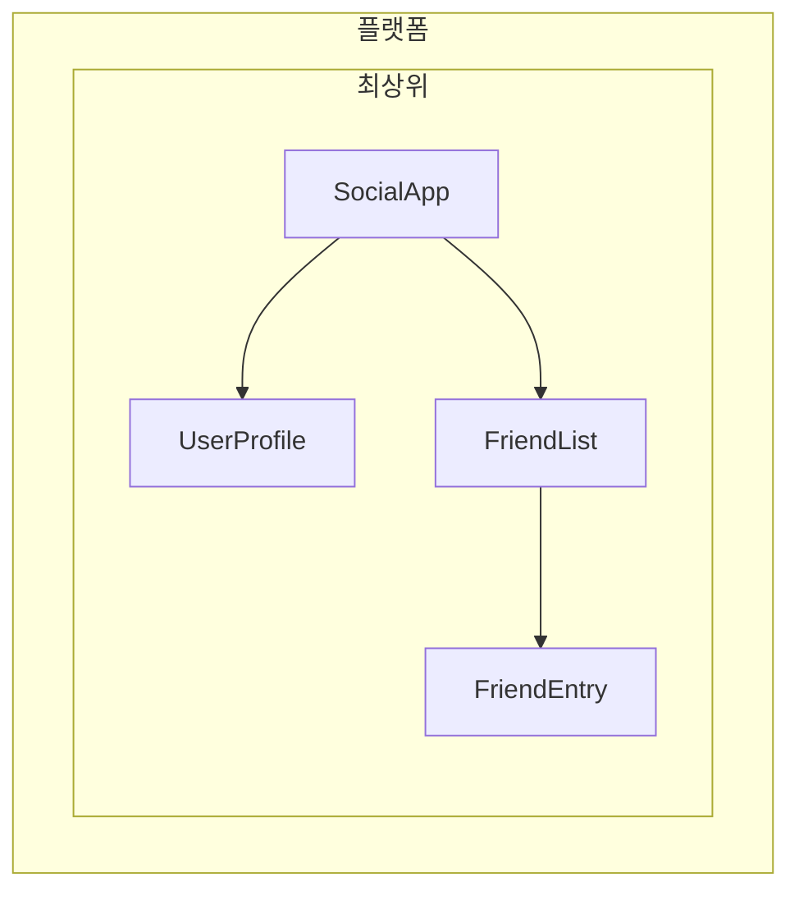

<!--
# Defining dependency providers
-->

# 의존성 프로바이더 정의하기

<!--
Angular provides two ways to make services available for injection:

1. **Automatic provision** - Using `providedIn` in the `@Injectable` decorator, the [`@Service`](guide/di/creating-and-using-services#using-the-service-decorator) decorator, or by providing a factory in the `InjectionToken` configuration
2. **Manual provision** - Using the `providers` array in components, directives, routes, or application config

In the [previous guide](/guide/di/creating-and-using-services), you learned how to create services using `providedIn: 'root'`, which handles most common use cases. This guide explores additional patterns for both automatic and manual provider configuration.
-->

Angular가 서비스를 의존성 주입 가능하게 만드는 방식은 두 가지입니다:

1. **자동 프로비전(provision)** - `@Injectable` 데코레이터에 `providedIn`을 지정하거나, [`@Service`](guide/di/creating-and-using-services#using-the-service-decorator) 데코레이터를 지정하는 경우, `InjectionToken` 설정에서 팩토리를 사용하는 경우
2. **수동 프로비전** - 컴포넌트, 디렉티브, 라우팅 규칙, 애플리케이션 환경설정에서 `providers` 배열을 사용하는 경우

[이전 가이드 문서](/guide/di/creating-and-using-services)에서는 `providedIn: 'root'`를 사용해서 서비스를 생성했고, 이것이 일반적인 사용방법입니다.
이 문서에서는 프로바이더 설정방법을 조금 더 알아봅시다.

<!--
## Automatic provision for non-class dependencies
-->

## 자동 프로비전: 클래스가 아닌 경우

<!--
While the `@Injectable` decorator with `providedIn: 'root'` works great for services (classes), you might need to provide other types of values globally - like configuration objects, functions, or primitive values. Angular provides `InjectionToken` for this purpose.
-->

`@Injectable` 데코레이터에 `providedIn: 'root'`를 사용해도 서비스(클래스)는 잘 동작하지만, 객체나 함수, 기본 자료형을 의존성으로 주입하는 경우가 있을 수 있습니다.
이런 경우에는 `InjectionToken`을 사용합니다.

<!--
### What is an InjectionToken?
-->

### 인젝션 토큰이 무엇인가요?

<!--
An `InjectionToken` is an object that Angular's dependency injection system uses to uniquely identify values for injection. Think of it as a special key that lets you store and retrieve any type of value in Angular's DI system:

```ts
import {InjectionToken} from '@angular/core';

// Create a token for a string value
export const API_URL = new InjectionToken<string>('api.url');

// Create a token for a function
export const LOGGER = new InjectionToken<(msg: string) => void>('logger.function');

// Create a token for a complex type
export interface Config {
  apiUrl: string;
  timeout: number;
}
export const CONFIG_TOKEN = new InjectionToken<Config>('app.config');
```

NOTE: The string parameter (e.g., `'api.url'`) is a description purely for debugging — Angular identifies tokens by their object reference, not this string.
-->

`InjectionToken`은 Angular 의존성 주입 시스템이 의존성 객체가 어떤 것인지 구분하는 객체입니다.
의존성 객체에 매겨진 특별한 키 값이며, 의존성 객체를 요청할 때 사용하는 값이라고 이해하면 됩니다:

```ts
import {InjectionToken} from '@angular/core';

// 문자열 값으로 토큰을 생성합니다.
export const API_URL = new InjectionToken<string>('api.url');

// 함수로 토큰을 생성합니다.
export const LOGGER = new InjectionToken<(msg: string) => void>('logger.function');

// 복잡한 타입으로 토큰을 생성합니다.
export interface Config {
  apiUrl: string;
  timeout: number;
}
export const CONFIG_TOKEN = new InjectionToken<Config>('app.config');
```

참고: `'api.url'`과 같은 문자열 값은 디버깅을 위한 설명일 뿐입니다. Angular는 이 문자열이 아닌 객체 참조로 토큰을 식별합니다.

<!--
### InjectionToken with `providedIn: 'root'`
-->

### `providedIn: 'root'`를 사용하는 인젝션 토큰

<!--
An `InjectionToken` that has a `factory` results in `providedIn: 'root'` by default (but can be overridden via the `providedIn` prop).

```ts
// 📁 /app/config.token.ts
import {InjectionToken} from '@angular/core';

export interface AppConfig {
  apiUrl: string;
  version: string;
  features: Record<string, boolean>;
}

// Globally available configuration using providedIn
export const APP_CONFIG = new InjectionToken<AppConfig>('app.config', {
  providedIn: 'root',
  factory: () => ({
    apiUrl: 'https://api.example.com',
    version: '1.0.0',
    features: {
      darkMode: true,
      analytics: false,
    },
  }),
});

// No need to add to providers array - available everywhere!
@Component({
  selector: 'app-header',
  template: `<h1>Version: {{ config.version }}</h1>`,
})
export class Header {
  config = inject(APP_CONFIG); // Automatically available
}
```
-->

`factory` 프로퍼티를 사용하는 `InjectionToken`은 기본적으로 `providedIn: 'root'` 값을 갖습니다.
하지만 `providedIn` 프로퍼티가 다시 지정되면 오버라이드할 수 있습니다.

```ts
// 📁 /app/config.token.ts
import {InjectionToken} from '@angular/core';

export interface AppConfig {
  apiUrl: string;
  version: string;
  features: Record<string, boolean>;
}

// Globally available configuration using providedIn
export const APP_CONFIG = new InjectionToken<AppConfig>('app.config', {
  providedIn: 'root',
  factory: () => ({
    apiUrl: 'https://api.example.com',
    version: '1.0.0',
    features: {
      darkMode: true,
      analytics: false,
    },
  }),
});

// No need to add to providers array - available everywhere!
@Component({
  selector: 'app-header',
  template: `<h1>Version: {{ config.version }}</h1>`,
})
export class Header {
  config = inject(APP_CONFIG); // Automatically available
}
```

<!--
### When to use InjectionToken with factory functions
-->

### 팩토리 함수를 사용하는 인젝션 토큰

<!--
InjectionToken with factory functions is ideal when you can't use a class but need to provide dependencies globally:

```ts
// 📁 /app/logger.token.ts
import {InjectionToken, inject} from '@angular/core';
import {APP_CONFIG} from './config.token';

// Logger function type
export type LoggerFn = (level: string, message: string) => void;

// Global logger function with dependencies
export const LOGGER_FN = new InjectionToken<LoggerFn>('logger.function', {
  providedIn: 'root',
  factory: () => {
    const config = inject(APP_CONFIG);

    return (level: string, message: string) => {
      if (config.features.logging !== false) {
        console[level](`[${new Date().toISOString()}] ${message}`);
      }
    };
  },
});

// 📁 /app/storage.token.ts
// Providing browser APIs as tokens
export const LOCAL_STORAGE = new InjectionToken<Storage>('localStorage', {
  // providedIn: 'root' is configured as the default
  factory: () => window.localStorage,
});

export const SESSION_STORAGE = new InjectionToken<Storage>('sessionStorage', {
  providedIn: 'root',
  factory: () => window.sessionStorage,
});

// 📁 /app/feature-flags.token.ts
// Complex configuration with runtime logic
export const FEATURE_FLAGS = new InjectionToken<Map<string, boolean>>('feature.flags', {
  providedIn: 'root',
  factory: () => {
    const flags = new Map<string, boolean>();

    // Parse from environment or URL params
    const urlParams = new URLSearchParams(window.location.search);
    const enableBeta = urlParams.get('beta') === 'true';

    flags.set('betaFeatures', enableBeta);
    flags.set('darkMode', true);
    flags.set('newDashboard', false);

    return flags;
  },
});
```

This approach offers several advantages:

- **No manual provider configuration needed** - Works just like `providedIn: 'root'` for services
- **Tree-shakeable** - Only included if actually used
- **Type-safe** - Full TypeScript support for non-class values
- **Can inject other dependencies** - Factory functions can use `inject()` to access other services
-->

팩토리 함수를 사용하는 InjectionToken은 전역 범위에서 클래스를 의존성 객체로 사용하지만 클래스를 직접 사용할 수 없는 경우에 유용합니다:

```ts
// 📁 /app/logger.token.ts
import {InjectionToken, inject} from '@angular/core';
import {APP_CONFIG} from './config.token';

// 로그 함수 타입
export type LoggerFn = (level: string, message: string) => void;

// 전역 로그 함수
export const LOGGER_FN = new InjectionToken<LoggerFn>('logger.function', {
providedIn: 'root',
factory: () => {
const config = inject(APP_CONFIG);

    return (level: string, message: string) => {
      if (config.features.logging !== false) {
        console[level](`[${new Date().toISOString()}] ${message}`);
      }
    };
},
});

// 📁 /app/storage.token.ts
// 브라우저 API를 토컨으로 등록합니다.
export const LOCAL_STORAGE = new InjectionToken<Storage>('localStorage', {
// providedIn: 'root' is configured as the default
factory: () => window.localStorage,
});

export const SESSION_STORAGE = new InjectionToken<Storage>('sessionStorage', {
providedIn: 'root',
factory: () => window.sessionStorage,
});

// 📁 /app/feature-flags.token.ts
// 실행환경에 따라 복잡한 환경설정을 등록합니다.
export const FEATURE_FLAGS = new InjectionToken<Map<string, boolean>>('feature.flags', {
  providedIn: 'root',
  factory: () => {
    const flags = new Map<string, boolean>();

    // 환경변수나 URL 인자를 파싱합니다.
    const urlParams = new URLSearchParams(window.location.search);
    const enableBeta = urlParams.get('beta') === 'true';

    flags.set('betaFeatures', enableBeta);
    flags.set('darkMode', true);
    flags.set('newDashboard', false);

    return flags;
  },
});
```

이 방식은 이런 장점이 있습니다:

- **수동으로 프로바이더를 등록할 필요가 없습니다.** - `providedIn: 'root'` 설정을 하기만 하면 됩니다.
- **트리 셰이킹이 가능합니다.** - 실제로 사용될 때만 빌드 결과물에 포함됩니다.
- **타입 검사가 가능합니다.** - 클래스가 아니더라도 TypeScript 타입 검사를 완벽하게 지원합니다.
- **다른 의존성을 활용할 수 있습니다.** - 팩토리 함수는 `inject()` 함수를 사용해서 다른 서비스를 참조할 수 있습니다.

<!--
## Understanding manual provider configuration
-->

## 수동 프로바이더 등록 이해하기

<!--
When you need more control than `providedIn: 'root'` offers, you can manually configure providers. Manual configuration through the `providers` array is useful when:

1. **The service doesn't have `providedIn`** - Services without automatic provision must be manually provided
2. **You want a new instance** - To create a separate instance at the component/directive level instead of using the shared one
3. **You need runtime configuration** - When service behavior depends on runtime values
4. **You're providing non-class values** - Configuration objects, functions, or primitive values
-->

의존성 객체를 `providedIn: 'root'` 와는 다르게 조작해야 하는 경우라면 프로바이더를 수동으로 등록하면 됩니다.
`providers` 배열을 활용하는 수동 등록은 이런 경우에 유용합니다:

1. **서비스에 `providedIn`이 설정되지 않았을 때** - 전역 범위에 등록되지 않은 서비스는 수동으로 등록해야 합니다.
2. **인스턴스를 새로 만드는 경우** - 기존에 있던 인스턴스를 사용하지 않고 컴포넌트/디렉티브 계층에서 인스턴스를 새로 만들려고 할 때
3. **실행환경에 맞는 설정을 해야 할 때** - 실행환경에 맞는 설정으로 서비스가 동작해야 할 때
4. **클래스가 아닌 의존성 객체** - 객체나 함수, 기본 타입 의존성 토큰을 사용하는 경우

<!--
### Example: Service without `providedIn`
-->

### 예제: `providedIn`이 설정되지 않은 서비스

<!--
```ts
import {Injectable, Component, inject} from '@angular/core';

// Service without providedIn
@Injectable()
export class LocalDataStore {
  private data: string[] = [];

  addData(item: string) {
    this.data.push(item);
  }
}

// Component must provide it
@Component({
  selector: 'app-example',
  // A provider is required here because the `LocalDataStore` service has no providedIn.
  providers: [LocalDataStore],
  template: `...`,
})
export class Example {
  dataStore = inject(LocalDataStore);
}
```
-->

```ts
import {Injectable, Component, inject} from '@angular/core';

// providedIn이 설정되지 않은 서비스
@Injectable()
export class LocalDataStore {
  private data: string[] = [];

  addData(item: string) {
    this.data.push(item);
  }
}

// 컴포넌트에서 프로바이더를 등록해야 합니다.
@Component({
  selector: 'app-example',
  // `LocalDataStore` 서비스에 providedIn이 지정되지 않았기 때문에 프로바이더 배열에 등록해야 합니다.
  providers: [LocalDataStore],
  template: `...`,
})
export class Example {
  dataStore = inject(LocalDataStore);
}
```

<!--
### Example: Creating component-specific instances
-->

### 예제: 컴포넌트별 인스턴스를 생성할 때

<!--
Services with `providedIn: 'root'` can be overridden at the component level. This ties the instance of the service to the life of a component. As a result, when the component gets destroyed, the provided service is also destroyed as well.

```ts
import {Injectable, Component, inject} from '@angular/core';

@Injectable({providedIn: 'root'})
export class DataStore {
  private data: ListItem[] = [];
}

// This component gets its own instance
@Component({
  selector: 'app-isolated',
  // Creates new instance of `DataStore` rather than using the root-provided instance.
  providers: [DataStore],
  template: `...`,
})
export class Isolated {
  dataStore = inject(DataStore); // Component-specific instance
}
```
-->

서비스에 `providedIn: 'root'`가 지정되어 있어도 컴포넌트 계층에서 이 값을 오버라이드 할 수 있습니다.
이 경우에는 서비스의 인스턴스가 컴포넌트의 생명주기와 동일하게 동작합니다.
그래서 컴포넌트가 종료되면 의존성으로 주입된 서비스의 인스턴스도 함께 종료됩니다.

```ts
import { Injectable, Component, inject } from '@angular/core';

@Injectable({ providedIn: 'root' })
export class DataStore {
  private data: ListItem[] = [];
}

// 컴포넌트는 의존성 객체의 개별적인 인스턴스를 갖습니다.
@Component({
  selector: 'app-isolated',
  // 전역 범위에 존재하는 인스턴스를 사용하지 않고 `DataStore` 인스턴스를 새로 생성합니다.
  providers: [DataStore],
  template: `...`
})
export class IsolatedComponent {
  dataStore = inject(DataStore); // 컴포넌트와 연동되는 의존성 객체의 인스턴스가 생성됩니다.
}
```

<!--
## Injector hierarchy in Angular
-->

## Angular의 의존성 계층

<!--
Angular's dependency injection system is hierarchical. When a component requests a dependency, Angular starts with that component's injector and walks up the tree until it finds a provider for that dependency. Each component in your application tree can have its own injector, and these injectors form a hierarchy that mirrors your component tree.

This hierarchy enables:

- **Scoped instances**: Different parts of your app can have different instances of the same service
- **Override behavior**: Child components can override providers from parent components
- **Memory efficiency**: Services are only instantiated where needed

In Angular, any element with a component or directive can provide values to all of its descendants.

```mermaid
graph TD
    subgraph platform
        subgraph root
            direction TB
            A[SocialApp] -> B[UserProfile]
            A -> C[FriendList]
            C -> D[FriendEntry]
        end
    end
```

In the example above:

1. `SocialApp` can provide values for `UserProfile` and `FriendList`
2. `FriendList` can provide values for injection to `FriendEntry`, but cannot provide values for injection in `UserProfile` because it's not part of the tree
-->

Angular의 의존성 주입 시스템은 계층으로 구성됩니다.
컴포넌트가 의존성 객체를 요청하면 Angular는 해당 컴포넌트의 인젝터부터 의존성 객체를 찾기 시작해서, 해당 의존성 객체의 프로바이더를 찾을 때까지 트리를 거슬러 올라갑니다.
애플리케이션의 개별 컴포넌트 트리는 개별 인젝터를 구성하기 때문에, 의존성 계층은 컴포넌트 트리의 구조와 동일하다고 볼 수 있습니다.

이 계층 구조는 다음과 같은 점에서 유용합니다:

- **인스턴스의 사용 범위를 지정할 수 있습니다.**: 앱의 일부분마다 같은 서비스라도 다른 인스턴스를 사용할 수 있습니다.
- **프로바이더 오버라이드**: 자식 컴포넌트가 부모 컴포넌트 프로바이더를 오버라이드할 ㅅ ㅜ있씁니다.
- **효율적인 메모리 사용**: 서비스의 인스턴스는 필요한 경우에만 생성됩니다.

Angular에서 컴포넌트나 디렉티브가 적용된 엘리먼트는 모든 하위 요소에 의존성 객체를 제공할 수 있습니다.



위 예제를 보면:

1. `SocialApp`은 `UserProfile`과 `FriendList` 인스턴스를 활용할 수 있습니다.
2. `FriendList`에 존재하는 의존성 객체의 인스턴스는 `FriendEntry`에서 사용할 수 있지만, `UserProfile`는 다른 트리에 있기 때문에 사용할 수 없습니다.

<!--
## Declaring a provider
-->

## 프로바이더 정의하기

<!--
Think of Angular's dependency injection system as a hash map or dictionary. Each provider configuration object defines a key-value pair:

- **Key (Provider identifier)**: The unique identifier you use to request a dependency
- **Value**: What Angular should return when that token is requested

When manually providing dependencies, you typically see this shorthand syntax:

```angular-ts
import {Component} from '@angular/core';
import {LocalService} from './local-service';

@Component({
  selector: 'app-example',
  providers: [LocalService], // Service without providedIn
})
export class Example {}
```

This is actually a shorthand for a more detailed provider configuration:

```ts
{
  // This is the shorthand version
  providers: [LocalService],

  // This is the full version
  providers: [
    { provide: LocalService, useClass: LocalService }
  ]
}
```
-->

Angular의 의존성 주입 시스템은 맵이나 사전처럼 생각할 수 있습니다.
개별 프로바이더 설정은 다음과 같은 키-값 쌍으로 구성됩니다:

- **키 (프로바이더 구분자)**: 의존성 객체를 요청할 때 사용하는 고유 구분자
- **값**: 의존성 토큰을 요청했을 때 Angular가 반환할 값

의존성 프로바이더를 수동으로 등록할 때는 일반적으로 단축 문법을 사용합니다:

```angular-ts
import {Component} from '@angular/core';
import {LocalService} from './local-service';

@Component({
  selector: 'app-example',
  providers: [LocalService], // providedIn이 지정되지 않은 서비스
})
export class Example {}
```

단축 문법을 풀어서 쓰면 이렇습니다:

```ts
{
  // 단축 문법
  providers: [LocalService],

  // 전체 문법
  providers: [
    { provide: LocalService, useClass: LocalService }
  ]
}
```

<!--
### Provider configuration object
-->

### 프로바이더 설정 객체

<!--
Every provider configuration object has two primary parts:

1. **Provider identifier**: The unique key that Angular uses to get the dependency (set via the `provide` property)
2. **Value**: The actual dependency that you want Angular to fetch, configured with different keys based on the desired type:
   - `useClass` - Provides a JavaScript class
   - `useValue` - Provides a static value
   - `useFactory` - Provides a factory function that returns the value
   - `useExisting` - Provides an alias to an existing provider
-->

프로바이더 설정 객체는 두 부분으로 구성됩니다:

1. **프로바이더 구분자**: Angular에 의존성 객체를 요청할 때 사용하는 유일한 키 (`provide` 프로퍼티에 설정하는 값)
2. **값**: 받아와서 사용할 의존성 객체이며, 요청하는 타입에 따라 각각 다음 프로퍼티로 연결합니다:
   - `useClass` - JavaScript 클래스인 경우
   - `useValue` - 정적인 값인 경우
   - `useFactory` - 팩토리 함수가 반환하는 값을 사용하는 경우
   - `useExisting` - 기존에 등록된 프로바이더에 별칭을 연결하는 경우

<!--
### Provider identifiers
-->

### 프로바이더 구분자

<!--
Provider identifiers allow Angular's dependency injection (DI) system to retrieve a dependency through a unique ID. You can generate provider identifiers in two ways:

1. [Class names](#class-names)
2. [Injection tokens](#injection-tokens)
-->

프로바이더 구분자는 의존성 객체를 가리키는 유일한 ID입니다.
두 가지 방식을 사용할 수 있습니다:

1. [클래스 이름](#클래스-이름)
2. [인젝션 토큰](#인젝션-토큰)

<!--
#### Class names
-->

#### 클래스 이름

<!--
Class names use the imported class directly as the identifier:

```angular-ts
import {Component} from '@angular/core';
import {LocalService} from './local-service';

@Component({
  selector: 'app-example',
  providers: [{provide: LocalService, useClass: LocalService}],
})
export class Example {
  /* ... */
}
```

The class serves as both the identifier and the implementation, which is why Angular provides the shorthand `providers: [LocalService]`.
-->

클래스 이름을 구분자로 직접 사용할 수 있ㅅ브니다:

```angular-ts
import {Component} from '@angular/core';
import {LocalService} from './local-service';

@Component({
  selector: 'app-example',
  providers: [{provide: LocalService, useClass: LocalService}],
})
export class Example {
  /* ... */
}
```

클래스 이름은 구분자이면서 구현체를 가리키는 용도로 사용됩니다.
단축 문법으로 사용하면 `providers: [LocalService]` 와 같습니다.

<!--
#### Injection tokens
-->

#### 인젝션 토큰

<!--
Angular provides a built-in [`InjectionToken`](api/core/InjectionToken) class that creates a unique object reference for injectable values or when you want to provide multiple implementations of the same interface.

```ts
// 📁 /app/tokens.ts
import {InjectionToken} from '@angular/core';
import {DataService} from './data-service.interface';

export const DATA_SERVICE_TOKEN = new InjectionToken<DataService>('DataService');
```

NOTE: The string `'DataService'` is a description used purely for debugging purposes. Angular identifies the token by its object reference, not this string.

Use the token in your provider configuration:

```angular-ts
import {Component, inject} from '@angular/core';
import {LocalDataService} from './local-data-service';
import {DATA_SERVICE_TOKEN} from './tokens';

@Component({
  selector: 'app-example',
  providers: [{provide: DATA_SERVICE_TOKEN, useClass: LocalDataService}],
})
export class Example {
  private dataService = inject(DATA_SERVICE_TOKEN);
}
```
```
-->

Angular는 의존성으로 주입할 수 있는 객체를 생성하거나 같은 인터페이스 구현체를 여러개 사용할 때 활용할 수 있는 [`InjectionToken`](api/core/InjectionToken) 클래스를 제공합니다.

```ts
// 📁 /app/tokens.ts
import {InjectionToken} from '@angular/core';
import {DataService} from './data-service.interface';

export const DATA_SERVICE_TOKEN = new InjectionToken<DataService>('DataService');
```

참고: `'DataService'` 문자열은 설명을 위해 사용한 것입니다. 실제로는 문자열이 아니라 객체 참조를 직접 토큰으로 사용합니다.

토큰을 사용한 프로바이더 등록 방법은 이렇습니다:

```angular-ts
import {Component, inject} from '@angular/core';
import {LocalDataService} from './local-data-service';
import {DATA_SERVICE_TOKEN} from './tokens';

@Component({
  selector: 'app-example',
  providers: [{provide: DATA_SERVICE_TOKEN, useClass: LocalDataService}],
})
export class Example {
  private dataService = inject(DATA_SERVICE_TOKEN);
}
```

<!--
#### Can TypeScript interfaces be identifiers for injection?
-->

#### TypeScript 인터페이스를 구분자로 사용할 수 있나요?

<!--
TypeScript interfaces cannot be used for injection because they don't exist at runtime:

```ts
// ❌ This won't work!
interface DataService {
  getData(): string[];
}

// Interfaces disappear after TypeScript compilation
@Component({
  providers: [
    {provide: DataService, useClass: LocalDataService}, // Error!
  ],
})
export class Example {
  private dataService = inject(DataService); // Error!
}

// ✅ Use InjectionToken instead
export const DATA_SERVICE_TOKEN = new InjectionToken<DataService>('DataService');

@Component({
  providers: [{provide: DATA_SERVICE_TOKEN, useClass: LocalDataService}],
})
export class Example {
  private dataService = inject(DATA_SERVICE_TOKEN); // Works!
}
```

The InjectionToken provides a runtime value that Angular's DI system can use, while still maintaining type safety through TypeScript's generic type parameter.
-->

TypeScript 인터페이스는 실행시점에 존재하지 않기 때문에 인젝션 토큰으로 사용할 수 없습니다:

```ts
// ❌ 동작하지 않는 방식
interface DataService {
  getData(): string[];
}

// 인터페이스는 TypeScript 컴파일 이후에 존재하지 않습니다.
@Component({
  providers: [
    {provide: DataService, useClass: LocalDataService}, // 에러!
  ],
})
export class Example {
  private dataService = inject(DataService); // 에러!
}

// ✅ 대신 InjectionToken을 사용하세요
export const DATA_SERVICE_TOKEN = new InjectionToken<DataService>('DataService');

@Component({
  providers: [{provide: DATA_SERVICE_TOKEN, useClass: LocalDataService}],
})
export class Example {
  private dataService = inject(DATA_SERVICE_TOKEN); // 동작합니다!
}
```

InjectionToken은 실행 시점에 Angular 의존성 주입 시스템에서 사용할 수 있는 값을 가리키는 동시에, TypeScript의 제네릭 타입을 통해 타입 안정성을 유지합니다.

<!--
### Provider value types
-->

### 프로바이더 값 타입

#### useClass

<!--
`useClass` provides a JavaScript class as a dependency. This is the default when using the shorthand syntax:

```ts
// Shorthand
providers: [DataService];

// Full syntax
providers: [{provide: DataService, useClass: DataService}];

// Different implementation
providers: [{provide: DataService, useClass: MockDataService}];

// Conditional implementation
providers: [
  {
    provide: StorageService,
    useClass: environment.production ? CloudStorageService : LocalStorageService,
  },
];
```
-->

`useClass`를 사용하면 JavaScript 클래스를 의존성 객체로 등록할 수 있습니다.
단축 문법은 이렇습니다:

```ts
// 단축 문법
providers: [DataService];

// 전체 문법
providers: [{provide: DataService, useClass: DataService}];

// 구현체를 더미로 대체하기
providers: [{provide: DataService, useClass: MockDataService}];

// 조건에 따라 분기하기
providers: [
  {
    provide: StorageService,
    useClass: environment.production ? CloudStorageService : LocalStorageService,
  },
];
```

<!--
#### Practical example: Logger substitution
-->

#### 실전 예제: 로그

<!--
You can substitute implementations to extend functionality:

```ts
import {Injectable, Component, inject} from '@angular/core';

// Base logger
@Injectable()
export class Logger {
  log(message: string) {
    console.log(message);
  }
}

// Enhanced logger with timestamp
@Injectable()
export class BetterLogger extends Logger {
  override log(message: string) {
    super.log(`[${new Date().toISOString()}] ${message}`);
  }
}

// Logger that includes user context
@Injectable()
export class EvenBetterLogger extends Logger {
  private userService = inject(UserService);

  override log(message: string) {
    const name = this.userService.user.name;
    super.log(`Message to ${name}: ${message}`);
  }
}

// In your component
@Component({
  selector: 'app-example',
  providers: [
    UserService, // EvenBetterLogger needs this
    {provide: Logger, useClass: EvenBetterLogger},
  ],
})
export class Example {
  private logger = inject(Logger); // Gets EvenBetterLogger instance
}
```
-->

의존성 주입 시스템을 활용하면 구현체를 바꿔서 기능을 확장할 수 있습니다:

```ts
import {Injectable, Component, inject} from '@angular/core';

// 기본 로그 함수
@Injectable()
export class Logger {
  log(message: string) {
    console.log(message);
  }
}

// 타임스탬프 추가하기
@Injectable()
export class BetterLogger extends Logger {
  override log(message: string) {
    super.log(`[${new Date().toISOString()}] ${message}`);
  }
}

// 사용자 컨텍스트 추가하기
@Injectable()
export class EvenBetterLogger extends Logger {
  private userService = inject(UserService);

  override log(message: string) {
    const name = this.userService.user.name;
    super.log(`Message to ${name}: ${message}`);
  }
}

// 컴포넌트에서 사용하기
@Component({
  selector: 'app-example',
  providers: [
    UserService, // EvenBetterLogger가 필요합니다.
    {provide: Logger, useClass: EvenBetterLogger},
  ],
})
export class Example {
  private logger = inject(Logger); // EvenBetterLogger 인스턴스를 받아옵니다.
}
```

#### useValue

<!--
`useValue` provides any JavaScript data type as a static value:

```ts
providers: [
  {provide: API_URL_TOKEN, useValue: 'https://api.example.com'},
  {provide: MAX_RETRIES_TOKEN, useValue: 3},
  {provide: FEATURE_FLAGS_TOKEN, useValue: {darkMode: true, beta: false}},
];
```

IMPORTANT: TypeScript types and interfaces cannot serve as dependency values. They exist only at compile-time.
-->

`useValue`를 사용하면 JavaScript 데이터 타입을 정적인 값으로 등록할 수 있습니다:

```ts
providers: [
  {provide: API_URL_TOKEN, useValue: 'https://api.example.com'},
  {provide: MAX_RETRIES_TOKEN, useValue: 3},
  {provide: FEATURE_FLAGS_TOKEN, useValue: {darkMode: true, beta: false}},
];
```

중요: TypeScript 타입이나 인터페이스는 의존성 토큰으로 사용할 수 없습니다. 이 타입들은 컴파일 시점까지만 존재합니다.

<!--
#### Practical example: Application configuration
-->

#### 실전 예제: 애플리케이션 환경설정

<!--
A common use case for `useValue` is providing application configuration:

```ts
// Define configuration interface
export interface AppConfig {
  apiUrl: string;
  appTitle: string;
  features: {
    darkMode: boolean;
    analytics: boolean;
  };
}

// Create injection token
export const APP_CONFIG = new InjectionToken<AppConfig>('app.config');

// Define configuration
const appConfig: AppConfig = {
  apiUrl: 'https://api.example.com',
  appTitle: 'My Application',
  features: {
    darkMode: true,
    analytics: false,
  },
};

// Provide in bootstrap
bootstrapApplication(AppComponent, {
  providers: [{provide: APP_CONFIG, useValue: appConfig}],
});

// Use in component
@Component({
  selector: 'app-header',
  template: `<h1>{{ title }}</h1>`,
})
export class Header {
  private config = inject(APP_CONFIG);
  title = this.config.appTitle;
}
```
-->

애플리케이션 환경설정을 할 때 보통 `useValue`를 사용합니다:

```ts
// 환경설정 인터페이스를 정의합니다.
export interface AppConfig {
  apiUrl: string;
  appTitle: string;
  features: {
    darkMode: boolean;
    analytics: boolean;
  };
}

// 인젝션 토큰을 생성합니다.
export const APP_CONFIG = new InjectionToken<AppConfig>('app.config');

// 환경설정 값을 지정합니다.
const appConfig: AppConfig = {
  apiUrl: 'https://api.example.com',
  appTitle: 'My Application',
  features: {
    darkMode: true,
    analytics: false,
  },
};

// 앱을 시작할 때 프로바이더로 등록합니다.
bootstrapApplication(AppComponent, {
  providers: [{provide: APP_CONFIG, useValue: appConfig}],
});

// 컴포넌트에서 사용하기
@Component({
  selector: 'app-header',
  template: `<h1>{{ title }}</h1>`,
})
export class Header {
  private config = inject(APP_CONFIG);
  title = this.config.appTitle;
}
```

#### useFactory

<!--
`useFactory` provides a function that generates a new value for injection:

```ts
export const loggerFactory = (config: AppConfig) => {
  return new LoggerService(config.logLevel, config.endpoint);
};

providers: [
  {
    provide: LoggerService,
    useFactory: loggerFactory,
    deps: [APP_CONFIG], // Dependencies for the factory function
  },
];
```

You can mark factory dependencies as optional:

```ts
import {Optional} from '@angular/core';

providers: [
  {
    provide: MyService,
    useFactory: (required: RequiredService, optional?: OptionalService) => {
      return new MyService(required, optional || new DefaultService());
    },
    deps: [RequiredService, [new Optional(), OptionalService]]
  }
]
```
-->

`useFactory`를 활용하면 값을 반환하는 팩토리 함수를 프로바이더로 등록할 수 있습니다:

```ts
export const loggerFactory = (config: AppConfig) => {
  return new LoggerService(config.logLevel, config.endpoint);
};

providers: [
  {
    provide: LoggerService,
    useFactory: loggerFactory,
    deps: [APP_CONFIG],  // 팩토리 함수에 필요한 의존성
  },
]
```

팩토리 함수에 필요한 의존성은 다음과 같이 명시적으로 지정할 수도 있습니다:

```ts
import {Optional} from '@angular/core';

providers: [
  {
    provide: MyService,
    useFactory: (required: RequiredService, optional?: OptionalService) => {
      return new MyService(required, optional || new DefaultService());
    },
    deps: [RequiredService, [new Optional(), OptionalService]],
  },
];
```

<!--
#### Practical example: Configuration-based API client
-->

#### 실전 예제: 환경설정에 따른 API 클라이언트

<!--
Here's a complete example showing how to use a factory to create a service with runtime configuration:

```ts
// Service that needs runtime configuration
class ApiClient {
  constructor(
    private http: HttpClient,
    private baseUrl: string,
    private rateLimitMs: number,
  ) {}

  async fetchData(endpoint: string) {
    // Apply rate limiting based on user tier
    await this.applyRateLimit();
    return this.http.get(`${this.baseUrl}/${endpoint}`);
  }

  private async applyRateLimit() {
    // Simplified example - real implementation would track request timing
    return new Promise((resolve) => setTimeout(resolve, this.rateLimitMs));
  }
}

// Factory function that configures based on user tier
import {inject} from '@angular/core';
import {HttpClient} from '@angular/common/http';
const apiClientFactory = () => {
  const http = inject(HttpClient);
  const userService = inject(UserService);

  // Assuming userService provides these values
  const baseUrl = userService.getApiBaseUrl();
  const rateLimitMs = userService.getRateLimit();

  return new ApiClient(http, baseUrl, rateLimitMs);
};

// Provider configuration
export const apiClientProvider = {
  provide: ApiClient,
  useFactory: apiClientFactory,
};

// Usage in component
@Component({
  selector: 'app-dashboard',
  providers: [apiClientProvider],
})
export class Dashboard {
  private apiClient = inject(ApiClient);
}
```
-->

실행시점의 환경설정에 따라 서비스를 생성하는 팩토리를 프로바이더로 등록한다면 다음과 같이 구현할 수 있습니다:

```ts
// 실행 시점의 환경설정이 필요한 서비스
class ApiClient {
  constructor(
    private http: HttpClient,
    private baseUrl: string,
    private rateLimitMs: number,
  ) {}

  async fetchData(endpoint: string) {
    // 사용자 등급에 따라 속도 제한을 적용합니다.
    await this.applyRateLimit();
    return this.http.get(`${this.baseUrl}/${endpoint}`);
  }

  private async applyRateLimit() {
    // 간단한 예제 - 실제 구현은 요청 시점을 조절해야 합니다.
    return new Promise((resolve) => setTimeout(resolve, this.rateLimitMs));
  }
}

// 사용자 등급에 따라 구성되는 팩토리 함수
import {inject} from '@angular/core';
import {HttpClient} from '@angular/common/http';
const apiClientFactory = () => {
  const http = inject(HttpClient);
  const userService = inject(UserService);

  // 필요한 값은 userService에서 받아온다고 가정합니다.
  const baseUrl = userService.getApiBaseUrl();
  const rateLimitMs = userService.getRateLimit();

  return new ApiClient(http, baseUrl, rateLimitMs);
};

// 프로바이더 등록
export const apiClientProvider = {
  provide: ApiClient,
  useFactory: apiClientFactory,
};

// 컴포넌트에서 사용하기
@Component({
  selector: 'app-dashboard',
  providers: [apiClientProvider],
})
export class Dashboard {
  private apiClient = inject(ApiClient);
}
```

#### useExisting

<!--
`useExisting` creates an alias for a provider that was already defined. Both tokens return the same instance:

```ts
providers: [
  NewLogger, // The actual service
  {provide: OldLogger, useExisting: NewLogger}, // The alias
];
```

IMPORTANT: Don't confuse `useExisting` with `useClass`. `useClass` creates separate instances, while `useExisting` ensures you get the same singleton instance.
-->

`useExisting`를 활용하면 이미 존재하는 프로바이더에 별칭을 추가할 수 있습니다.
기존 토큰과 별칭으로 만드는 토큰은 같은 인스턴스를 반환합니다:

```ts
providers: [
  NewLogger, // 실제 서비스
  {provide: OldLogger, useExisting: NewLogger}, // 별칭 추가
];
```

중요: `useExisting`과 `useClass`를 혼동하지 마세요. `useClass`는 인스턴스를 매번 새로 생성하지만, `useExisting`은 유일한 인스턴스를 보장합니다.

<!--
### Multiple providers
-->

### 프로바이더 여러개 등록하기

<!--
Use the `multi: true` flag when multiple providers contribute values to the same token:

```ts
export const INTERCEPTOR_TOKEN = new InjectionToken<Interceptor[]>('interceptors');

providers: [
  {provide: INTERCEPTOR_TOKEN, useClass: AuthInterceptor, multi: true},
  {provide: INTERCEPTOR_TOKEN, useClass: LoggingInterceptor, multi: true},
  {provide: INTERCEPTOR_TOKEN, useClass: RetryInterceptor, multi: true},
];
```

When you inject `INTERCEPTOR_TOKEN`, you'll receive an array containing instances of all three interceptors.
-->

`multi: true` 플래그를 사용하면 한 토큰에 프로바이더 여러개를 인젝션 토큰 하나에 등록할 수 있습니다:

```ts
export const INTERCEPTOR_TOKEN = new InjectionToken<Interceptor[]>('interceptors');

providers: [
  {provide: INTERCEPTOR_TOKEN, useClass: AuthInterceptor, multi: true},
  {provide: INTERCEPTOR_TOKEN, useClass: LoggingInterceptor, multi: true},
  {provide: INTERCEPTOR_TOKEN, useClass: RetryInterceptor, multi: true},
];
```

이후에 `INTERCEPTOR_TOKEN`을 의존성으로 주입받으면 인터셉터 3개의 인스턴스가 들어있는 배열을 반환받습니다.

<!--
## Where can you specify providers?
-->

## 프로바이더는 어디에 등록하나요?

<!--
Angular offers several levels where you can register providers, each with different implications for scope, lifecycle, and performance:

- [**Application bootstrap**](#application-bootstrap) - Global singletons available everywhere
- [**On an element (component or directive)**](#component-or-directive-providers) - Isolated instances for specific component trees
- [**Route**](#route-providers) - Feature-specific services for lazy-loaded modules
-->

프로바이더를 등록하는 계층은 접근 범위, 라이프싸이클, 성능에 따라 선택할 수 있습니다:

- [**애플리케이션을 부트스트랩 할 때**](#애플리케이션을-부트스트랩-할-때) - 전역 범위에 싱글턴 인스턴스로 등록됩니다.
- [**컴포넌트나 디렉티브 계층**](#컴포넌트나-디렉티브-프로바이더-배열) - 컴포넌트 트리별로 인스턴스를 구분할 때
- [**라우팅 규칙(Route)**](#라우팅-규칙-프로바이더) - 지연 로딩되는 모듈인 경우

<!--
### Application bootstrap
-->

### 애플리케이션을 부트스트랩 할 때

<!--
Use application-level providers in `bootstrapApplication` when:

- **The service is used across multiple feature areas** - Services like HTTP clients, logging, or authentication that many parts of your app need
- **You want a true singleton** - One instance shared by the entire application
- **The service has no component-specific configuration** - General-purpose utilities that work the same everywhere
- **You're providing global configuration** - API endpoints, feature flags, or environment settings

```ts
// main.ts
bootstrapApplication(App, {
  providers: [
    {provide: API_BASE_URL, useValue: 'https://api.example.com'},
    {provide: INTERCEPTOR_TOKEN, useClass: AuthInterceptor, multi: true},
    LoggingService, // Used throughout the app
    {provide: ErrorHandler, useClass: GlobalErrorHandler},
  ],
});
```

**Benefits:**

- Single instance reduces memory usage
- Available everywhere without additional setup
- Easier to manage global state

**Drawbacks:**

- Always included in your JavaScript bundle, even if the value is never injected
- Cannot be easily customized per feature
- Harder to test individual components in isolation
-->

이런 경우는 `bootstrapApplication` 함수를 사용할 때 애플리케이션 계층 프로바이더에 등록합니다:

- **서비스가 애플리케이션 여러 부분에 사용될 때** - HTTP 클라이언트나 로그 서비스, 인증과 같이 앱 여러 부분에 필요한 서비스
- **인스턴스를 하나만 유지할 때** - 앱 전역 범위에서 인스턴스 하나를 공유할 때
- **서비스가 컴포넌트와 관계없이 동작할 때** - 유틸리티 역할을 하는 서비스
- **전역 환경설정 값을 등록하는 경우** - API 엔드포인트, 기능 on/off 플래그, 환경설정 값을 등록할 때

```ts
// main.ts
bootstrapApplication(App, {
  providers: [
    {provide: API_BASE_URL, useValue: 'https://api.example.com'},
    {provide: INTERCEPTOR_TOKEN, useClass: AuthInterceptor, multi: true},
    LoggingService, // 앱 전역 범위에 사용합니다.
    {provide: ErrorHandler, useClass: GlobalErrorHandler},
  ],
});
```

**장점:**

- 싱글턴 인스턴스를 활용하면 메모리 사용량을 줄일 수 있습니다.
- 별도 설정없이도 앱 전역에서 사용할 수 있습니다.
- 전역 상태를 관리하기 편합니다.

**단점:**

- 실제 의존성 객체로 사용하지 않더라도 JavaScript 빌드 결과물에 항상 포함됩니다.
- 앱 부분별로 커스터마이징하기 어렵습니다.
- 컴포넌트를 테스트하기에 비교적 어렵습니다.

<!--
#### Why provide during bootstrap instead of using `providedIn: 'root'`?
-->

#### `providedIn: 'root'`를 사용하지 않고 부트스트랩 단계에 등록하는 이유는 무엇인가요?

<!--
You might want a provider during bootstrap when:

- The provider has side-effects (e.g., installing the client-side router)
- The provider requires configuration (e.g., routes)
- You're using Angular's `provideSomething` pattern (e.g., `provideRouter`, `provideHttpClient`)
-->

프로바이더를 부트스트랩 단계에 등록하는 것은 이런 경우에 유용합니다:

- 부수효과를 유발하는 프로바이더 (예: 클라이언트 측 라우터를 설치하기)
- 환경설정이 필요한 프로바이더 (예: 라우팅 규칙)
- Angular가 제공하는 `provideSomething` 패턴을 사용할 때 (예: `provideRouter`, `provideHttpClient`)

<!--
### Component or directive providers
-->

### 컴포넌트나 디렉티브 프로바이더 배열

<!--
Use component or directive providers when:

- **The service has component-specific state** - Form validators, component-specific caches, or UI state managers
- **You need isolated instances** - Each component needs its own copy of the service
- **The service is only used by one component tree** - Specialized services that don't need global access
- **You're creating reusable components** - Components that should work independently with their own services

```angular-ts
// Specialized form component with its own validation service
@Component({
  selector: 'app-advanced-form',
  providers: [
    FormValidationService, // Each form gets its own validator
    {provide: FORM_CONFIG, useValue: {strictMode: true}},
  ],
})
export class AdvancedForm {}

// Modal component with isolated state management
@Component({
  selector: 'app-modal',
  providers: [
    ModalStateService, // Each modal manages its own state
  ],
})
export class Modal {}
```

**Benefits:**

- Better encapsulation and isolation
- Easier to test components individually
- Multiple instances can coexist with different configurations

**Drawbacks:**

- New instance created for each component (higher memory usage)
- No shared state between components
- Must be provided wherever needed
- Always included in the same JavaScript bundle as the component or directive, even if the value is never injected

NOTE: If multiple directives on the same element provide the same token, one will win, but which one is undefined.
-->

컴포넌트나 디렉티브 계층 프로바이더는 이런 경우에 사용합니다:

- **서비스가 컴포넌트별 상태와 관련될 때** - 폼 유효성 검사 함수, 컴포넌트별 캐시, UI 상태 매니저 등
- **인스턴스를 구분해야 할 때** - 개별 컴포넌트마다 서비스 인스턴스를 각각 가져야 할 때
- **컴포넌트 트리 한 곳에서만 사용되는 서비스** - 서비스를 전역 범위에서는 사용할 필요가 없을 때
- **재사용하는 컴포넌트를 사용할 때** - 서비스와 독립적으로 작동해야 하는 컴포넌트

```angular-ts
// 유효성 검사 서비스를 갖는 폼 컴포넌트
@Component({
  selector: 'app-advanced-form',
  providers: [
    FormValidationService, // 개별 폼은 각각 유효성 검사 함수를 갖습니다.
    {provide: FORM_CONFIG, useValue: {strictMode: true}},
  ],
})
export class AdvancedForm {}

// 상태를 독립적으로 관리하는 모달 컴포넌트
@Component({
  selector: 'app-modal',
  providers: [
    ModalStateService, // 개별 모달의 상태는 각각 관리합니다.
  ],
})
export class Modal {}
```

**장점:**

- 캡슐화와 코드 분리에 유리합니다.
- 컴포넌트만 테스트하기 비교적 쉽습니다.
- 여러 인스턴스가 서로 다른 환경설정으로 존재할 수 있습니다.

**단점:**

- 개별 컴포넌트마다 인스턴스가 생성되기 때문에 메모리 사용량이 많습니다.
- 컴포넌트끼리 상태를 공유할 수 없습니다.
- 사용하는 곳마다 프로바이더를 등록해야 합니다.
- 의존성 객체를 실제로 사용하지 않더라도, 컴포넌트/디렉티브 빌드 결과물에 항상 포함됩니다.

참고: 한 엘리먼트에 같은 토큰으로 디렉티브 여러개가 존재하면, 하나만 유효하지만, 어떤 것이 유효할 지는 알 수 없습니다.

<!--
### Route providers
-->

### 라우팅 규칙 프로바이더

<!--
Use route-level providers for:

- **Feature-specific services** - Services only needed for particular routes or feature modules
- **Lazy-loaded module dependencies** - Services that should only load with specific features
- **Route-specific configuration** - Settings that vary by application area

```ts
// routes.ts
export const routes: Routes = [
  {
    path: 'admin',
    providers: [
      AdminService, // Only loaded with admin routes
      {provide: FEATURE_FLAGS, useValue: {adminMode: true}},
    ],
    loadChildren: () => import('./admin/admin.routes'),
  },
  {
    path: 'shop',
    providers: [
      ShoppingCartService, // Isolated shopping state
      PaymentService,
    ],
    loadChildren: () => import('./shop/shop.routes'),
  },
];
```

Services provided at the route level are available to all components and directives within that route, as well as to its guards and resolvers.

Since these services are instantiated independently of the route’s components, they do not have direct access to route-specific information.

-->

라우팅 규칙 계층에 프로바이더를 등록하는 경우가 있습니다:

- **기능별 서비스** - 특정 라우팅 규칙이나 특정 모듈에서만 동작하는 서비스인 경우
- **지연 로딩되는 모듈 의존성** - 특정 기능에만 필요한 서비스인 경우
- **라우팅 규칙별 환경설정** - 애플리케이션 부분마다 환경설정이 달라지는 경우

```ts
// routes.ts
export const routes: Routes = [
  {
    path: 'admin',
    providers: [
      AdminService, // admin 라우팅 규칙에 접근할 때만 로드됩니다.
      {provide: FEATURE_FLAGS, useValue: {adminMode: true}},
    ],
    loadChildren: () => import('./admin/admin.routes'),
  },
  {
    path: 'shop',
    providers: [
      ShoppingCartService, // 독립적인 상태 관리를 생성합니다.
      PaymentService,
    ],
    loadChildren: () => import('./shop/shop.routes'),
  },
];
```

Services provided at the route level are available to all components and directives within that route, as well as to its guards and resolvers.

Since these services are instantiated independently of the route’s components, they do not have direct access to route-specific information.


<!--
## Library author patterns
-->

## 라이브러리 개발자 패턴

<!--
When creating Angular libraries, you often need to provide flexible configuration options for consumers while maintaining clean APIs. Angular's own libraries demonstrate powerful patterns for achieving this.
-->

Angular 라이브러리를 개발한다면, 깔끔한 API를 유지하면서도 사용자에게 맞는 환경설정을 제공해야 하는 경우가 있습니다.
ANgular 자체 라이브러리가 활용하는 강력한 패턴을 활용해 보세요.

<!--
### The `provide` pattern
-->

### `provide` 패턴

<!--
Instead of requiring users to manually configure complex providers, library authors can export functions that return provider configurations:

```ts
// 📁 /libs/analytics/src/providers.ts
import {InjectionToken, Provider, inject} from '@angular/core';

// Configuration interface
export interface AnalyticsConfig {
  trackingId: string;
  enableDebugMode?: boolean;
  anonymizeIp?: boolean;
}

// Internal token for configuration
const ANALYTICS_CONFIG = new InjectionToken<AnalyticsConfig>('analytics.config');

// Main service that uses the configuration
export class AnalyticsService {
  private config = inject(ANALYTICS_CONFIG);

  track(event: string, properties?: any) {
    // Implementation using config
  }
}

// Provider function for consumers
export function provideAnalytics(config: AnalyticsConfig): Provider[] {
  return [{provide: ANALYTICS_CONFIG, useValue: config}, AnalyticsService];
}

// Usage in consumer app
// main.ts
bootstrapApplication(App, {
  providers: [
    provideAnalytics({
      trackingId: 'GA-12345',
      enableDebugMode: !environment.production,
    }),
  ],
});
```
-->

라이브러리 사용자가 복잡하게 프로바이더 설정을 하게 하는 것보다, 프로바이더 환경설정을 반환하는 함수를 사용하는 것이 더 좋습니다:

```ts
// 📁 /libs/analytics/src/providers.ts
import {InjectionToken, Provider, inject} from '@angular/core';

// 환경설정 인터페이스
export interface AnalyticsConfig {
  trackingId: string;
  enableDebugMode?: boolean;
  anonymizeIp?: boolean;
}

// 환경설정을 위한 내부 토큰
const ANALYTICS_CONFIG = new InjectionToken<AnalyticsConfig>('analytics.config');

// 환경설정을 활용하는 메인 서비스
export class AnalyticsService {
  private config = inject(ANALYTICS_CONFIG);

  track(event: string, properties?: any) {
    // Implementation using config
  }
}

// 라이브러리 사용자를 위한 프로바이더 함수
export function provideAnalytics(config: AnalyticsConfig): Provider[] {
  return [{provide: ANALYTICS_CONFIG, useValue: config}, AnalyticsService];
}

// 라이브러리 사용자가 앱에서 사용할 때
// main.ts
bootstrapApplication(App, {
  providers: [
    provideAnalytics({
      trackingId: 'GA-12345',
      enableDebugMode: !environment.production,
    }),
  ],
});
```

<!--
### Advanced provider patterns with options
-->

### 옵션을 사용하는 고급 프로바이더 패턴

<!--
For more complex scenarios, you can combine multiple configuration approaches:

```ts
// 📁 /libs/http-client/src/provider.ts
import {Provider, InjectionToken, inject} from '@angular/core';

// Feature flags for optional functionality
export enum HttpFeatures {
  Interceptors = 'interceptors',
  Caching = 'caching',
  Retry = 'retry',
}

// Configuration interfaces
export interface HttpConfig {
  baseUrl?: string;
  timeout?: number;
  headers?: Record<string, string>;
}

export interface RetryConfig {
  maxAttempts: number;
  delayMs: number;
}

// Internal tokens
const HTTP_CONFIG = new InjectionToken<HttpConfig>('http.config');
const RETRY_CONFIG = new InjectionToken<RetryConfig>('retry.config');
const HTTP_FEATURES = new InjectionToken<Set<HttpFeatures>>('http.features');

// Core service
class HttpClientService {
  private config = inject(HTTP_CONFIG, {optional: true});
  private features = inject(HTTP_FEATURES);

  get(url: string) {
    // Use config and check features
  }
}

// Feature services
class RetryInterceptor {
  private config = inject(RETRY_CONFIG);
  // Retry logic
}

class CacheInterceptor {
  // Caching logic
}

// Main provider function
export function provideHttpClient(config?: HttpConfig, ...features: HttpFeature[]): Provider[] {
  const providers: Provider[] = [
    {provide: HTTP_CONFIG, useValue: config || {}},
    {provide: HTTP_FEATURES, useValue: new Set(features.map((f) => f.kind))},
    HttpClientService,
  ];

  // Add feature-specific providers
  features.forEach((feature) => {
    providers.push(...feature.providers);
  });

  return providers;
}

// Feature configuration functions
export interface HttpFeature {
  kind: HttpFeatures;
  providers: Provider[];
}

export function withInterceptors(...interceptors: any[]): HttpFeature {
  return {
    kind: HttpFeatures.Interceptors,
    providers: interceptors.map((interceptor) => ({
      provide: INTERCEPTOR_TOKEN,
      useClass: interceptor,
      multi: true,
    })),
  };
}

export function withCaching(): HttpFeature {
  return {
    kind: HttpFeatures.Caching,
    providers: [CacheInterceptor],
  };
}

export function withRetry(config: RetryConfig): HttpFeature {
  return {
    kind: HttpFeatures.Retry,
    providers: [{provide: RETRY_CONFIG, useValue: config}, RetryInterceptor],
  };
}

// Consumer usage with multiple features
bootstrapApplication(App, {
  providers: [
    provideHttpClient(
      {baseUrl: 'https://api.example.com'},
      withInterceptors(AuthInterceptor, LoggingInterceptor),
      withCaching(),
      withRetry({maxAttempts: 3, delayMs: 1000}),
    ),
  ],
});
```
-->

더 복잡한 경우라면 여러가지 구현 방식을 섞어서 사용할 수 있습니다:

```ts
// 📁 /libs/http-client/src/provider.ts
import {Provider, InjectionToken, inject} from '@angular/core';

// 기능 활성화 플래그
export enum HttpFeatures {
  Interceptors = 'interceptors',
  Caching = 'caching',
  Retry = 'retry',
}

// 환경설정 인터페이스
export interface HttpConfig {
  baseUrl?: string;
  timeout?: number;
  headers?: Record<string, string>;
}

export interface RetryConfig {
  maxAttempts: number;
  delayMs: number;
}

// 내부용 토큰
const HTTP_CONFIG = new InjectionToken<HttpConfig>('http.config');
const RETRY_CONFIG = new InjectionToken<RetryConfig>('retry.config');
const HTTP_FEATURES = new InjectionToken<Set<HttpFeatures>>('http.features');

// 핵심 서비스
class HttpClientService {
  private config = inject(HTTP_CONFIG, {optional: true});
  private features = inject(HTTP_FEATURES);

  get(url: string) {
    // 환경설정 값과 기능 활성화 플래그를 활용하는 로직
  }
}

// 서비스 기능
class RetryInterceptor {
  private config = inject(RETRY_CONFIG);
  // 재시도 로직
}

class CacheInterceptor {
  // 캐싱 로직
}

// 메인 프로바이더 함수
export function provideHttpClient(config?: HttpConfig, ...features: HttpFeature[]): Provider[] {
  const providers: Provider[] = [
    {provide: HTTP_CONFIG, useValue: config || {}},
    {provide: HTTP_FEATURES, useValue: new Set(features.map((f) => f.kind))},
    HttpClientService,
  ];

  // 기능별 프로바이더를 추가합니다.
  features.forEach((feature) => {
    providers.push(...feature.providers);
  });

  return providers;
}

// 기능 활성화 함수
export interface HttpFeature {
  kind: HttpFeatures;
  providers: Provider[];
}

export function withInterceptors(...interceptors: any[]): HttpFeature {
  return {
    kind: HttpFeatures.Interceptors,
    providers: interceptors.map((interceptor) => ({
      provide: INTERCEPTOR_TOKEN,
      useClass: interceptor,
      multi: true,
    })),
  };
}

export function withCaching(): HttpFeature {
  return {
    kind: HttpFeatures.Caching,
    providers: [CacheInterceptor],
  };
}

export function withRetry(config: RetryConfig): HttpFeature {
  return {
    kind: HttpFeatures.Retry,
    providers: [{provide: RETRY_CONFIG, useValue: config}, RetryInterceptor],
  };
}

// 라이브러리 사용자가 필요한 기능을 구성해서 활용하는 코드
bootstrapApplication(App, {
  providers: [
    provideHttpClient(
      {baseUrl: 'https://api.example.com'},
      withInterceptors(AuthInterceptor, LoggingInterceptor),
      withCaching(),
      withRetry({maxAttempts: 3, delayMs: 1000}),
    ),
  ],
});
```

<!--
### Why use provider functions instead of direct configuration?
-->

### 왜 프로바이더를 직접 설정하지 않고 프로바이더 생성 함수를 사용하나요?

<!--
Provider functions offer several advantages for library authors:

1. **Encapsulation** - Internal tokens and implementation details remain private
2. **Type safety** - TypeScript ensures correct configuration at compile time
3. **Flexibility** - Easily compose features with `with*` pattern
4. **Future-proofing** - Internal implementation can change without breaking consumers
5. **Consistency** - Aligns with Angular's own patterns (`provideRouter`, `provideHttpClient`, etc.)

This pattern is extensively used in Angular's own libraries and is considered a best practice for library authors who need to provide configurable services.
-->

라이브러리 개발자인 경우 프로바이더 함수를 사용하면 이런 점이 좋습니다:

1. **캡슐화** - 내부용 토큰과 구현 세부 정보를 공개하지 않아도 됩니다.
2. **타입 안전성** - 컴파일 시점에 TypeScript를 활용해서 정확한 타입을 보장합니다.
3. **유연성** - `with*` 패턴으로 원하는 기능을 간단하게 조합할 수 있습니다.
4. **미래 대비** - 내부 로직을 변경하더라도 라이브러리 사용자는 코드를 변경하지 않아도 됩니다.
5. **일관성** - Angular가 제공하는 `provideRouter`, `provideHttpClient` 등과 같은 방식입니다.

이 패턴은 Angular가 제공하는 라이브러리에서도 적극적으로 사용되며, 설정값을 변경하는 방식으로 프로바이더를 등록하는 라이브러리 개발자를 위한 모범 사례입니다.
