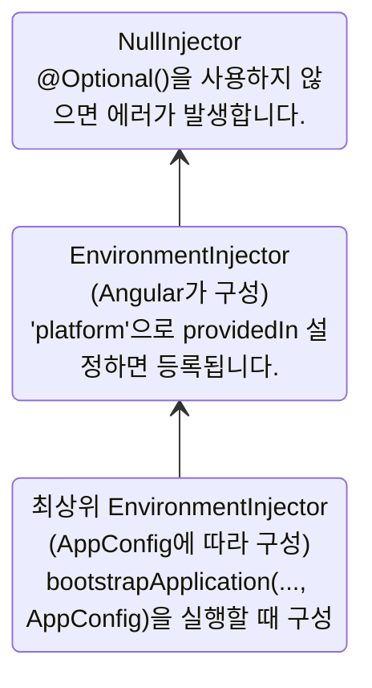
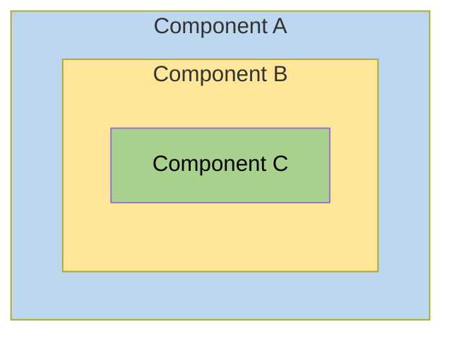
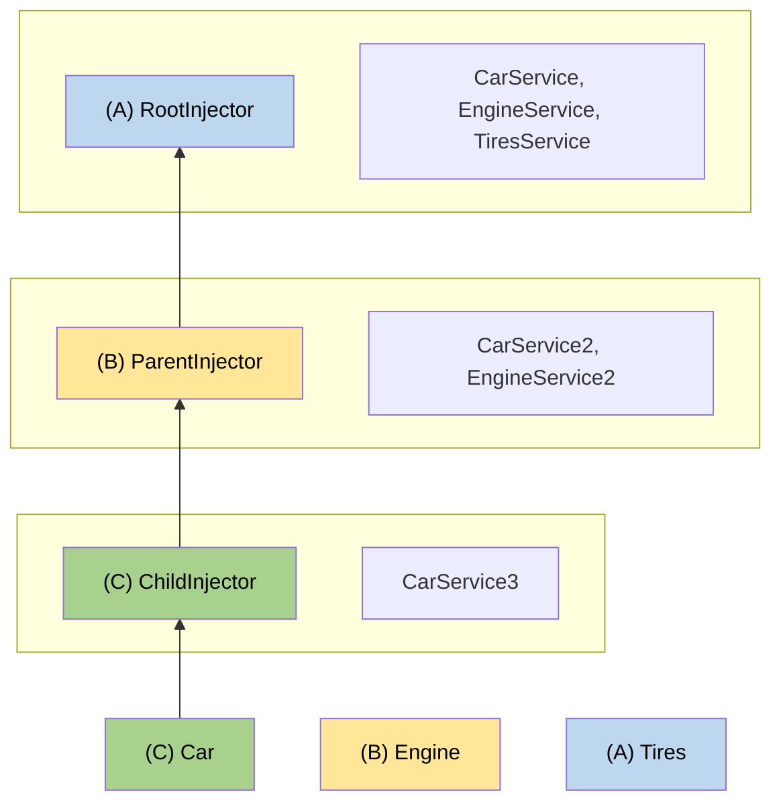

<!--
# Hierarchical injectors
-->

# 인젝터의 계층 구조

<!--
This guide provides in-depth coverage of Angular's hierarchical dependency injection system, including resolution rules, modifiers, and advanced patterns.

NOTE: For basic concepts about injector hierarchy and provider scoping, see the [defining dependency providers guide](guide/di/defining-dependency-providers#injector-hierarchy-in-angular).
-->

이 문서는 Angular 의존성 주입 시스템을 의존성 객체 판단 규칙, 수정자, 고급 패턴을 포함하여 깊이 있게 다룹니다.

참고: 인젝터 계층의 기본 개념이나 프로바이더 범위를 확인하려면 [의존성 주입 프로바이더 문서](guide/di/defining-dependency-providers#injector-hierarchy-in-angular)를 참고하세요.

<!--
## Types of injector hierarchies
-->

## 인젝터 계층의 종류

<!--
Angular has two injector hierarchies:

| Injector hierarchies            | Details                                                                                                                                                                   |
| :------------------------------ | :------------------------------------------------------------------------------------------------------------------------------------------------------------------------ |
| `EnvironmentInjector` hierarchy | Configure an `EnvironmentInjector` in this hierarchy using `@Service()` or `providers` array in `ApplicationConfig`.                                                      |
| `ElementInjector` hierarchy     | Created implicitly at each DOM element. An `ElementInjector` is empty by default unless you configure it in the `providers` property on `@Directive()` or `@Component()`. |

<docs-callout title="NgModule Based Applications">
For `NgModule` based applications, you can provide dependencies with the `ModuleInjector` hierarchy using an `@NgModule()` or `@Injectable()` annotation.
</docs-callout>
-->

Angular의 인젝터 계층은 두 종류입니다:

| 인젝터 계층                | 설명                                                                                                                                                                   |
| :------------------------- | :--------------------------------------------------------------------------------------------------------------------------------------------------------------------- |
| `EnvironmentInjector` 계층 | `@Service()` 이나 `ApplicationConfig`의 `providers` 배열을 사용하면 `EnvironmentInjector`를 구성할 수 있습니다.                                                     |
| `ElementInjector` 계층     | 개별 DOM 엘리먼트마다 암묵적으로 구성됩니다. `@Directive()`나 `@Component()`의 `providers` 프로퍼티에서 구성하지 않는 한 `ElementInjector`는 기본적으로 비어 있습니다. |

<docs-callout title="NgModule 기반 애플리케이션">
`NgModule` 방식으로 개발한 애플리케이션이라면 `@NgModule()` 이나 `@Injectable()`에서 `ModuleInjector` 계층을 구성할 수 있습니다.
</docs-callout>

### `EnvironmentInjector`

<!--
The `EnvironmentInjector` can be configured in one of two ways by using:

- The `@Service()`
- The `ApplicationConfig` `providers` array

<docs-callout title="Tree-shaking and @Service()">

Using the `@Service()` decorator is preferable to using the `ApplicationConfig` `providers` array. With `@Service`, optimization tools can perform tree-shaking, which removes services that your application isn't using. This results in smaller bundle sizes.

Tree-shaking is especially useful for a library because the application which uses the library may not have a need to inject it.

</docs-callout>

`EnvironmentInjector` is configured by the `ApplicationConfig.providers`.

Provide services using `@Service()` as follows:

```ts {highlight:[4]}
import {Service} from '@angular/core';

@Service() // <--provides this service in the root EnvironmentInjector
export class ItemService {
  name = 'telephone';
}
```

The `@Service()` or `@Injectable()` decorators identify a service class.
-->

`EnvironmentInjector`는 다음 두 가지 방법 중 하나로 구성할 수 있습니다:

- `@Service()`
- `ApplicationConfig` `providers` 배열로

<docs-callout title="트리 셰이킹과 @Injectable()">

`ApplicationConfig` `providers` 배열보다는 `@Service()` `providedIn` 프로퍼티 사용을 더 권장합니다.
`@Service()` `providedIn`을 사용하면 최적화 툴이 트리 셰이킹을 수행할 수 있으며, 이 서비스가 실제로 애플리케이션에 사용되지 않으면 빌드 결과물에 포함하지 않습니다.
결과적으로 빌드 결과물의 크기가 꼭 필요한 수준으로 줄어들 수 있습니다.

트리 셰이킹은 라이브러리인 경우 특히 유용합니다.
애플리케이션이 라이브러리를 사용하지 않으면 빌드 결과물에도 포함되지 않기 때문입니다.

</docs-callout>

`EnvironmentInjector`는 `ApplicationConfig.providers`에서 구성할 수 있습니다.

그리고 `@Service()`를 활용해서 등록할 수 있습니:

```ts {highlight:[4]}
import { Service } from '@angular/core';

@Service() <-- 이 서비스를 최상위 EnvironmentInjector에 등록합니다.
export class ItemService {
  name = 'telephone';
}
```

`@Injectable()` 데코레이터가 붙은 클래스는 Angular 서비스 클래스입니다.
이 데코레이터의 `providedIn` 프로퍼티는 `EnvironmentInjector`를 구성하는데, `root`를 지정하면 최상위 `EnvironmentInjector`에 이 서비스의 프로바이더를 등록합니다.


### ModuleInjector

<!--
In the case of `NgModule` based applications, the ModuleInjector can be configured in one of two ways by using:

- The `@Service()` decorator,
- The `@Injectable()` `providedIn` property to refer to `root` or `platform`
- The `@NgModule()` `providers` array

`ModuleInjector` is configured by the `@NgModule.providers` and `NgModule.imports` property. `ModuleInjector` is a flattening of all the providers arrays that can be reached by following the `NgModule.imports` recursively.

Child `ModuleInjector` hierarchies are created when lazy loading other `@NgModules`.
-->

`NgModule` 기반 애플리케이션은 다음 두 가지 방법으로 `ModuleInjector`를 구성할 수 있습니다:

- `@Service()` 데코레이터
- `@Injectable()` `providedIn` 프로퍼티 값으로 `root` 이나 `platform`를 사용할 때
- `@NgModule()` `providers` 배열을 사용할 때

`ModuleInjector`는 `@NgModule.providers`와 `@NgModule.imports` 프로퍼티를 사용해서 구성됩니다.
`ModuleInjector`는 `@NgModule.imports`를 재귀적으로 순회하면서 프로바이더 배열에 있는 모든 프로바이더를 평탄화(flattening)합니다.

`@NgModule`이 지연 로딩되는 경우에는 자식 `ModuleInjector` 계층이 구성됩니다.


<!--
### Platform injector
-->

### 플랫폼 인젝터

<!--
There are two more injectors above `root`, an additional `EnvironmentInjector` and `NullInjector()`.

Consider how Angular bootstraps the application with the following in `main.ts`:

```ts
bootstrapApplication(App, appConfig);
```

The `bootstrapApplication()` method creates a child injector of the platform injector which is configured by the `ApplicationConfig` instance.
This is the `root` `EnvironmentInjector`.

The `platformBrowserDynamic()` method creates an injector configured by a `PlatformModule`, which contains platform-specific dependencies.
This allows multiple applications to share a platform configuration.
For example, a browser has only one URL bar, no matter how many applications you have running.
You can configure additional platform-specific providers at the platform level by supplying `extraProviders` using the `platformBrowser()` function.

The next parent injector in the hierarchy is the `NullInjector()`, which is the top of the tree.
If you've gone so far up the tree that you are looking for a service in the `NullInjector()`, you'll get an error unless you've used `@Optional()` because ultimately, everything ends at the `NullInjector()` and it returns an error or, in the case of `@Optional()`, `null`.
For more information on `@Optional()`, see the [`@Optional()` section](#optional) of this guide.

The following diagram represents the relationship between the `root` `ModuleInjector` and its parent injectors as the previous paragraphs describe.

```mermaid
stateDiagram-v2
    elementInjector: EnvironmentInjector<br>(configured by Angular)<br>has special things like DomSanitizer => providedIn 'platform'
    rootInjector: root EnvironmentInjector<br>(configured by AppConfig)<br>has things for your app => bootstrapApplication(..., AppConfig)
    nullInjector: NullInjector<br>always throws an error unless<br>you use @Optional()

    direction BT
    rootInjector -> elementInjector
    elementInjector -> nullInjector
```

While the name `root` is a special alias, other `EnvironmentInjector` hierarchies don't have aliases.
You have the option to create `EnvironmentInjector` hierarchies whenever a dynamically loaded component is created, such as with the Router, which will create child `EnvironmentInjector` hierarchies.

All requests forward up to the root injector, whether you configured it with the `ApplicationConfig` instance passed to the `bootstrapApplication()` method, or registered all providers with `root` in their own services.

<docs-callout title="@Injectable() vs. ApplicationConfig">

If you configure an app-wide provider in the `ApplicationConfig` of `bootstrapApplication`, it overrides one configured for `root` in the `@Injectable()` metadata.
You can do this to configure a non-default provider of a service that is shared with multiple applications.

Here is an example of the case where the component router configuration includes a non-default [location strategy](guide/routing/common-router-tasks#locationstrategy-and-browser-url-styles) by listing its provider in the `providers` list of the `ApplicationConfig`.

```ts
providers: [{provide: LocationStrategy, useClass: HashLocationStrategy}];
```

For `NgModule` based applications, configure app-wide providers in the `AppModule` `providers`.

</docs-callout>
-->

`root` 인젝터 상위 계층에는 `EnvironmentInjector`와 `NullInjector()`가 존재합니다.

`main.ts` 파일에서 Angular가 애플리케이션을 부트르트랩하는 과정을 살펴봅시다:

```ts
bootstrapApplication(App, appConfig);
```

`bootstrapApplication` 메서드는 `ApplicationConfig` 인스턴스 값에 따라 플랫폼 인젝터의 자식 인젝터를 생성합니다.
이것이 최상위 인젝터인 `EnvironmentInjector`입니다.

`platformBrowserDynamic()` 메서드는 각 플랫폼 의존성 객체를 기반으로 `PlatformModule` 인젝터를 생성합니다.
이 방식에 따라 플랫폼 환경설정을 공유하는 애플리케이션은 여러개가 될 수도 있습니다.
예를 들면, 브라우저에서 실행되는 애플리케이션 숫자에 관계없이 브라우저에는 주소표시줄이 하나만 존재합니다.
그리고 `platformBrowser()` 함수를 실행할 때 `extraProviders` 옵션을 사용해서 플랫폼 계층에 플랫폼별 프로바이더를 추가로 구성할 수 있씁니다.

그 다음으로 트리 최상단에 존재하는 부모 인젝터는 `NullInjector()` 입니다.
`@Optional()`을 사용하지 않은 채로 의존성 객체를 찾다가 `NullInjector()`를 만나면 에러가 발생합니다.
왜냐하면 `NullInjector()`는 의존성 객체를 찾는 마지막 지점이기 때문에 `@Optional()`을 사용한 경우 `null`을 반환하거나, 아니면 에러를 반환하기 때문입니다.
`@Optional()`에 대해 자세하게 알아보려면 이 문서의 [`@Optional()` 섹션](#optional)을 참고하세요.

아래 다이어그램은 최상위 `ModuleInjector`와 그 부모 인젝터들의 관계를 표현합니다.



`root`라는 이름은 특별한 별칭이지만, `EnvironmentInjector`와 같은 계층에는 별칭이 없습니다.
Router와 같이 컴포넌트를 동적으로 로딩할 때마다 `EnvironmentInjector` 계층 구조를 생성할 수 있습니다.

`bootstrapApplication()` 메서드에 `ApplicationConfig` 인스턴스가 전달되거나, 각 서비스에서 `root` 계층으로 등록하면 인스턴스 주입 요청은 최상위 인젝터까지 전달됩니다.

<docs-callout title="@Injectable() vs. ApplicationConfig">

`bootstrapApplication()` 메서드와 `ApplicationConfig`를 사용해서 앱 전역 프로바이더를 설정하면 `@Injectable()` 메타데이터에서 `root`로 설정한 것을 오버라이드합니다.
이 방식을 활용하면 애플리케이션 여러 곳에 사용되는 서비스 프로바이더 구성을 변경할 수 있습니다.

아래 예제처럼 `ApplicationConfig`에서 `providers` 배열에 프로바이더를 등록하면 컴포넌트 라우터 설정 중 [location 정책](guide/routing/common-router-tasks#locationstrategy-and-browser-url-styles)을 변경할 수 있습니다.

```ts
providers: [{provide: LocationStrategy, useClass: HashLocationStrategy}];
```

`NgModule` 기반으로 개발한 애플리케이션이라면, `AppModule` `providers`에 프로바이더를 설정하면 동일한 효과가 됩니다.

</docs-callout>

### `ElementInjector`

<!--
Angular creates `ElementInjector` hierarchies implicitly for each DOM element.

Providing a service in the `@Component()` decorator using its `providers` or `viewProviders` property configures an `ElementInjector`.
For example, the following `TestComponent` configures the `ElementInjector` by providing the service as follows:

```ts {highlight:[3]}
@Component({
  /* … */
  providers: [{ provide: ItemService, useValue: { name: 'lamp' } }]
})
export class TestComponent
```

HELPFUL: See the [resolution rules](#resolution-rules) section to understand the relationship between the `EnvironmentInjector` tree, the `ModuleInjector` and the `ElementInjector` tree.

When you provide services in a component, that service is available by way of the `ElementInjector` at that component instance.
It may also be visible at child component/directives based on visibility rules described in the [resolution rules](#resolution-rules) section.

When the component instance is destroyed, so is that service instance.
-->

Angular는 개별 DOM 엘리먼트마다 `ElementInjector` 계층을 구성합니다.

그래서 `@Component()` 데코레이터의 `providers` 프로퍼티나 `viewProviders` 프로퍼티를 사용하면 `ElementInjector` 계층이 구성됩니다.
예를 들어 다음과 같이 `TestComponent` 코드를 작성하면 해당 서비스가 `ElementInjector` 계층에 등록됩니다:

```ts {highlight:[3]}
@Component({
  /* … */
  providers: [{ provide: ItemService, useValue: { name: 'lamp' } }]
})
export class TestComponent
```

참고: `EnvironmentInjector` 트리와 `ModuleInjector`, `ELementInjector` 트리 관계를 이해하려면 [의존성 객체 결정 규칙](#의존성-객체-결정-규칙) 섹션을 참고하세요.

서비스를 컴포넌트 계층에 등록하면, 해당 서비스는 컴포넌트 인스턴스의 `ElementInjector`를 통해 사용할 수 있습니다.
그래서 이 컴포넌트의 자식 컴포넌트나 디렉티브라면 [의존성 객체 결정 규칙](#의존성-객체-결정-규칙)에 따라 해당 서비스의 인스턴스에 접근할 수 있습니다.

이렇게 등록된 서비스의 인스턴스는 컴포넌트 인스턴스가 종료되면 함께 종료됩니다.

<!--
#### `@Directive()` and `@Component()`
-->

#### `@Directive()`, `@Component()`

<!--
A component is a special type of directive, which means that just as `@Directive()` has a `providers` property, `@Component()` does too.
This means that directives as well as components can configure providers, using the `providers` property.
When you configure a provider for a component or directive using the `providers` property, that provider belongs to the `ElementInjector` of that component or directive.
Components and directives on the same element share an injector.
-->

컴포넌트는 디렉티브의 특수한 형태라고 볼 수 있습니다.
그렇다는 것은 `@Directive()`에 `providers` 프로바이더가 있는 것처럼 `@Component()` 에서도 `providers` 배열을 활용해서 프로바이더를 등록할 수 있습니다.
컴포넌트나 디렉티브에서 `providers` 프로퍼티로 프로바이더를 등록하면, 이 프로바이더는 해당 컴포넌트/디렉티브의 `ElementInjector`에 등록됩니다.
엘리먼트에 컴포넌트와 디렉티브가 동시에 존재하면 이 컴포넌트와 디렉티브는 인젝터를 공유합니다.

<!--
## Resolution rules
-->

## 의존성 객체 결정 규칙

<!--
When resolving a token for a component/directive, Angular resolves it in two phases:

1. Against its parents in the `ElementInjector` hierarchy.
2. Against its parents in the `EnvironmentInjector` hierarchy.

When a component declares a dependency, Angular tries to satisfy that dependency with its own `ElementInjector`.
If the component's injector lacks the provider, it passes the request up to its parent component's `ElementInjector`.

The requests keep forwarding up until Angular finds an injector that can handle the request or runs out of ancestor `ElementInjector` hierarchies.

If Angular doesn't find the provider in any `ElementInjector` hierarchies, it goes back to the element where the request originated and looks in the `EnvironmentInjector` hierarchy.
If Angular still doesn't find the provider, it throws an error.

If you have registered a provider for the same DI token at different levels, the first one Angular encounters is the one it uses to resolve the dependency.
If, for example, a provider is registered locally in the component that needs a service,
Angular doesn't look for another provider of the same service.

HELPFUL: For `NgModule` based applications, Angular will search the `ModuleInjector` hierarchy if it cannot find a provider in the `ElementInjector` hierarchies.
-->

컴포넌트/디렉티브에서 의존성 객체 토큰을 결정할 때는 두 단계로 진행됩니다:

1. `ElementInjector` 계층을 따라 부모 방향으로 탐색합니다.
2. `EnvironmentInjector` 계층을 따라 부모 방향으로 탐색합니다.

어떤 컴포넌트에 의존성 객체가 등록되면 Angular는 해당 `ElementInjector`에서 의존성 객체를 찾습니다.
그리고 컴포넌트 인젝터에서 프로바이더를 찾지 못하면, 부모 컴포넌트의 `ElementInjector`를 따라 의존성 객체를 찾습니다.

이런 요청은 부모 `ElementInjector` 계층을 따라 거슬러 올라가며 원하는 의존성 객체를 찾을 때까지 계속됩니다.

Angular가 `ElementInjector` 계층을 따라 탐색했지만 의존성 객체를 찾지 못하면, 다시 시작 엘리먼트로 돌아가서 `EnvironmentInjector` 계층을 따라 다시 한 번 탐색합니다.
그리고 마지막까지 의존성 객체를 찾지 못하면 에러가 발생합니다.

같은 의존성 객체 토큰을 다른 계층에 등록하면, 먼저 만나는 의존성 객체를 사용합니다.
그래서 어떤 서비스가 컴포넌트 계층에 등록되어 있다면, Angular는 해당 컴포넌트에 등록된 프로바이더를 사용하며 다른 곳을 탐색하지 않습니다.

참고: `NgModule` 기반 애플리케이션은 `ElementInjector` 계층에서 의존성 객체를 찾지 못했을 때 `ModuleInjector` 계층을 탐색합니다.

<!--
## Resolution modifiers
-->

## 의존성 객체 결정에 영향을 주는 심볼

<!--
Angular's resolution behavior can be modified with `optional`, `self`, `skipSelf` and `host`.
Import each of them from `@angular/core` and use each in the [`inject`](/api/core/inject) configuration when you inject your service.
-->

`optional`, `self`, `skipSelf`, `host`를 사용하면 의존성 객체 결정 방식을 변경할 수 있습니다.
이 심볼들은 `@angular/core` 패키지로 제공되며, [`inject`](/api/core/inject) 함수를 사용할 때 사용할 수 있습니다.

<!--
### Types of modifiers
-->

### 종류

<!--
Resolution modifiers fall into three categories:

- What to do if Angular doesn't find what you're looking for, that is `optional`
- Where to start looking, that is `skipSelf`
- Where to stop looking, `host` and `self`

By default, Angular always starts at the current `Injector` and keeps searching all the way up.
Modifiers allow you to change the starting, or _self_, location and the ending location.

Additionally, you can combine all of the modifiers except:

- `host` and `self`
- `skipSelf` and `self`.
-->

의존성 객체에 영향을 주는 심볼은 세 종류로 구분할 수 있습니다:

- Angular가 의존성 객체를 찾지 못할 때: `optional`
- 의존성 객체 탐색을 시작 위치를 변경할 때: `skipSelf`
- 의존성 객체 탐색을 멈출 위치를 변경할 때: `host`, `self`

기본적으로 Angular는 현재 위치의 `Injector`부터 의존성 객체를 찾기 시작하지만, 이런 심볼들을 사용하면 의존성 탐색의 시작 위치와 종료 위치를 변경할 수 있습니다.

그리고 다음 조합을 제외한 심볼은 동시에 사용할 수 있습니다:

- `host`와 `self`
- `skipSelf`와 `self`

### `optional`

<!--
`optional` allows Angular to consider a service you inject to be optional.
This way, if it can't be resolved at runtime, Angular resolves the service as `null`, rather than throwing an error.
In the following example, the service, `OptionalService`, isn't provided in the service, `ApplicationConfig`, `@NgModule()`, or component class, so it isn't available anywhere in the app.

```ts {header:"src/app/optional/optional.ts"}
export class Optional {
  public optional? = inject(OptionalService, {optional: true});
}
```
-->

의존성 객체를 찾지 못해도 오류가 발생하지 않으며, 의존성으로 요청한 객체의 인스턴스는 `null`이 반환됩니다.
아래 예제 코드에서 `OptionalService`는 `ApplicationConfig`, `@NgModule()`, 컴포넌트 클래스 어디에도 등록되지 않았기 때문에 의존성 객체의 인스턴스를 찾을 수 없습니다.

```ts {header:"src/app/optional/optional.component.ts"}
export class Optional {
  public optional? = inject(OptionalService, {optional: true});
}
```

### `self`

<!--
Use `self` so that Angular will only look at the `ElementInjector` for the current component or directive.

A good use case for `self` is to inject a service but only if it is available on the current host element.
To avoid errors in this situation, combine `self` with `optional`.

For example, in the following `SelfNoData`, notice the injected `LeafService` as a property.

```ts {header: 'self-no-data.ts', highlight: [7]}
@Component({
  selector: 'app-self-no-data',
  templateUrl: './self-no-data.html',
  styleUrls: ['./self-no-data.css'],
})
export class SelfNoData {
  public leaf = inject(LeafService, {optional: true, self: true});
}
```

In this example, there is a parent provider and injecting the service will return the value, however, injecting the service with `self` and `optional` will return `null` because `self` tells the injector to stop searching in the current host element.

Another example shows the component class with a provider for `FlowerService`.
In this case, the injector looks no further than the current `ElementInjector` because it finds the `FlowerService` and returns the tulip 🌷.

```ts {header:"src/app/self/self.ts"}
@Component({
  selector: 'app-self',
  templateUrl: './self.html',
  styleUrls: ['./self.css'],
  providers: [{provide: FlowerService, useValue: {emoji: '🌷'}}],
})
export class Self {
  public flower = inject(FlowerService, {self: true});
}
```
-->

`self`를 사용하면 Angular는 해당 컴포넌트/디렉티브의 `ElementInjector`에서만 의존성 객체를 찾습니다.

`self`는 현재 호스트 엘리먼트에서 사용할 수 있는 서비스 인스턴스를 참조할 때 사용하면 좋습니다.
이 때 오류가 발생하는 것을 방지하려면 `self`와 `optional`을 함께 사용하세요.

예를 들어 아래 코드에서 `SelfNoDataComponent`는 `LeafService`를 의존성 객체로 요청합니다.

```ts {header: 'self-no-data.ts', highlight: [7]}
@Component({
  selector: 'app-self-no-data',
  templateUrl: './self-no-data.html',
  styleUrls: ['./self-no-data.css'],
})
export class SelfNoData {
  public leaf = inject(LeafService, {optional: true, self: true});
}
```

이 예제에서 부모 프로바이더가 있고 서비스 객체도 존재한다면 의존성 객체의 인스턴스가 주입되겠지만, `self`와 `optional`을 사용하면 현재 호스트 엘리먼트까지 탐색하고 의존성 객체를 찾지 않기 때문에 의존성 객체 인스턴스로 `null`을 사용합니다.

`FlowerService`를 사용하는 예제를 살펴봅시다.
아래 예제 코드에서 인젝터는 현재 계층의 `ElementInjector`에서만 의존성 객체를 찾기 때문, `FlowerService`는 튤립(<code>🌷</code>)을 반환합니다.

```ts {header:"src/app/self/self.ts"}
@Component({
  selector: 'app-self',
  templateUrl: './self.html',
  styleUrls: ['./self.css'],
  providers: [{provide: FlowerService, useValue: {emoji: '🌷'}}],
})
export class Self {
  public flower = inject(FlowerService, {self: true});
}
```

### `skipSelf`

<!--
`skipSelf` is the opposite of `self`.
With `skipSelf`, Angular starts its search for a service in the parent `ElementInjector`, rather than in the current one.
So if the parent `ElementInjector` were using the fern <code>🌿</code> value for `emoji`, but you had maple leaf <code>🍁</code> in the component's `providers` array, Angular would ignore maple leaf <code>🍁</code> and use fern <code>🌿</code>.

To see this in code, assume that the following value for `emoji` is what the parent component were using, as in this service:

```ts {header: 'leaf.service.ts'}
export class LeafService {
  emoji = '🌿';
}
```

Imagine that in the child component, you had a different value, maple leaf 🍁 but you wanted to use the parent's value instead.
This is when you'd use `skipSelf`:

```ts {header:"skipself.ts" highlight:[[6],[10]]}
@Component({
  selector: 'app-skipself',
  templateUrl: './skipself.html',
  styleUrls: ['./skipself.css'],
  // Angular would ignore this LeafService instance
  providers: [{provide: LeafService, useValue: {emoji: '🍁'}}],
})
export class Skipself {
  // Use skipSelf as inject option
  public leaf = inject(LeafService, {skipSelf: true});
}
```

In this case, the value you'd get for `emoji` would be fern <code>🌿</code>, not maple leaf <code>🍁</code>.
-->

`skipSelf`는 `self`와 반대입니다.
`skipSelf`를 사용하면 Angular는 현재 컴포넌트/디렉티브의 부모 `ElementInjector`부터 의존성 객체를 찾기 시작합니다.
그래서 현재 컴포넌트의 `providers` 배열에 단풍잎 <code>🍁</code>이 의존성 객체로 등록되어 있고, 부모 `ElementInjector`에 양치식물 <code>🌿</code>이 등록되어 있으면, Angular는 단풍잎 <code>🍁</code>을 건너뛰고 양치식물 <code>🌿</code>을 의존성 객체로 사용합니다.

코드로 보면, 부모 컴포넌트에 다음과 같이 등록되었다고 합시다.

```ts {header: 'leaf.service.ts'}
export class LeafService {
  emoji = '🌿';
}
```

자식 컴포넌트에는 `LeafService`에 대해 단풍잎 <code>🍁</code>이 등록되어 있지만, `skipSelf`를 사용하면 이 값 대신 부모 계층의 값이 대신 사용됩니다:

```ts {header:"skipself.ts" highlight:[[6],[10]]}
@Component({
  selector: 'app-skipself',
  templateUrl: './skipself.html',
  styleUrls: ['./skipself.css'],
  // 이 계층의 LeafService 인스턴스는 무시합니다.
  providers: [{provide: LeafService, useValue: {emoji: '🍁'}}],
})
export class Skipself {
  // skipSelf 옵션을 사용했습니다.
  public leaf = inject(LeafService, {skipSelf: true});
}
```

이 경우 `SkipselfComponent`에 주입되는 의존성 객체의 값은 단풍잎 <code>🍁</code>이 아니라 양치식물 <code>🌿</code>입니다.

<!--
#### `skipSelf` option with `optional`
-->

#### `skipSelf`와 `optional`을 함께 사용하는 경우

<!--
Use the `skipSelf` option with `optional` to prevent an error if the value is `null`.

In the following example, the `Person` service is injected during property initialization.
`skipSelf` tells Angular to skip the current injector and `optional` will prevent an error should the `Person` service be `null`.

```ts
class Person {
  parent = inject(Person, {optional: true, skipSelf: true});
}
```
-->

`skipSelf` 옵션을 사용할 때 `optional`을 함께 사용하면 의존성 객체를 찾지 못해 `null`을 반환하더라도 오류가 발생하지 않습니다.

아래 코드는 프로퍼티 초기화 시점에 `Person` 서비스를 의존성으로 주입받는 예제 코드입니다.
이 때 `skipSelf`를 사용했기 때문에 현재 계층의 인젝터는 건너뛰지만, `optional`을 함께 사용했기 때문에 `Person` 서비스를 찾지 못해 `null`을 반환하더라도 오류가 발생하지는 않습니다.

```ts
class Person {
  parent = inject(Person, {optional: true, skipSelf: true});
}
```

### `host`

<!-- TODO: Remove ambiguity between host and self. -->

<!--
`host` lets you designate a component as the last stop in the injector tree when searching for providers.

Even if there is a service instance further up the tree, Angular won't continue looking.
Use `host` as follows:

```ts {header:"host.ts" highlight:[[6],[9]]}
@Component({
  selector: 'app-host',
  templateUrl: './host.html',
  styleUrls: ['./host.css'],
  // provide the service
  providers: [{provide: FlowerService, useValue: {emoji: '🌷'}}],
})
export class Host {
  // use host when injecting the service
  flower = inject(FlowerService, {host: true, optional: true});
}
```

Since `Host` has the `host` option , no matter what the parent of `Host` might have as a `flower.emoji` value, the `Host` will use tulip <code>🌷</code>.
-->

`host`를 사용하면 의존성 객체 탐색 지점의 마지막 위치를 지정할 수 있습니다.

그래서 `host`를 사용하면 해당 계층 위쪽으로 의존성 객체의 인스턴스가 존재하더라도 위 계층을 탐색하지 않습니다.
`host`는 이런 경우에 사용합니다:

```ts {header:"host.ts" highlight:[[6],[9]]}
@Component({
  selector: 'app-host',
  templateUrl: './host.html',
  styleUrls: ['./host.css'],
  // 서비스 프로바이더를 등록합니다.
  providers: [{provide: FlowerService, useValue: {emoji: '🌷'}}],
})
export class Host {
  // 의존성 객체를 참조하면서 host 옵션을 사용합니다.
  flower = inject(FlowerService, {host: true, optional: true});
}
```

<!--
### Modifiers with constructor injection
-->

### 생성자 주입 시점에 사용하기

<!--
Similarly as presented before, the behavior of constructor injection can be modified with `@Optional()`, `@Self()`, `@SkipSelf()` and `@Host()`.

Import each of them from `@angular/core` and use each in the component class constructor when you inject your service.

```ts {header:"self-no-data.ts" highlight:[2]}
export class SelfNoData {
  constructor(@Self() @Optional() public leaf?: LeafService) {}
}
```
-->

위에서 다룬 것처럼, `@Optional()`, `@Self()`, `@SkipSelf()`, `@Host()`는 생성자에서 의존성 객체를 주입할 때도 사용할 수 있습니다.

개별 심볼은 `@angular/core` 패키지로 제공되며, 컴포넌트 클래스 생성자에 주입하는 서비스마다 다음과 같이 지정하면 됩니다.

```ts {header:"self-no-data.ts" highlight:[2]}
export class SelfNoData {
  constructor(@Self() @Optional() public leaf?: LeafService) {}
}
```

<!--
## Logical structure of the template
-->

## 템플릿의 논리 구조

<!--
When you provide services in the component class, services are visible within the `ElementInjector` tree relative to where and how you provide those services.

Understanding the underlying logical structure of the Angular template will give you a foundation for configuring services and in turn control their visibility.

Components are used in your templates, as in the following example:

```html
<app-root> <app-child />; </app-root>
```

HELPFUL: Usually, you declare the components and their templates in separate files.
For the purposes of understanding how the injection system works, it is useful to look at them from the point of view of a combined logical tree.
The term _logical_ distinguishes it from the render tree, which is your application's DOM tree.
To mark the locations of where the component templates are located, this guide uses the `<#VIEW>` pseudo-element, which doesn't actually exist in the render tree and is present for mental model purposes only.

The following is an example of how the `<app-root>` and `<app-child>` view trees are combined into a single logical tree:

```html
<app-root>
  <#VIEW>
    <app-child>
     <#VIEW>
       …content goes here…
     </#VIEW>
    </app-child>
  </#VIEW>
</app-root>
```

Understanding the idea of the `<#VIEW>` demarcation is especially significant when you configure services in the component class.
-->

컴포넌트 클래스에 서비스 프로바이더를 등록했다면, 이 서비스는 `ElementInjector` 트리 안에서 접근할 수 있습니다.

Angular 템플릿의 논리 구조를 이해하면 서비스를 어떻게 구성하는지, 어느 범위에서 접근할 수 있는지 더 명확하게 이해할 수 있습니다.

컴포넌트는 템플릿에 이렇게 사용됩니다:

```html
<app-root> <app-child />; </app-root>

```

참고: 일반적으로 컴포넌트 클래스 코드와 템플릿은 별도 파일로 작성합니다.
의존성 주입 시스템이 어떻게 동작하는지 이해하려면 이 둘을 논리적 트리로 합쳐서 바라보는 것이 좋습니다.
이 때 _논리적(logical)_ 이라는 것은 애플리케이션 DOM 트리인 렌더링 트리와 구분하기 위한 용어입니다.
그리고 컴포넌트 템플릿이 위치한 곳을 표시하기 위해 예제 코드에서는 `<#VIEW>` 라는 임시 엘리먼트를 사용하겠습니다.
이 엘리먼트는 렌더링 트리에 실제로 존재하는 것은 아니며, 이해를 돕기 위한 목적입니다.

트리 하나로 구성되는 `<app-root>`와 `<app-child>` 뷰 트리를 표현해보면 이렇습니다:

```html
<app-root>
  <#VIEW>
    <app-child>
     <#VIEW>
       …내용물은 여기에 들어갑니다…
     </#VIEW>
    </app-child>
  </#VIEW>
</app-root>
```

컴포넌트 클래스에 서비스를 등록한다면 `<#VIEW>`라는 개념을 구분해서 이해하는 것이 중요합니다.

<!--
## Example: Providing services in `@Component()`
-->

## 예제: 서비스를 `@Component()`에 등록하기

<!--
How you provide services using a `@Component()` (or `@Directive()`) decorator determines their visibility.
The following sections demonstrate `providers` and `viewProviders` along with ways to modify service visibility with `skipSelf` and `host`.

A component class can provide services in two ways:

| Arrays                       | Details                                        |
| :--------------------------- | :--------------------------------------------- |
| With a `providers` array     | `@Component({ providers: [SomeService] })`     |
| With a `viewProviders` array | `@Component({ viewProviders: [SomeService] })` |

In the examples below, you will see the logical tree of an Angular application.
To illustrate how the injector works in the context of templates, the logical tree will represent the HTML structure of the application.
For example, the logical tree will show that `<child-component>` is a direct child of `<parent-component>`.

In the logical tree, you will see special attributes: `@Provide`, `@Inject`, and `@ApplicationConfig`.
These aren't real attributes but are here to demonstrate what is going on under the hood.

| Angular service attribute | Details                                                                                  |
| :------------------------ | :--------------------------------------------------------------------------------------- |
| `@Inject(Token)=>Value`   | If `Token` is injected at this location in the logical tree, its value would be `Value`. |
| `@Provide(Token=Value)`   | Indicates that `Token` is provided with `Value` at this location in the logical tree.    |
| `@ApplicationConfig`      | Demonstrates that a fallback `EnvironmentInjector` should be used at this location.      |
-->

`@Component()`나 `@Directive()` 데코레이터에 서비스 프로바이더를 등록하면 이 서비스의 접근 범위가 결정됩니다.
다음 섹션에서는 `providers`나 `viewProviders`, `skipSelf`와 `host`를 사용해서 서비스의 접근 범위를 변경하는 방법을 알아봅시다.

서비스 프로바이더를 컴포넌트 클래스에 등록하는 방법은 두 가지 입니다:

| 배열            | 설명                                           |
| :-------------- | :--------------------------------------------- |
| `providers`     | `@Component({ providers: [SomeService] })`     |
| `viewProviders` | `@Component({ viewProviders: [SomeService] })` |

아래 예제 코드에서는 Angular 애플리케이션의 논리 트리를 확인할 수 있습니다.
템플릿 컨텍스트에서 인젝터가 어떻게 동작하는지 셜명하기 위해, 논리 트리는 HTML 구조로 표현하겠습니다.
예를 들어 논리 트리에 있는 `<child-component>`는 `<parent-component>`의 직접 자식 엘리먼트인 것을 의미합니다.

논리 트리에서 `@Provide`, `@Inject`, `@ApplicationConfig` 와 같은 특수 어트리뷰트를 확인할 수 있습니다.
이 어트리뷰트들이 실제 어트리뷰트는 아니지만, 개념을 설명하기 위한 것입니다.

| Angular 서비스 어트리뷰트 | 설명                                                                              |
| :------------------------ | :-------------------------------------------------------------------------------- |
| `@Inject(Token)=>Value`   | 어떤 논리 트리에 `Token`이 의존성으로 주입되면, 실제 주입되는 값은 `Value`입니다. |
| `@Provide(Token=Value)`   | 어떤 논리 트리에 `Token` 객체를 `Value`라는 값으로 등록합니다.                    |
| `@ApplicationConfig`      | 어떤 논리 트리에 기본값으로 사용하는`EnvironmentInjector` 를 설정합니다.          |

<!--
### Example app structure
-->

### 예제 앱의 구조

<!--
The example application has a `FlowerService` provided in `root` with an `emoji` value of red hibiscus <code>🌺</code>.

```ts {header:"flower.service.ts"}
@Service()
export class FlowerService {
  emoji = '🌺';
}
```

Consider an application with only an `App` and a `Child`.
The most basic rendered view would look like nested HTML elements such as the following:

```html
<app-root>
  <!- App selector ->
  <app-child> <!- Child selector -> </app-child>
<app-root> <!- AppComponent selector ->
<app-child> <!- ChildComponent selector ->
</app-child>
</app-root>
```

However, behind the scenes, Angular uses a logical view representation as follows when resolving injection requests:

```html
<app-root> <!- App selector ->
  <#VIEW>
    <app-child> <!- Child selector ->
      <#VIEW>
      </#VIEW>
    </app-child>
  </#VIEW>
</app-root>
```

The `<#VIEW>` here represents an instance of a template.
Notice that each component has its own `<#VIEW>`.

Knowledge of this structure can inform how you provide and inject your services, and give you complete control of service visibility.

Now, consider that `<app-root>` injects the `FlowerService`:

```typescript
export class App {
  flower = inject(FlowerService);
}
```

Add a binding to the `<app-root>` template to visualize the result:

```html
<p>Emoji from FlowerService: {{flower.emoji}}</p>
```

The output in the view would be:

```text {hideCopy}
Emoji from FlowerService: 🌺
```

In the logical tree, this would be represented as follows:

```html
<app-root @ApplicationConfig
        @Inject(FlowerService) flower=>"🌺">
  <#VIEW>
    <p>Emoji from FlowerService: {{flower.emoji}} (🌺)</p>
    <app-child>
      <#VIEW>
      </#VIEW>
    </app-child>
  </#VIEW>
</app-root>
```

When `<app-root>` requests the `FlowerService`, it is the injector's job to resolve the `FlowerService` token.
The resolution of the token happens in two phases:

1. The injector determines the starting location in the logical tree and an ending location of the search.
   The injector begins with the starting location and looks for the token at each view level in the logical tree.
   If the token is found it is returned.

1. If the token is not found, the injector looks for the closest parent `EnvironmentInjector` to delegate the request to.

In the example case, the constraints are:

1. Start with `<#VIEW>` belonging to `<app-root>` and end with `<app-root>`.
   - Normally the starting point for search is at the point of injection.
     However, in this case `<app-root>` is a component. `@Component`s are special in that they also include their own `viewProviders`, which is why the search starts at `<#VIEW>` belonging to `<app-root>`.
     This would not be the case for a directive matched at the same location.
   - The ending location happens to be the same as the component itself, because it is the topmost component in this application.

1. The `EnvironmentInjector` provided by the `ApplicationConfig` acts as the fallback injector when the injection token can't be found in the `ElementInjector` hierarchies.
-->

예제 애플리케이션은 `FlowerService`를 `root` 계층에 등록하며, 이 서비스에 있는 `emoji` 프로퍼티 값은 히비스커스 <code>🌺</code> 입니다.

```ts {header:"flower.service.ts"}
@Service()
export class FlowerService {
  emoji = '🌺';
}
```

예시 애플리케이션에는 `AppComponent`와 `ChildComponent`만 있다고 합시다.
일반적으로 구성하는 방법을 따르면 다음과 같이 구성할 수 있을 것입니다:

```html
<app-root>
  <!-- App 셀렉터 -->
  <app-child> <!-- 자식 셀렉터 --> </app-child>
</app-root>
```

하지만 Angular가 내부적으로 의존성 객체를 처리하기 위해 구성하는 논리적 뷰를 표현하면 이렇습니다:

```html
<app-root> <!-- App selector -->
  <#VIEW>
    <app-child> <!-- Child selector -->
      <#VIEW>
      </#VIEW>
    </app-child>
  </#VIEW>
</app-root>
```

`<#VIEW>`는 템플릿 인스턴스를 의미합니다.
개별 컴포넌트는 각각의 `<#VIEW>`를 갖습니다.

이 구조를 이해하면 서비스를 어떻게 등록해야 하는지, 어떻게 주입할 수 있는지, 어느 범위에서 접근할 수 있는지 이해하는 데에 큰 도움이 됩니다.

이제 `FlowerService`를 주입받는 `<app-root>`를 봅시다:

```typescript
export class App {
  flower = inject(FlowerService);
}
```

`<app-root>` 컴포넌트의 `flower` 프로퍼티는 템플릿에 이렇게 바인딩됩니다:

```html
<p>Emoji from FlowerService: {{flower.emoji}}</p>
```

그리고 최종 결과물은 이렇습니다:

```shell
Emoji from FlowerService: 🌺
```

논리 트리 관점에서 보면 이렇게 표현할 수 있습니다:

```html
<app-root @ApplicationConfig
        @Inject(FlowerService) flower=>"🌺">
  <#VIEW>
    <p>Emoji from FlowerService: {{flower.emoji}} (🌺)</p>
    <app-child>
      <#VIEW>
      </#VIEW>
    </app-child>
  </#VIEW>
</app-root>
```

`<app-root>`에서 `FlowerService`를 의존성 객체로 요청하면, 인젝터가 `FlowerService` 토큰을 찾기 시작합니다.
이 토큰은 두 단계로 결정됩니다:

1. 인젝터가 논리 트리에서 검색할 시작 위치와 종료 위치를 결정합니다.
   그리고 인젝터는 검색 시작 위치에서 토큰을 찾는데, 토큰을 발견하면 토큰에 연결된 값을 반환합니다.

1. 토큰을 찾지 못하면 인젝터는 가장 가까운 부모 `EnvironmentInjector`에서 다시 토큰을 찾습니다.

예제 코드로 설명하면 이렇습니다:

1. `<app-root>`의 `<#VIEW>` 범위에서만 토큰을 찾습니다.
   - 일반적으로는 의존성 객체를 요청한 계층부터 의존성 객체의 토큰을 찾기 시작합니다.
     하지만, `<app-root>` 는 컴포넌트이며, `viewProviders`가 설정되어 있습니다. 따라서 의존성 객체는 `<app-root>` 컴포넌트의 `<#VIEW>` 부터 찾기 시작합니다.
     같은 계층에 존재하는 디렉티브는 해당되지 않습니다.
   - 의존성 객체를 검색하는 마지막 지점이 같은 컴포넌트인 이유는, 이 컴포넌트가 애플리케이션의 최상위 컴포넌트이기 때문입니다.

1. `ElementInjector` 계층을 따라가면서 인젝터가 의존성 객체를 찾지 못하면 기본값으로 사용할 값을 `EnvironmentInjector`에 `ApplicationConfig`로 등록합니다.

<!--
### Using the `providers` array
-->

### `providers` 배열을 활용하는 방법

<!--
Now, in the `Child` class, add a provider for `FlowerService` to demonstrate more complex resolution rules in the upcoming sections:

```ts
@Component({
  selector: 'app-child',
  templateUrl: './child.html',
  styleUrls: ['./child.css'],
  // use the providers array to provide a service
  providers: [{provide: FlowerService, useValue: {emoji: '🌻'}}],
})
export class Child {
  // inject the service
  flower = inject(FlowerService);
}
```

Now that the `FlowerService` is provided in the `@Component()` decorator, when the `<app-child>` requests the service, the injector has only to look as far as the `ElementInjector` in the `<app-child>`.
It won't have to continue the search any further through the injector tree.

The next step is to add a binding to the `Child` template.

```html
<p>Emoji from FlowerService: {{flower.emoji}}</p>
```

To render the new values, add `<app-child>` to the bottom of the `App` template so the view also displays the sunflower:

```text {hideCopy}
Child Component
Emoji from FlowerService: 🌻
```

In the logical tree, this is represented as follows:

```html
<app-root @ApplicationConfig
          @Inject(FlowerService) flower=>"🌺">
  <#VIEW>

  <p>Emoji from FlowerService: {{flower.emoji}} (🌺)</p>
  <app-child @Provide(FlowerService="🌻" )
             @Inject(FlowerService)=>"🌻"> <!- search ends here ->
    <#VIEW> <!- search starts here ->
    <h2>Child Component</h2>
    <p>Emoji from FlowerService: {{flower.emoji}} (🌻)</p>
  </
  #VIEW>
  </app-child>
</#VIEW>
</app-root>
```

When `<app-child>` requests the `FlowerService`, the injector begins its search at the `<#VIEW>` belonging to `<app-child>` \(`<#VIEW>` is included because it is injected from `@Component()`\) and ends with `<app-child>`.
In this case, the `FlowerService` is resolved in the `providers` array with sunflower <code>🌻</code> of the `<app-child>`.
The injector doesn't have to look any further in the injector tree.
It stops as soon as it finds the `FlowerService` and never sees the red hibiscus <code>🌺</code>.
-->

이제 좀 더 복잡한 경우를 살펴보기 위해 `ChildComponent` 클래스에 `FlowerService`의 프로바이더를 추가해 봅시다:

```ts
@Component({
  selector: 'app-child',
  templateUrl: './child.html',
  styleUrls: ['./child.css'],
  // providers 배열을 사용해서 서비스 프로바이더를 등록합니다.
  providers: [{provide: FlowerService, useValue: {emoji: '🌻'}}],
})
export class Child {
  // inject the service
  flower = inject(FlowerService);
}
```

이제 `FlowerService`가 `@Component()` 데코레이터에 등록되었기 때문에, `<app-child>`에서 의존성 객체를 요청하면 인젝터는 `<app-child>`에 있는 `ElementInjector` 에서만 의존성 객체를 찾습니다.
인젝터 트리를 따라 위로 향하지 않습니다.

그 다음 단계는 `Child` 템플릿에 바인딩을 추가해 봅시다:

```html
<p>Emoji from FlowerService: {{flower.emoji}}</p>
```

이제 새 값을 렌더링하기 위해 `App` 템플릿 제일 아래에 `<app-child>`를 추가합니다.
그러면 해바라기가 화면에 표시될 것입니다:

```text {hideCopy}
Child Component
Emoji from FlowerService: 🌻
```

논리 트리로 표현하면 이렇습니다:

```html
<app-root @ApplicationConfig
          @Inject(FlowerService) flower=>"🌺">
  <#VIEW>

  <p>Emoji from FlowerService: {{flower.emoji}} (🌺)</p>
  <app-child @Provide(FlowerService="🌻" )
             @Inject(FlowerService)=>"🌻"> <!-- 검색이 여기에서 종료됩니다 -->
    <#VIEW> <!-- 검색이 여기에서 시작됩니다 -->
    <h2>Child Component</h2>
    <p>Emoji from FlowerService: {{flower.emoji}} (🌻)</p>
  </
  #VIEW>
  </app-child>
</#VIEW>
</app-root>
```

`<app-child>`가 `FlowerService`를 의존성 객체로 요청하면, 인젝터는 `<app-child>`의 `<#VIEW>`부터 의존성 객체를 찾기 시작합니다.
`<#VIEW>`는 `@Component()`에서 주입되기 때문에 검색 범위에 포함되며, `<app-child>`에서 검색이 종료됩니다.
이 예제의 경우는 `FlowerService`가 `<app-child>` 단계에서 `providers` 배열에 등록되었기 때문에 해바라기 <code>🌻</code> 가 의존성 객체로 결정됩니다.
그래서 인젝턴는 이보다 상위 인젝터 트리는 탐색하지 않습니다.
히비스커스 <code>🌺</code>가 등록된 `FlowerService`는 전혀 참조하지 않습니다.

<!--
### Using the `viewProviders` array
-->

### `viewProviders` 배열을 활용하는 방법

<!--
Use the `viewProviders` array as another way to provide services in the `@Component()` decorator.
Using `viewProviders` makes services visible in the `<#VIEW>`.

HELPFUL: The steps are the same as using the `providers` array, with the exception of using the `viewProviders` array instead.

For step-by-step instructions, continue with this section.
If you can set it up on your own, skip ahead to [Modifying service availability](#visibility-of-provided-tokens).

For demonstration, we are building an `AnimalService` to demonstrate `viewProviders`.
First, create an `AnimalService` with an `emoji` property of whale <code>🐳</code>:

```typescript
import {Service} from '@angular/core';

@Service()
export class AnimalService {
  emoji = '🐳';
}
```

Following the same pattern as with the `FlowerService`, inject the `AnimalService` in the `App` class:

```ts
export class App {
  public flower = inject(FlowerService);
  public animal = inject(AnimalService);
}
```

HELPFUL: You can leave all the `FlowerService` related code in place as it will allow a comparison with the `AnimalService`.

Add a `viewProviders` array and inject the `AnimalService` in the `<app-child>` class, too, but give `emoji` a different value.
Here, it has a value of dog 🐶.

```typescript
@Component({
  selector: 'app-child',
  templateUrl: './child.html',
  styleUrls: ['./child.css'],
  // provide services
  providers: [{provide: FlowerService, useValue: {emoji: '🌻'}}],
  viewProviders: [{provide: AnimalService, useValue: {emoji: '🐶'}}],
})
export class Child {
  // inject services
  flower = inject(FlowerService);
  animal = inject(AnimalService);
}
```

Add bindings to the `Child` and the `App` templates.
In the `Child` template, add the following binding:

```html
<p>Emoji from AnimalService: {{animal.emoji}}</p>
```

Additionally, add the same to the `App` template:

```html
<p>Emoji from AnimalService: {{animal.emoji}}</p>
```

Now you should see both values in the browser:

```text {hideCopy}
App
Emoji from AnimalService: 🐳

Child Component
Emoji from AnimalService: 🐶
```

The logic tree for this example of `viewProviders` is as follows:

```html
<app-root @ApplicationConfig
          @Inject(AnimalService) animal=>"🐳">
  <#VIEW>
  <app-child>
    <#VIEW @Provide(AnimalService="🐶")
    @Inject(AnimalService=>"🐶")>

    <!- ^^using viewProviders means AnimalService is available in <#VIEW>->
    <p>Emoji from AnimalService: {{animal.emoji}} (🐶)</p>
  </
  #VIEW>
  </app-child>
</#VIEW>
</app-root>
```

Just as with the `FlowerService` example, the `AnimalService` is provided in the `<app-child>` `@Component()` decorator.
This means that since the injector first looks in the `ElementInjector` of the component, it finds the `AnimalService` value of dog <code>🐶</code>.
It doesn't need to continue searching the `ElementInjector` tree, nor does it need to search the `ModuleInjector`.
-->

`@Component()` 데코레이터에서 `viewProviders` 배열을 활용해도 서비스를 의존성 객체로 등록할 수 있습니다.
`viewProviders`를 활용하면 `<#VIEW>`에서도 서비스에 접근할 수 있습니다.

참고: 방법은 `providers` 배열 대신 `viewProviders` 배열을 활용한다는 것 외에는 `providers` 배열을 활용할 때와 동일합니다.

단계별 설정방법은 이 섹션을 계속 진행하면 되며, 직접 설정하는 단계로 진행하려면 [서비스 접근범위 변경하기](#의존성-토큰의-접근-범위) 섹션을 참고하세요.

`viewProviders`를 설명하기 위해 `AnimalService`를 만들어 봅시다.
먼저, `AnimalService`에 `emoji` 프로퍼티 값으로 고래 <code>🐳</code>를 할당합니다:

```typescript
import {Service} from '@angular/core';

@Service()
export class AnimalService {
  emoji = '🐳';
}
```

그리고 `FlowerService` 때와 마찬가지로, `App` 클래스에 `AnimalService` 를 의존성으로 주입합니다:

```ts
export class App {
  public flower = inject(FlowerService);
  public animal = inject(AnimalService);
}
```

참고: `FlowerService` 코드는 그대로 두고 `AnimalService`와 비교해봐도 좋습니다.

이번에는 `<app-child>` 클래스에 `viewProviders` 배열을 추가하고 `AnimalService`를 등록하는데, `emoji` 값을 강아지 <code>🐶</code>로 설정해 봅시다.

```typescript
@Component({
  selector: 'app-child',
  templateUrl: './child.html',
  styleUrls: ['./child.css'],
  // 서비스 프로바이더를 등록합니다.
  providers: [{provide: FlowerService, useValue: {emoji: '🌻'}}],
  viewProviders: [{provide: AnimalService, useValue: {emoji: '🐶'}}],
})
export class Child {
  // inject services
  flower = inject(FlowerService);
  animal = inject(AnimalService);
}
```

그리고 `App` 템플릿에 `Child`를 바인딩합니다.
`Child` 템플릿에는 이런 바인딩 문구가 있습니다:

```html
<p>Emoji from AnimalService: {{animal.emoji}}</p>
```

그리고 `App` 템플릿에도 같은 내용을 추가합니다:

```html
<p>Emoji from AnimalService: {{animal.emoji}}</p>s
```

이제 브라우저에서 두 값이 어떻게 표시되는지 확인해 보세요:

```text {hideCopy}
App
Emoji from AnimalService: 🐳

Child Component
Emoji from AnimalService: 🐶
```

`viewProviders` 논리 트리를 보면 이렇습니다:

```html
<app-root @ApplicationConfig
          @Inject(AnimalService) animal=>"🐳">
  <#VIEW>
  <app-child>
    <#VIEW @Provide(AnimalService="🐶")
    @Inject(AnimalService=>"🐶")>

    <!-- ^^using viewProviders means AnimalService is available in <#VIEW>-->
    <p>Emoji from AnimalService: {{animal.emoji}} (🐶)</p>
  </
  #VIEW>
  </app-child>
</#VIEW>
</app-root>
```

`FlowerService` 예제에서 본 것처럼, `AnimalService`는 `<app-child>`의 `@Component()` 데코레이터에 등록되어 있습니다.
이 말은, 인젝터가 컴포넌트의 `ElementInjector`에서 의존성 객체를 제일 먼저 찾기 때문에, 값이 강아지 <code>🐶</code>인 `AnimalService`를 찾게 된다는 것을 의미합니다.
상위 `ElementInjector` 트리나 `ModuleInjector` 트리를 탐색할 필요는 없습니다.

### `providers` vs. `viewProviders`

<!--
The `viewProviders` field is conceptually similar to `providers`, but there is one notable difference.
Providers in `viewProviders` are only visible inside the component's own view — content projected into the component via `<ng-content>` cannot see them.

To see the difference between using `providers` and `viewProviders`, add another component to the example and call it `Inspector`.
`Inspector` will be a child of the `Child`.
In `inspector.ts`, inject the `FlowerService` and `AnimalService` during property initialization:

```typescript
export class Inspector {
  flower = inject(FlowerService);
  animal = inject(AnimalService);
}
```

You do not need a `providers` or `viewProviders` array.
Next, in `inspector.html`, add the same markup from previous components:

```html
<p>Emoji from FlowerService: {{flower.emoji}}</p>
<p>Emoji from AnimalService: {{animal.emoji}}</p>
```

Remember to add the `Inspector` to the `Child` `imports` array.

```ts
@Component({
  ...
  imports: [Inspector]
})
```

Next, add the following to `child.html`:

```html
...

<div class="container">
  <h3>Content projection</h3>
  <ng-content />
</div>
<h3>Inside the view</h3>

<app-inspector />
```

`<ng-content>` allows you to project content, and `<app-inspector>` inside the `Child` template makes the `Inspector` a child component of `Child`.

Next, add the following to `app.html` to take advantage of content projection.

```html
<app-child>
  <app-inspector />
</app-child>
```

The browser now renders the following, omitting the previous examples for brevity:

```text {hideCopy}
...
Content projection

Emoji from FlowerService: 🌻
Emoji from AnimalService: 🐳

Emoji from FlowerService: 🌻
Emoji from AnimalService: 🐶
```

These four bindings demonstrate the difference between `providers` and `viewProviders`.
Remember that the dog emoji <code>🐶</code> is declared inside the `<#VIEW>` of `Child` and isn't visible to the projected content.
Instead, the projected content sees the whale <code>🐳</code>.

You might wonder why the projected `<app-inspector>` can still see <code>🐳</code> from `App`'s `viewProviders`.
The reason is that Angular DI tracks **where a component was declared**, not where it ends up being rendered.
`<app-inspector>` lives in `App`'s template — inside `App`'s `<#VIEW>` — so `App`'s `viewProviders` are fair game.
Projecting it into `Child` cuts off access to `Child`'s `viewProviders` (<code>🐶</code>), but `App`'s providers (<code>🐳</code>) are still reachable up the tree.

However, in the next output section though, the `Inspector` is an actual child component of `Child`, `Inspector` is inside the `<#VIEW>`, so when it asks for the `AnimalService`, it sees the dog <code>🐶</code>.

The `AnimalService` in the logical tree would look like this:

```html
<app-root @ApplicationConfig
          @Inject(AnimalService) animal=>"🐳">
  <#VIEW>
  <app-child>
    <#VIEW @Provide(AnimalService="🐶")
    @Inject(AnimalService=>"🐶")>

    <!- ^^using viewProviders means AnimalService is available in <#VIEW>->
    <p>Emoji from AnimalService: {{animal.emoji}} (🐶)</p>

    <div class="container">
      <h3>Content projection</h3>
      <app-inspector @Inject(AnimalService) animal=>"🐳">
        <p>Emoji from AnimalService: {{animal.emoji}} (🐳)</p>
      </app-inspector>
    </div>

    <app-inspector>
      <#VIEW @Inject(AnimalService) animal=>"🐶">
      <p>Emoji from AnimalService: {{animal.emoji}} (🐶)</p>
    </
    #VIEW>
    </app-inspector>
  </
  #VIEW>
  </app-child>

</#VIEW>
</app-root>
```

The projected `<app-inspector>` gets <code>🐳</code> because <code>🐶</code> belongs to `Child`'s view and projected content can't reach it.
<code>🐳</code> is accessible because `<app-inspector>` was declared in `App`'s template, so it can still walk up to `App`'s `viewProviders`.

The `<app-inspector>` that lives directly inside `Child`'s template (not projected) gets <code>🐶</code> — it's inside the `<#VIEW>`, so no boundary to cross.
-->

`viewProviders`는 `providers`와 개념적으로 유사하지만, 중요한 차이가 있습니다.
`viewProviders`에 프로바이더를 등록하면 컴포넌트의 논리적 자식으로 추가되어 프로젝션되는 컨텐츠에서는 접근할 수 없습니다.

`providers`와 `viewProviders`의 차이를 확인하기 위해 `Inspector`를 추가해 봅시다.
`Inspector`는 `ChildComponent`의 자식 컴포넌트로 구성하며, `inspector.ts` 파일에서 프로퍼티를 선언하면서 `FlowerService`와 `AnimalService`를 의존성 객체로 할당합니다:

```typescript
export class Inspector {
  flower = inject(FlowerService);
  animal = inject(AnimalService);
}
```

이 때 `providers` 배열이나 `viewProviders` 배열은 필요하지 않습니다.
그리고 `inspector.html` 파일에서 이전에 추가했던 것과 같은 마크업을 추가합니다:

```html
<p>Emoji from FlowerService: {{flower.emoji}}</p>
<p>Emoji from AnimalService: {{animal.emoji}}</p>
```

`Inspector`를 `ChildComponent` `imports` 배열에 추가해야 하는 것을 잊지 마세요.

```ts
@Component({
  ...
  imports: [Inspector]
})
```

그리고 `child.html` 파일의 내용을 다음과 같이 구성합니다:

```html
...

<div class="container">
  <h3>Content projection</h3>
  <ng-content />
</div>
<h3>Inside the view</h3>

<app-inspector>
```

`<ng-content>`는 컨텐츠를 프로젝션할 때 사용하며, `<app-inspector>`가 `Child`의 템플릿 안에 사용되었기 때문에 `Inspector`는 `Child`의 자식 컴포넌트로 구성됩니다.

이제 `app.html` 파일에 컨텐츠를 프로젝션하는 코드를 추가합니다.

```html
<app-child>
  <app-inspector />
</app-child>
```

이제 브라우저는 간결하게 다음과 같이 표시됩니다:

```text {hideCopy}
...
Content projection

Emoji from FlowerService: 🌻
Emoji from AnimalService: 🐳

Emoji from FlowerService: 🌻
Emoji from AnimalService: 🐶
```

`App`의 `viewProviders`를 사용해서 `<app-inspector>`에 프로젝션 된 코드가 <code>🐳</code>로 남아있는 것이 의문일 수 있습니다.
Angular는 AngularDI는 컴포넌트가 최종적으로 렌더링되는 위치가 아니라 **컴포넌트가 어디에 선언되었는지** 추적하기 때문입니다.
`<app-inspector`는 `App`의 템플릿, 즉, `App`의 `<#VIEW>` 안에 있기 때문에 `App`의 `viewProviders`에 접근할 수 있습니다.
`<app-inspector>`를 `Child`로 프로젝션하면 `Child`의 `viewProviders` (<code>🐶</code>)는 접근이 차단되지만, `App`의 `viewProviders` (<code>🐳</code>)는 여전히 부모 컴포넌트에 접근할 수 있습니다.

하지만 아래 출력 섹션에서 `Inspector`는 실제로 `Child`의 자식 컴포넌트이고 `<#VIEW>` 안에 있습니다.
따라서 `AnimalService`를 요청하면 강아지 이미지 <code>🐶</code> 를 볼 수 있습니다.

논리 트리 구조에서 `AnimalService`는 다음과 같이 사용됩니다:

```html
<app-root @ApplicationConfig
          @Inject(AnimalService) animal=>"🐳">
  <#VIEW>
  <app-child>
    <#VIEW @Provide(AnimalService="🐶")
    @Inject(AnimalService=>"🐶")>

    <!-- ^^viewProviders를 사용하면 <#VIEW> 안에서 AnimalService에 접근할 수 있습니다.-->
    <p>Emoji from AnimalService: {{animal.emoji}} (🐶)</p>

    <div class="container">
      <h3>Content projection</h3>
      <app-inspector @Inject(AnimalService) animal=>"🐳">
        <p>Emoji from AnimalService: {{animal.emoji}} (🐳)</p>
      </app-inspector>
    </div>

    <app-inspector>
      <#VIEW @Inject(AnimalService) animal=>"🐶">
      <p>Emoji from AnimalService: {{animal.emoji}} (🐶)</p>
    </
    #VIEW>
    </app-inspector>
  </
  #VIEW>
  </app-child>

</#VIEW>
</app-root>
```

`<app-inspector>`에 프로젝션된 컨텐츠는 강아지 <code>🐶</code>가 아니라 고래 <code>🐳</code>입니다.
왜냐하면, 강아지 <code>🐶</code> 값은 `<app-child>` `<#VIEW>` 안에 존재하기 때문입니다.
`<app-inspector>`는 강아지 <code>🐶</code> 값이 `<#VIEW>` 안에 있을 때만 참조할 수 있습니다.


The projected `<app-inspector>` gets <code>🐳</code> because <code>🐶</code> belongs to `Child`'s view and projected content can't reach it.
<code>🐳</code> is accessible because `<app-inspector>` was declared in `App`'s template, so it can still walk up to `App`'s `viewProviders`.

The `<app-inspector>` that lives directly inside `Child`'s template (not projected) gets <code>🐶</code> — it's inside the `<#VIEW>`, so no boundary to cross.


<!--
### Visibility of provided tokens
-->

### 의존성 토큰의 접근 범위

<!--
Visibility decorators influence where the search for the injection token begins and ends in the logic tree.
To do this, place visibility configuration at the point of injection, that is, when invoking `inject()`, rather than at a point of declaration.

To alter where the injector starts looking for `FlowerService`, add `skipSelf` to the `<app-child>` `inject()` invocation where `FlowerService` is injected.
This invocation is a property initializer in `<app-child>` as shown in `child.ts`:

```typescript
flower = inject(FlowerService, {skipSelf: true});
```

With `skipSelf`, the `<app-child>` injector doesn't look to itself for the `FlowerService`.
Instead, the injector starts looking for the `FlowerService` at the `ElementInjector` of the `<app-root>`, where it finds nothing.
Then, it goes back to the `<app-child>` `ModuleInjector` and finds the red hibiscus <code>🌺</code> value, which is available because `<app-child>` and `<app-root>` share the same `ModuleInjector`.
The UI renders the following:

```text {hideCopy}
Emoji from FlowerService: 🌺
```

In a logical tree, this same idea might look like this:

```html
<app-root @ApplicationConfig
          @Inject(FlowerService) flower=>"🌺">
  <#VIEW>
  <app-child @Provide(FlowerService="🌻" )>
    <#VIEW @Inject(FlowerService, SkipSelf)=>"🌺">

    <!- With SkipSelf, the injector looks to the next injector up the tree (app-root) ->

  </
  #VIEW>
  </app-child>
</#VIEW>
</app-root>
```

Though `<app-child>` provides the sunflower <code>🌻</code>, the application renders the red hibiscus <code>🌺</code> because `skipSelf` causes the current injector (`app-child`) to skip itself and look to its parent.

If you now add `host` (in addition to the `skipSelf`), the result will be `null`.
This is because `host` limits the upper bound of the search to the `app-child` `<#VIEW>`.
Here's the idea in the logical tree:

```html
<app-root @ApplicationConfig
          @Inject(FlowerService) flower=>"🌺">
  <#VIEW> <!-- end search here with null-->
  <app-child @Provide(FlowerService="🌻" )> <!-- start search here -->
    <#VIEW inject(FlowerService, {skipSelf: true, host: true, optional:true})=>null>
  </
  #VIEW>
  </app-parent>
</#VIEW>
</app-root>
```

Here, the services and their values are the same, but `host` stops the injector from looking any further than the `<#VIEW>` for `FlowerService`, so it doesn't find it and returns `null`.
-->

접근 범위를 조절하는 데코레이터는 의존성 토큰을 로직 트리에서 찾는 시작 지점과 종료 지점을 변경합니다.
이렇게 접근 범위를 조절하려면, 선언 시점이 아니라 `inject()`를 실행해서 의존성 객체를 주입하는 시점에 데코레이터를 사용해야 합니다.

인젝터가 `FlowerService`를 찾는 시작 지점을 변경하려면 `<app-child>`에서 `inject()`를 실행해서 `FlowerService`를 주입하는 코드에 `skipSelf`를 추가하면 됩니다.
아래 예제 코드에서 보면 `child.ts` 파일의 `<app-child>` 컴포넌트에서 프로퍼티를 선언하는 시점에 해당됩니다:

```typescript
  flower = inject(FlowerService, {skipSelf: true});
```

`skipSelf`를 사용하면 `<app-child>`의 인젝터가 자신의 계층에서 `FlowerService`를 탐색하지 않습니다.
대신에, 인젝터는 `<app-root>` 게층의 `ElementInjector`에서 `FlowerService`를 찾기 시작하며, 여기에서는 의존성 토큰을 찾지 못합니다.
그러면 이제 `<app-child>`와 `<app-root>`가 공유하고 있는 `ModuleInjector`로 돌아가서 빨간 히비스커스 <code>🌺</code> 값을 찾게 됩니다.
결과적으로 화면이 다음과 같이 표시됩니다:

```text {hideCopy}
Emoji from FlowerService: 🌺
```

논리 트리로 표현해보면 이렇습니다:

```html
<app-root @ApplicationConfig
          @Inject(FlowerService) flower=>"🌺">
  <#VIEW>
  <app-child @Provide(FlowerService="🌻" )>
    <#VIEW @Inject(FlowerService, SkipSelf)=>"🌺">

    <!- With SkipSelf, the injector looks to the next injector up the tree (app-root) ->

  </
  #VIEW>
  </app-child>
</#VIEW>
</app-root>
```

`<app-child>`에 해바라기 <code>🌻</code>가 등록되어 있기는 하지만, `skipSelf`가 사용되어서 현재 계층(`app-child`)의 인젝터 탐색을 건너뛰기 때문에 빨간 히비스커스 <code>🌺</code>를 찾지 않고 부모 계층에서 의존성 객체를 찾게 됩니다.

`skipSelf`와 `host`를 함께 사용하면 언제나 `null`을 반환합니다.
왜냐하면 `host`는 `app-child`의 `<#VIEW>` 상위 계층의 탐색을 제한하기 때문입니다.
논리 트리로 표현하면 이렇습니다:

```html
<app-root @ApplicationConfig
          @Inject(FlowerService) flower=>"🌺">
  <#VIEW> <!-- 탐색이 여기에서 종료되고 null을 반환합니다 -->
  <app-child @Provide(FlowerService="🌻" )> <!-- 여기에서 탐색을 시작합니다 -->
    <#VIEW inject(FlowerService, {skipSelf: true, host: true, optional:true})=>null>
  </
  #VIEW>
  </app-parent>
</#VIEW>
</app-root>
```

이 예제를 보면, 서비스와 서비스에 연결된 값은 동일하지만, `host`가 지정되었기 때문에 인젝터가 현재 계층의 `<#VIEW>` 위쪽을 탐색하지 않기 때문에, `FlowerService`를 찾지 못하고 `null`을 반환합니다.

<!--
### `skipSelf` and `viewProviders`
-->

### `skipSelf`, `viewProviders`

<!--
Remember, `<app-child>` provides the `AnimalService` in the `viewProviders` array with the value of dog <code>🐶</code>.
Because the injector has only to look at the `ElementInjector` of the `<app-child>` for the `AnimalService`, it never sees the whale <code>🐳</code>.

As in the `FlowerService` example, if you add `skipSelf` to the `inject()` of `AnimalService`, the injector won't look in the `ElementInjector` of the current `<app-child>` for the `AnimalService`.
Instead, the injector will begin at the `<app-root>` `ElementInjector`.

```typescript
@Component({
  selector: 'app-child',
  …
  viewProviders: [
    { provide: AnimalService, useValue: { emoji: '🐶' } },
  ],
})
```

The logical tree looks like this with `skipSelf` in `<app-child>`:

```html
<app-root @ApplicationConfig
          @Inject(AnimalService=>"🐳")>
  <#VIEW><!-- search begins here -->
  <app-child>
    <#VIEW @Provide(AnimalService="🐶")
    @Inject(AnimalService, SkipSelf=>"🐳")>

    <!--Add skipSelf -->

  </
  #VIEW>
  </app-child>
</#VIEW>
</app-root>
```

With `skipSelf` in the `<app-child>`, the injector begins its search for the `AnimalService` in the `<app-root>` `ElementInjector` and finds whale 🐳.
-->

`<app-child>`의 `viewProviders` 배열에는 `AnimalService`가 강아지 <code>🐶</code> 값으로 등록되어 있습니다.
인젝터는 `<app-child>`의 `ElementInjector`에서만 `AnimalService`를 탐색하기 때문에, 고래 <code>🐳</code> 값은 절대 발견할 수 없습니다.

그래서 `FlowerService` 예제와 마찬가지로, `inject()`를 실행해서 `AnimalService`를 주입하는 코드에 `skipSelf`를 추가하면, 인젝터는 현재 `<app-child>` 계층의 `ElementInjector`에서 `AnimalService`를 찾지 못합니다.
대신, 인젝터는 `<app-root>`의 `ElementInjector` 부터 탐색을 시작합니다.

```typescript
@Component({
  selector: 'app-child',
  …
  viewProviders: [
    { provide: AnimalService, useValue: { emoji: '🐶' } },
  ],
})
```

논리 트리로 표현하면 이렇습니다:

```html
<app-root @ApplicationConfig
          @Inject(AnimalService=>"🐳")>
  <#VIEW><!-- 여기부터 탐색을 시작합니다 -->
  <app-child>
    <#VIEW @Provide(AnimalService="🐶")
    @Inject(AnimalService, SkipSelf=>"🐳")>

    <!-- skipSelf를 추가 -->

  </
  #VIEW>
  </app-child>
</#VIEW>
</app-root>
```


`<app-child>`에 `skipSelf`를 사용하면, 인젝터는 `<app-root>`의 `ElementInjector` 부터 `AnimalService`를 탐색하기 때문에, 고래 <code>🐳</code> 값을 찾을 수 있습니다.

<!--
### `host` and `viewProviders`
-->

### `host`, `viewProviders`

<!--
If you just use `host` for the injection of `AnimalService`, the result is dog <code>🐶</code> because the injector finds the `AnimalService` in the `<app-child>` `<#VIEW>` itself.
The `Child` configures the `viewProviders` so that the dog emoji is provided as `AnimalService` value.
You can also see `host` the `inject()`:

```typescript
@Component({
  selector: 'app-child',
  …
  viewProviders: [
    { provide: AnimalService, useValue: { emoji: '🐶' } },
  ]
})
export class Child {
  animal = inject(AnimalService, { host: true })
}
```

`host: true` causes the injector to look until it encounters the edge of the `<#VIEW>`.

```html
<app-root @ApplicationConfig
          @Inject(AnimalService=>"🐳")>
  <#VIEW>
  <app-child>
    <#VIEW @Provide(AnimalService="🐶")
    inject(AnimalService, {host: true}=>"🐶")> <!-- host stops search here -->
  </
  #VIEW>
  </app-child>
</#VIEW>
</app-root>
```

Add a `viewProviders` array with a third animal, hedgehog <code>🦔</code>, to the `app.ts` `@Component()` metadata:

```typescript
@Component({
  selector: 'app-root',
  templateUrl: './app.html',
  styleUrls: [ './app.css' ],
  viewProviders: [
    { provide: AnimalService, useValue: { emoji: '🦔' } },
  ],
})
```

Next, add `skipSelf` along with `host` to the `inject()` for the `AnimalService` injection in `child.ts`.
Here are `host` and `skipSelf` in the `animal` property initialization:

```typescript
export class Child {
  animal = inject(AnimalService, {host: true, skipSelf: true});
}
```

<!- TODO: This requires a rework. It seems not well explained what `viewProviders`/`injectors` is here
  and how `host` works.
 ->

When `host` and `skipSelf` were applied to the `FlowerService`, which is in the `providers` array, the result was `null` because `skipSelf` starts its search in the `<app-child>` injector, but `host` stops searching at `<#VIEW>` —where there is no `FlowerService`
In the logical tree, you can see that the `FlowerService` is visible in `<app-child>`, not its `<#VIEW>`.

However, the `AnimalService`, which is provided in the `App` `viewProviders` array, is visible.

The logical tree representation shows why this is:

```html
<app-root @ApplicationConfig
          @Inject(AnimalService=>"🐳")>
  <#VIEW @Provide(AnimalService="🦔")
  @Inject(AnimalService, @Optional)=>"🦔">

  <!-- ^^skipSelf starts here,  host stops here^^ -->
  <app-child>
    <#VIEW @Provide(AnimalService="🐶")
    inject(AnimalService, {skipSelf:true, host: true, optional: true})=>"🦔">
    <!-- Add skipSelf ^^-->
  </
  #VIEW>
  </app-child>
</#VIEW>
</app-root>
```

`skipSelf`, causes the injector to start its search for the `AnimalService` at the `<app-root>`, not the `<app-child>`, where the request originates, and `host` stops the search at the `<app-root>` `<#VIEW>`.
Since `AnimalService` is provided by way of the `viewProviders` array, the injector finds hedgehog <code>🦔</code> in the `<#VIEW>`.
-->

`AnimalService`를 주입할 때 `host`를 사용하면 인젝터가 `<app-child>`의 `<#VIEW>`부터 의존성 객체를 찾기 때문에 강아지 <code>🐶</code> 값을 찾습니다.
이 값은 `ChildComponent`의 `viewProviders`에 등록되어 있으며, `host`는 `inject()`를 실행할 때 사용합니다:

```typescript
@Component({
  selector: 'app-child',
  …
  viewProviders: [
    { provide: AnimalService, useValue: { emoji: '🐶' } },
  ]
})
export class Child {
  animal = inject(AnimalService, { host: true })
}
```

`host: true` 옵션을 사용하면 인젝터는 `<#VIEW>`의 영역까지만 의존성 객체를 찾습니다.

```html
<app-root @ApplicationConfig
          @Inject(AnimalService=>"🐳")>
  <#VIEW>
  <app-child>
    <#VIEW @Provide(AnimalService="🐶")
    inject(AnimalService, {host: true}=>"🐶")> <!-- host stops search here -->
  </
  #VIEW>
  </app-child>
</#VIEW>
</app-root>
```

`app.ts` 파일 `@Component()` 메타데이터의 `viewProviders` 배열에 세번째 동물로 고슴도치 <code>🦔</code>를 추가해 봅시다:

```typescript
@Component({
  selector: 'app-root',
  templateUrl: './app.html',
  styleUrls: [ './app.css' ],
  viewProviders: [
    { provide: AnimalService, useValue: { emoji: '🦔' } },
  ],
})
```

다음에는 `child.ts` 파일에서 `inject()`를 실행해서 `AnimalService`를 주입할 때 `host`와 함께 `skipSelf`를 추가해 봅시다.
`animal` 프로퍼티를 초기화할 때 `host`와 `skipSelf`를 사용하면 이렇습니다:

```typescript
export class Child {
  animal = inject(AnimalService, { host: true, skipSelf: true });
}
```

<!-- TODO: This requires a rework. It seems not well explained what `viewProviders`/`injectors` is here
  and how `host` works.
 -->

`providers` 배열에 `FlowerService`를 등록했지만 `host`와 `skipSelf`를 사용하면 `null`이 반환되는 이유는, `skipSelf`를 사용했기 때문에 `<app-child>` 인젝터를 건너 뛰지만, `host`를 사용했기 때문에 해당 계층의 `<#VIEW>`에서 탐색을 멈추기 떄문입니다.
논리 트리로 보면 `<app-child>`에서는 `FlowerService`에 접근할 수 있지만 `<app-child>`의 `<#VIEW>`는 그렇지 않습니다.

하지만, `AnimalService`는 `App`의 `viewProviders` 배열에 등록되었기 때문에 접근할 수 있습니다.

논리 트리로 표현하면 이렇습니다:

```html
<app-root @ApplicationConfig
          @Inject(AnimalService=>"🐳")>
  <#VIEW @Provide(AnimalService="🦔")
  @Inject(AnimalService, @Optional)=>"🦔">

  <!-- ^^가 사용되어 탐색이 여기에서 시작되지만, host가 사용되어 여기에서 종료됩니다.^^ -->
  <app-child>
    <#VIEW @Provide(AnimalService="🐶")
    inject(AnimalService, {skipSelf:true, host: true, optional: true})=>"🦔">
    <!-- skipSelf가 사용되었습니다 ^^-->
  </
  #VIEW>
  </app-child>
</#VIEW>
</app-root>
```

`skipSelf`를 사용하면 인젝터는 `<app-child>`가 아니라 `<app-root>`에서부터 `AnimalService`를 탐색하고, `host`를 사용하면 `<app-root>`의 `<#VIEW>`에서 탐색을 종료합니다.
결국 `AnimalService`는 `viewProviders` 배열에 등록되어 있기 때문에 `<#VIEW>`에서 접근할 수 있는 의존성 객체의 값은 고슴도치 <code>🦔</code>가 됩니다.

<!--
## Example: `ElementInjector` use cases
-->

## 예제: `ElementInject` 사용 사례

<!--
The ability to configure one or more providers at different levels opens up useful possibilities.
-->

여러 상황을 고려하면서 프로바이더를 다양하게 구성해 봅시다.

<!--
### Scenario: service isolation
-->

### 시나리오: 서비스 분리

<!--
Architectural reasons may lead you to restrict access to a service to the application domain where it belongs.
For example, consider we build a `VillainsList` that displays a list of villains.
It gets those villains from a `VillainsService`.

If you provide `VillainsService` in the root `AppModule`, it will make `VillainsService` visible everywhere in the application.
If you later modify the `VillainsService`, you could break something in other components that started depending on this service by accident.

Instead, you should provide the `VillainsService` in the `providers` metadata of the `VillainsList` like this:

```typescript
@Component({
  selector: 'app-villains-list',
  templateUrl: './villains-list.html',
  providers: [VillainsService],
})
export class VillainsList {}
```

By providing `VillainsService` in the `VillainsList` metadata and nowhere else, the service becomes available only in the `VillainsList` and its subcomponent tree.

`VillainService` is a singleton with respect to `VillainsListComponent` because that is where it is declared.
As long as `VillainsListComponent` does not get destroyed it will be the same instance of `VillainService` but if there are multiple instances of `VillainsListComponent`, then each instance of `VillainsListComponent` will have its own instance of `VillainService`.
-->
설계 측면에서 특정 서비스를 애플리케이션의 영역에서 분리해야 하는 경우가 있습니다.
빌런의 목록을 표시하는 `VillainsList`를 예로 들어 봅시다.
빌런 목록은 `VillainsService`에서 가져옵니다.

이 때 `VillainsService`를 `AppModule`에 등록하면, `VillainsService`는 애플리케이션 전체 범위에서 자유롭게 접근할 수 있습니다.
그래서 이후에 `VillainsService`를 수정하면 다른 컴포넌트에서 문제가 발생할 수 있습니다.

대신, `VillainService`를 `VillainsList`의 `providers`에 등록하는 방법을 사용할 수도 있습니다:

```typescript
@Component({
  selector: 'app-villains-list',
  templateUrl: './villains-list.component.html',
  providers: [VillainsService],
})
export class VillainsList {}
```

`VillainsService`를 `VillainsList`에 등록하면 이제 이 컴포넌트와 자식 컴포넌트가 아닌 곳에서는 `VillainsService`에 접근할 수 없습니다.

`VillainService`는 이 서비스가 등록된 `VillainsList`의 기준에서 싱글턴으로 동작합니다.
그래서 `VillainsList`가 종료되지 않는 한 `VillainService`는 동일한 인스턴스가 유지되지만, `VillainsList`의 인스턴스가 여러개가 되면 개별 컴포넌트 인스턴스마다 `VilalinService`의 인스턴스가 생성됩니다.

<!--
### Scenario: multiple edit sessions
-->

### 시나리오: 세션 여러개 유지하기

<!--
Many applications allow users to work on several open tasks at the same time.
For example, in a tax preparation application, the preparer could be working on several tax returns, switching from one to the other throughout the day.

To demonstrate that scenario, imagine a `HeroList` that displays a list of super heroes.

To open a hero's tax return, the preparer clicks on a hero name, which opens a component for editing that return.
Each selected hero tax return opens in its own component and multiple returns can be open at the same time.

Each tax return component has the following characteristics:

- Is its own tax return editing session
- Can change a tax return without affecting a return in another component
- Has the ability to save the changes to its tax return or cancel them

Suppose that the `HeroTaxReturn` had logic to manage and restore changes.
That would be a straightforward task for a hero tax return.
In the real world, with a rich tax return data model, the change management would be tricky.
You could delegate that management to a helper service, as this example does.

The `HeroTaxReturnService` caches a single `HeroTaxReturn`, tracks changes to that return, and can save or restore it.
It also delegates to the application-wide singleton `HeroService`, which it gets by injection.

```typescript
import {inject, Service} from '@angular/core';
import {HeroTaxReturn} from './hero';
import {HeroesService} from './heroes.service';

@Service({autoProvided: false})
export class HeroTaxReturnService {
  private currentTaxReturn!: HeroTaxReturn;
  private originalTaxReturn!: HeroTaxReturn;

  private heroService = inject(HeroesService);

  set taxReturn(htr: HeroTaxReturn) {
    this.originalTaxReturn = htr;
    this.currentTaxReturn = htr.clone();
  }

  get taxReturn(): HeroTaxReturn {
    return this.currentTaxReturn;
  }

  restoreTaxReturn() {
    this.taxReturn = this.originalTaxReturn;
  }

  saveTaxReturn() {
    this.taxReturn = this.currentTaxReturn;
    this.heroService.saveTaxReturn(this.currentTaxReturn).subscribe();
  }
}
```

Here is the `HeroTaxReturn` that makes use of `HeroTaxReturnService`.

```typescript
import {Component, input, output} from '@angular/core';
import {HeroTaxReturn} from './hero';
import {HeroTaxReturnService} from './hero-tax-return.service';

@Component({
  selector: 'app-hero-tax-return',
  templateUrl: './hero-tax-return.html',
  styleUrls: ['./hero-tax-return.css'],
  providers: [HeroTaxReturnService],
})
export class HeroTaxReturn {
  message = '';

  close = output<void>();

  get taxReturn(): HeroTaxReturn {
    return this.heroTaxReturnService.taxReturn;
  }

  taxReturn = input.required<HeroTaxReturn>();

  constructor() {
    effect(() => {
      this.heroTaxReturnService.taxReturn = this.taxReturn();
    });
  }

  private heroTaxReturnService = inject(HeroTaxReturnService);

  onCanceled() {
    this.flashMessage('Canceled');
    this.heroTaxReturnService.restoreTaxReturn();
  }

  onClose() {
    this.close.emit();
  }

  onSaved() {
    this.flashMessage('Saved');
    this.heroTaxReturnService.saveTaxReturn();
  }

  flashMessage(msg: string) {
    this.message = msg;
    setTimeout(() => (this.message = ''), 500);
  }
}
```

The _tax-return-to-edit_ arrives by way of the `input` property, which is implemented with getters and setters.
The setter initializes the component's own instance of the `HeroTaxReturnService` with the incoming return.
The getter always returns what that service says is the current state of the hero.
The component also asks the service to save and restore this tax return.

This won't work if the service is an application-wide singleton.
Every component would share the same service instance, and each component would overwrite the tax return that belonged to another hero.

To prevent this, configure the component-level injector of `HeroTaxReturn` to provide the service, using the `providers` property in the component metadata.

```typescript
providers: [HeroTaxReturnService];
```

The `HeroTaxReturn` has its own provider of the `HeroTaxReturnService`.
Recall that every component _instance_ has its own injector.
Providing the service at the component level ensures that _every_ instance of the component gets a private instance of the service. This makes sure that no tax return gets overwritten.

HELPFUL: The rest of the scenario code relies on other Angular features and techniques that you can learn about elsewhere in the documentation.
-->

대부분의 애플리케이션은 보통 동시에 여러 작업을 처리합니다.
세금 신고 애플리케이션이라면, 신고 담당자는 하루종일 여러 작업을 전환하면서 세금 신고서를 동시에 작업할 수도 있습니다.

이와 비슷하게, 슈퍼 히어로 목록을 표시하는 `HeroList`를 생각해 봅시다.

목록에서 히어로의 이름을 클릭하면 히어로의 세금 신고서가 표시되고 편집할 수 있는 컴포넌트가 열립니다.
그러면 각 히어로의 세금 신고서는 동기에 각각의 컴포넌트로 열립니다.

이 때 개별 컴포넌트는 이런 특징이 있습니다:

- 독립적인 편집 세션을 유지합니다.
- 다른 컴포넌트에 영향을 주지 않고 세금 신고서를 수정할 수 있습니다.
- 변경사항을 저장하거나 취소합니다.

`HeroTaxReturn`에 변경사항을 관리하고 복원하는 로직이 있다고 합시다.
히어로의 세금 신고서를 편집하는 화면이라면 간단한 작업입니다.
하지만 실제 운영되는 애플리케이션이라면 복잡한 데이터 모델을 사용하기 때문에 변경사항을 관리하는 것이 까다로워질 수 있습니다.
이런 경우 관리 로직은 헬퍼 서비스로 분리하는 것이 좋습니다.

`HeroTaxReturnService`는 개별 `HeroTaxReturn`을 캐싱하고 변경사항을 추적하며, 변경한 내용을 저장하거나 복원할 수 있습니다.
이 작업은 애플리케이션 전역에 싱글턴으로 존재하는 `HeroService`가 담당합니다.

```typescript
import {inject, Service} from '@angular/core';
import {HeroTaxReturn} from './hero';
import {HeroesService} from './heroes.service';

@Service({autoProvided: false})
export class HeroTaxReturnService {
  private currentTaxReturn!: HeroTaxReturn;
  private originalTaxReturn!: HeroTaxReturn;

  private heroService = inject(HeroesService);

  set taxReturn(htr: HeroTaxReturn) {
    this.originalTaxReturn = htr;
    this.currentTaxReturn = htr.clone();
  }

  get taxReturn(): HeroTaxReturn {
    return this.currentTaxReturn;
  }

  restoreTaxReturn() {
    this.taxReturn = this.originalTaxReturn;
  }

  saveTaxReturn() {
    this.taxReturn = this.currentTaxReturn;
    this.heroService.saveTaxReturn(this.currentTaxReturn).subscribe();
  }
}
```

`HeroTaxReturnService`를 활용하는 `HeroTaxReturn` 코드는 이렇습니다.

```typescript
import {Component, input, output} from '@angular/core';
import {HeroTaxReturn} from './hero';
import {HeroTaxReturnService} from './hero-tax-return.service';

@Component({
  selector: 'app-hero-tax-return',
  templateUrl: './hero-tax-return.html',
  styleUrls: ['./hero-tax-return.css'],
  providers: [HeroTaxReturnService],
})
export class HeroTaxReturn {
  message = '';

  close = output<void>();

  get taxReturn(): HeroTaxReturn {
    return this.heroTaxReturnService.taxReturn;
  }

  taxReturn = input.required<HeroTaxReturn>();

  constructor() {
    effect(() => {
      this.heroTaxReturnService.taxReturn = this.taxReturn();
    });
  }

  private heroTaxReturnService = inject(HeroTaxReturnService);

  onCanceled() {
    this.flashMessage('Canceled');
    this.heroTaxReturnService.restoreTaxReturn();
  }

  onClose() {
    this.close.emit();
  }

  onSaved() {
    this.flashMessage('Saved');
    this.heroTaxReturnService.saveTaxReturn();
  }

  flashMessage(msg: string) {
    this.message = msg;
    setTimeout(() => (this.message = ''), 500);
  }
}
```

수정하려는 세금 신고서는 `input` 프로퍼티로 전달되며, 게터(getter)와 세터(setter)가 존재합니다.
세터는 입력으로 전달되는 세금 신고서를 사용해서 컴포넌트의 인스턴스와 연동되는 `HeroTaxReturnService`를 초기화합니다.
그리고 게터는 서비스가 관리하는 현재 상태를 반환합니다.
이 컴포넌트는 세금 신고서를 저장하거나 복원할 때도 서비스를 활용합니다.

서비스가 애플리케이션 전역 범위에 싱글턴으로 존재하면 이런 방식은 동작하지 않습니다.
모든 컴포넌트가 서비스 인스턴스 하나를 공유하게 되면, 개별 컴포넌트에서 수정하는 세금 신고서가 다른 히어로의 세금 신고서를 덮어쓰게 될 것입니다.

그래서 이런 경우는 `HeroTaxReturn` 계층에서 `providers` 배열로 서비스 프로바이더를 등록해야 합니다.

```typescript
  providers: [HeroTaxReturnService]
```

`HeroTaxReturn`는 `HeroTaxReturnService`를 자체 프로바이더로 등록했습니다.
컴포넌트 인스턴스마다 인젝터가 존재한다는 것을 떠올려 보세요.
컴포넌트 계층에 서비스 프로바이더를 등록하면 _개별_ 컴포넌트 인스턴스마다 독자적인 서비스 인스턴스를 갖게 됩니다.
결국 다른 컴포넌트의 작업을 덮어쓰지 않습니다.

참고: 예제 코드에서 다루지 않은 부분은 다른 문서에서 설명합니다.

<!--
### Scenario: specialized providers
-->

### 시나리오: 프로바이더 오버라이드

<!--
Another reason to provide a service again at another level is to substitute a _more specialized_ implementation of that service, deeper in the component tree.

For example, consider a `Car` component that includes tire service information and depends on other services to provide more details about the car.

The root injector, marked as (A), uses _generic_ providers for details about `CarService` and `EngineService`.

1. `Car` component (A). Component (A) displays tire service data about a car and specifies generic services to provide more information about the car.

2. Child component (B). Component (B) defines its own, _specialized_ providers for `CarService` and `EngineService` that have special capabilities suitable for what's going on in component (B).

3. Child component (C) as a child of Component (B). Component (C) defines its own, even _more specialized_ provider for `CarService`.



Behind the scenes, each component sets up its own injector with zero, one, or more providers defined for that component itself.

When you resolve an instance of `Car` at the deepest component (C), its injector produces:

- An instance of `Car` resolved by injector (C)
- An `Engine` resolved by injector (B)
- Its `Tires` resolved by the root injector (A).

```mermaid
graph BT;

subgraph A[" "]
direction LR
RootInjector["(A) RootInjector"]
ServicesA["CarService, EngineService, TiresService"]
end

subgraph B[" "]
direction LR
ParentInjector["(B) ParentInjector"]
ServicesB["CarService2, EngineService2"]
end

subgraph C[" "]
direction LR
ChildInjector["(C) ChildInjector"]
ServicesC["CarService3"]
end

direction LR
car["(C) Car"]
engine["(B) Engine"]
tires["(A) Tires"]

direction BT
car->ChildInjector
ChildInjector->ParentInjector->RootInjector

class car,engine,tires,RootInjector,ParentInjector,ChildInjector,ServicesA,ServicesB,ServicesC,A,B,C noShadow
style car fill:#A9D18E,color:#000
style ChildInjector fill:#A9D18E,color:#000
style engine fill:#FFE699,color:#000
style ParentInjector fill:#FFE699,color:#000
style tires fill:#BDD7EE,color:#000
style RootInjector fill:#BDD7EE,color:#000
```
-->

서비스 프로바이더를 다른 계층에 다시 등록하는 경우가 있는데, 컴포넌트 트리 안쪽에서 서비스의 구현체를 _더 특화된_ 로직으로 대체하는 경우가 있습니다.

예를 들어, 타이어 서비스를 포함해서 여러 서비스를 활용하는 `Car` 컴포넌트가 있다고 합시다.

그리고 최상위 인젝터를 (A)라고 하고 `CarService`, `EngineService`와 같은 서비스가 있다고 합시다.

1. `Car` 컴포넌트 (A). 컴포넌트 (A)는 타이어 서비스의 데이터를 표시하고, 다른 서비스를 활용해서 자동차의 정보를 표시합니다.

2. 자식 컴포넌트 (B). 컴포넌트 (B)에는 컴포넌트 (B)에 특화된 `CarService`와 `EngineService`를 프로바이더로 등록했습니다.

3. 자식 컴포넌트 (C)는 자식 컴포넌트 (B)와 비슷하게 조금 더 특화된 `CarService`를 프로바이더로 등록했습니다.


내부적으로 컴포넌트는 각각 독립적인 인젝터를 구성하며, 이 컴포넌트 계층에 프로바이더를 자유롭게 구성할 수 있습니다.

그리고 가장 안쪽에 있는 컴포넌트 (C)에서 `Car` 인스턴스를 찾게 되면 인젝터가 이렇게 동작합니다:

- 인젝터 (C)가 `Car` 인스턴스를 생성합니다.
- 인젝터 (B)가 `Engine` 인스턴스를 생성합니다.
- 최상위 인젝터 (A)가 `Tires` 인스턴스를 생성합니다.



<!--
## More on dependency injection
-->

## 더 알아보기

<docs-pill-row>
  <docs-pill href="/guide/di/defining-dependency-providers" title="DI Providers"/>
</docs-pill-row>
