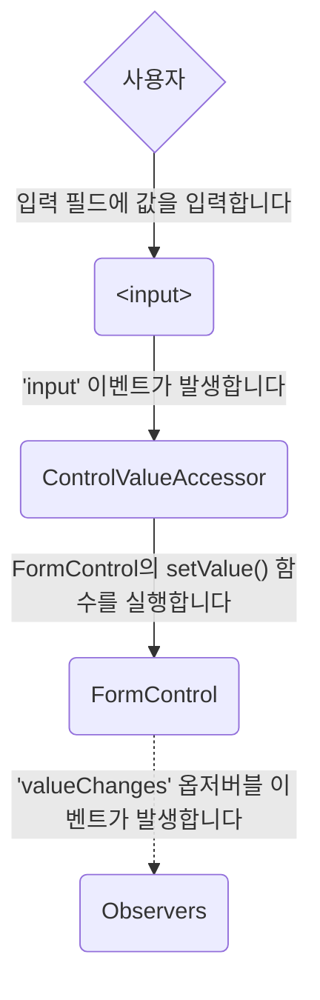
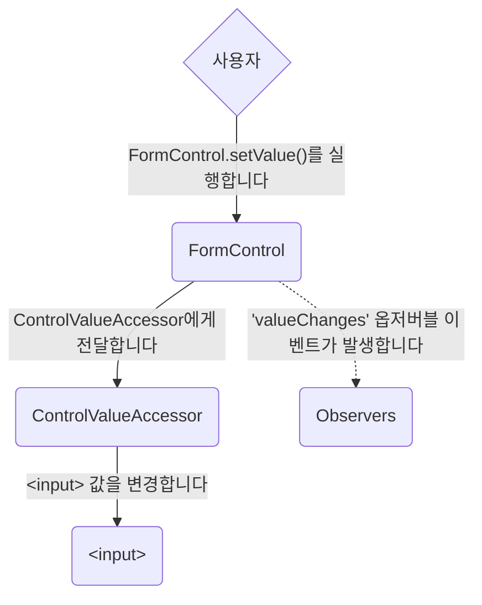
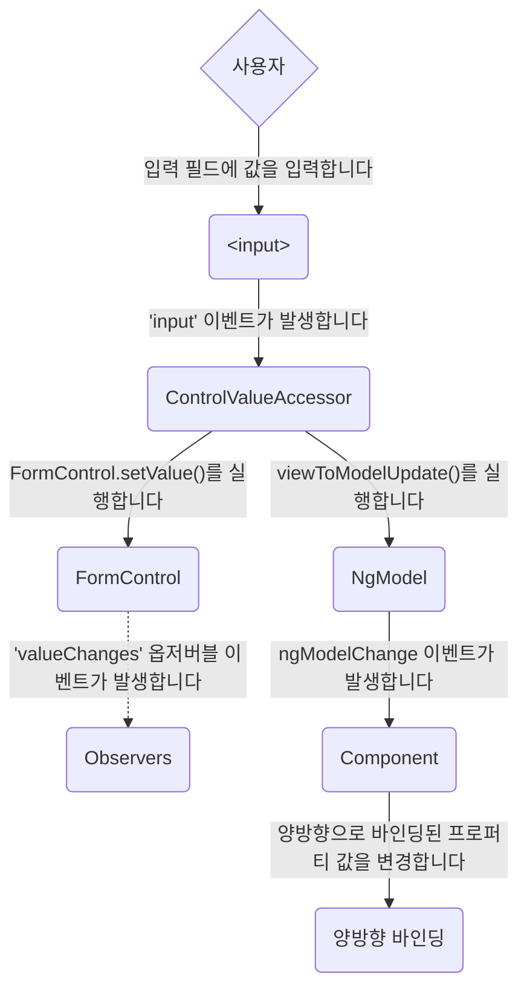
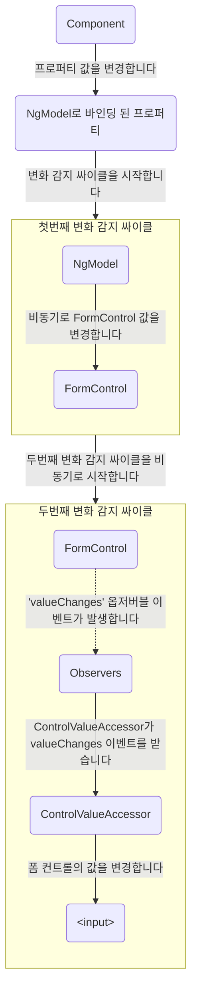

<!--
<docs-decorative-header title="Forms in Angular" imgSrc="adev/src/assets/images/overview.svg"> <!- markdownlint-disable-line ->
Handling user input with forms is the cornerstone of many common applications.
</docs-decorative-header>
-->

<docs-decorative-header title="폼" imgSrc="adev/src/assets/images/overview.svg"> <!-- markdownlint-disable-line -->
사용자 입력을 다루는 폼은 애플리케이션의 핵심요소입니다.
</docs-decorative-header>

<!--
Applications use forms to enable users to log in, to update a profile, to enter sensitive information, and to perform many other data-entry tasks.

Angular provides two different approaches to handling user input through forms: reactive and template-driven.

Both capture user input events from the view, validate the input, create a form and data model, and provide a way to track changes.

TIP: If you're looking for the new Signal Forms, check out our [essential Signal Forms guide](/essentials/signal-forms)!

This guide provides information to help you decide which type of form works best for your situation.
It introduces the common building blocks used by both approaches.
It also summarizes the key differences between the two approaches, and demonstrates those differences in the context of setup, data flow, and testing.
-->

폼은 사용자가 로그인할 때, 개인정보를 수정할 때, 추가 정보를 입력하는 등 데이터 입력이 필요한 작업에 다양하게 사용됩니다.

Angular는 반응형 폼과 템플릿 기반 폼을 기본으로 지원합니다.

두 방식 모두 뷰에서 사용자 입력 이벤트를 감지해서 유효성을 검사하고 폼과 데이터 모델을 구성하며, 변동사항이 있는지 추적합니다.

참고: 시그널 폼을 찾고 있다면 [시그널 폼 핵심](/essentials/signal-forms) 문서를 참고하세요!

이 문서는 어떤 상황에서 어떤 방식의 폼이 나은지 설명하고, 방식별 구성 요소를 소개합니다.
그리고 두 방식이 어떻게 다른지 구성방식, 데이터 흐름, 테스트 관점에서 설명합니다.

<!--
## Choosing an approach
-->

## 폼 종류 선택하기

<!--
Reactive forms and template-driven forms process and manage form data differently.
Each approach offers different advantages.

| Forms                 | Details                                                                                                                                                                                                                                                                                                                                                                                                             |
| :-------------------- | :------------------------------------------------------------------------------------------------------------------------------------------------------------------------------------------------------------------------------------------------------------------------------------------------------------------------------------------------------------------------------------------------------------------ |
| Reactive forms        | Provide direct, explicit access to the underlying form's object model. Compared to template-driven forms, they are more robust: they're more scalable, reusable, and testable. If forms are a key part of your application, or you're already using reactive patterns for building your application, use reactive forms.                                                                                            |
| Template-driven forms | Rely on directives in the template to create and manipulate the underlying object model. They are useful for adding a simple form to an app, such as an email list signup form. They're straightforward to add to an app, but they don't scale as well as reactive forms. If you have very basic form requirements and logic that can be managed solely in the template, template-driven forms could be a good fit. |
-->

반응형 폼과 템플릿 기반 폼은 폼을 처리하는 방법이나 폼 데이터를 관리하는 방식이 다릅니다.
각각의 장점을 확인해 보세요.

| 방식                                  | 설명                                                                                                                                                                                                                                                                                                         |
| :------------------------------------ | :----------------------------------------------------------------------------------------------------------------------------------------------------------------------------------------------------------------------------------------------------------------------------------------------------------- |
| 반응형 폼(Reactive forms)             | 폼 객체 모델을 명시적으로 선언하여 직접 접근합니다. 템플릿 기반 폼에 비해 직관적이고, 확장하기 쉬우며, 재사용하기 좋고, 테스트하기도 편합니다. 애플리케이션에서 폼이 차지하는 비중이 크거나, 반응형 디자인 패턴으로 애플리케이션을 구성하고 있다면, 반응형 폼을 사용하세요.                                  |
| 템플릿 기반 폼(Template-driven forms) | 객체 모델을 구성하기 위해 템플릿 안에서 디렉티브를 활용합니다. 이메일로 로그인하는 정도의 간단한 폼을 구성하는 경우에 유용합니다. 반응형 폼만큼 확장성이 좋지는 않습니다. 구성하려는 폼이 아주 단순하거나, 템플릿 안에서만으로도 유효성 검사를 할 수 있다면 템플릿 기반 폼을 선택하는 것이 나을 수 있습니다. |

<!--
### Key differences
-->

### 차이점

<!--
The following table summarizes the key differences between reactive and template-driven forms.

|                                                   | Reactive                             | Template-driven                 |
| :------------------------------------------------ | :----------------------------------- | :------------------------------ |
| [Setup of form model](#setting-up-the-form-model) | Explicit, created in component class | Implicit, created by directives |
| [Data model](#mutability-of-the-data-model)       | Structured and immutable             | Unstructured and mutable        |
| [Data flow](#data-flow-in-forms)                  | Synchronous                          | Asynchronous                    |
| [Form validation](#form-validation)               | Functions                            | Directives                      |
-->

반응형 폼과 템플릿 기반 폼은 이런 점이 다릅니다.

|                                              | 반응형 폼                              | 템플릿 기반 폼                               |
| :------------------------------------------- | :------------------------------------- | :------------------------------------------- |
| [폼 모델 구성](#setting-up-the-form-model)   | 컴포넌트 클래스에서 명시적으로 선언    | 디렉티브로 묵시적 선언                       |
| [데이터 모델](#mutability-of-the-data-model) | 구조가 명확하며 바뀌지 않음(immutable) | 구조가 명확하지 않으며 바뀔 수 있음(mutable) |
| [데이터 흐름](#data-flow-in-forms)           | 동기                                   | 비동기                                       |
| [유효성 검사](#form-validation)              | 함수                                   | 디렉티므                                     |

<!--
### Scalability
-->

### 확장성

<!--
If forms are a central part of your application, scalability is very important.
Being able to reuse form models across components is critical.

Reactive forms are more scalable than template-driven forms.
They provide direct access to the underlying form API, and use [synchronous data flow](#data-flow-in-reactive-forms) between the view and the data model, which makes creating large-scale forms easier.
Reactive forms require less setup for testing, and testing does not require deep understanding of change detection to properly test form updates and validation.

Template-driven forms focus on simple scenarios and are not as reusable.
They abstract away the underlying form API, and use [asynchronous data flow](#data-flow-in-template-driven-forms) between the view and the data model.
The abstraction of template-driven forms also affects testing.
Tests are deeply reliant on manual change detection execution to run properly, and require more setup.
-->

애플리케이션에서 폼이 중요한 요소라면, 확장성이 아주 중요합니다.
컴포넌트와 관계없이 폼 모델을 재사용할 수 있다는 점이 중요한 포인트가 될 수 있습니다.

반응형 폼은 템플릿 기반 폼보다 확장하기 쉽습니다.
폼 API를 직접 사용하며, 뷰와 데이터 모델의 [데이터 흐름이 동기](#data-flow-in-reactive-forms) 방식이기 때문에 복잡한 폼을 직관적으로 구성할 수 있습니다.
그리고 반응형 폼은 테스트할 때 설정할 것이 별로 없으며, 폼 값이 변경되거나 유효성 검사가 진행되는 동안 변화 감지를 신경쓰지 않아도 잘 동작합니다.

템플릿 기반 폼은 간단한 경우에 주로 사용하며, 재사용하기 어렵습니다.
폼 API는 추상적이고 뷰와 데이터 모델의 [데이터 흐름은 비동기](#data-flow-in-template-driven-forms) 방식입니다.
템플릿 기반 폼의 추상적인 특성은 테스트에도 영향을 줍니다.
폼을 정상적으로 테스트하려면 변화 감지를 수동으로 실행해야 하고, 반응형 폼보다 설정해야 할 것도 많습니다.

<a id="setting-up-the-form-model"/>
<!--
## Setting up the form model
-->

## 폼 모델 구성하기

<!--
Both reactive and template-driven forms track value changes between the form input elements that users interact with and the form data in your component model.
The two approaches share underlying building blocks, but differ in how you create and manage the common form-control instances.
-->

반응형 폼과 템플릿 기반 폼은 모두 사용자가 입력하는 폼 입력 엘리먼트와 컴포넌트에 있는 폼 데이터를 연결한다는 점에서 비슷합니다.
하지만, 폼 컨트롤 인스턴스를 어떻게 생성하고 관리하는지는 다릅니다.

<!--
### Common form foundation classes
-->

### 폼을 구성하는 클래스

<!--
Both reactive and template-driven forms are built on the following base classes.

| Base classes           | Details                                                                             |
| :--------------------- | :---------------------------------------------------------------------------------- |
| `FormControl`          | Tracks the value and validation status of an individual form control.               |
| `FormGroup`            | Tracks the same values and status for a collection of form controls.                |
| `FormArray`            | Tracks the same values and status for an array of form controls.                    |
| `ControlValueAccessor` | Creates a bridge between Angular `FormControl` instances and built-in DOM elements. |
-->

반응형 폼과 템플릿 기반 폼 모두 아래 클래스를 기반으로 구성됩니다.

| 클래스                 | 설명                                                             |
| :--------------------- | :--------------------------------------------------------------- |
| `FormControl`          | 개별 폼 컨트롤의 값과 유효성 상태를 추적합니다.                  |
| `FormGroup`            | 폼 컨트롤 묶음의 값과 유효성 상태를 추적합니다.                  |
| `FormArray`            | 폼 컨트롤 배열의 값과 유효성 상태를 추적합니다.                  |
| `ControlValueAccessor` | Angular `FormControl` 인스턴스와 표준 DOM 엘리먼트를 연결합니다. |

<!--
### Setup in reactive forms
-->

### 반응형 폼 구성하기

<!--
With reactive forms, you define the form model directly in the component class.
The `[formControl]` directive links the explicitly created `FormControl` instance to a specific form element in the view, using an internal value accessor.

The following component implements an input field for a single control, using reactive forms.
In this example, the form model is the `FormControl` instance.

<docs-code language="angular-ts" path="adev/src/content/examples/forms-overview/src/app/reactive/favorite-color/favorite-color.component.ts"/>

IMPORTANT: In reactive forms, the form model is the source of truth; it provides the value and status of the form element at any given point in time, through the `[formControl]` directive on the `<input>` element.
-->

반응형 폼을 사용하는 경우에는 컴포넌트 클래스에 폼 모델을 직접 정의하면 됩니다.
그리고 템플릿에서 `[formControl]` 디렉티브를 사용하면 `FormControl` 인스턴스와 폼 엘리먼트를 연결할 수 있습니다.

아래 컴포넌트 코드를 보면, 반응형 폼 방식으로 입력 필드가 하나 있습니다.
폼 모델은 `FormControl` 인스턴스입니다.

<docs-code language="angular-ts" path="adev/src/content/examples/forms-overview/src/app/reactive/favorite-color/favorite-color.component.ts"/>

중요: 반응형 폼에서는 폼 모델이 원장입니다. 이 폼 모델은 `<input>` 엘리먼트에 `[formControl]` 디렉티브로 연결해서 값을 반영하거나 유효성 검사 상태를 표현할 수 있습니다.

<!--
### Setup in template-driven forms
-->

### 템플릿 기반 폼 구성하기

<!--
In template-driven forms, the form model is implicit, rather than explicit.
The directive `NgModel` creates and manages a `FormControl` instance for a given form element.

The following component implements the same input field for a single control, using template-driven forms.

<docs-code language="angular-ts" path="adev/src/content/examples/forms-overview/src/app/template/favorite-color/favorite-color.component.ts"/>

IMPORTANT: In a template-driven form, the source of truth is the template. The `NgModel` directive automatically manages the `FormControl` instance for you.
-->

템플릿 기반 폼을 사용하는 경우에는 폼 모델을 명시적으로 선언하지 않습니다.
폼 엘리먼트에 `NgModel` 디렉티브를 사용하면 이 디렉티브가 `FormControl` 인스턴스를 생성하고 관리합니다.

아래 컴포넌트 코드를 보면, 위에서 본 코드와 마찬가지로 템플릿 기반 폼으로 입력 필드 하나가 있습니다.

<docs-code language="angular-ts" path="adev/src/content/examples/forms-overview/src/app/template/favorite-color/favorite-color.component.ts"/>

중요: 템플릿 폼에서는 템플릿이 원장입니다. `FormControl` 인스턴스는 `NgModel` 디렉티브가 자동으로 관리합니다.

<a id="data-flow-in-forms"></a>

<!--
## Data flow in forms
-->

## 데이터 흐름

<!--
When an application contains a form, Angular must keep the view in sync with the component model and the component model in sync with the view.
As users change values and make selections through the view, the new values must be reflected in the data model.
Similarly, when the program logic changes values in the data model, those values must be reflected in the view.

Reactive and template-driven forms differ in how they handle data flowing from the user or from programmatic changes.
The following diagrams illustrate both kinds of data flow for each type of form, using the favorite-color input field defined above.
-->

애플리케이션에 폼이 있다면 화면에서 변경된 사항을 컴포넌트 모델에 반영해야 하고, 컴포넌트 모델에서 변경된 사항을 화면에 반영해야 합니다.
화면에서 사용자가 무언가 입력하거나 선택하면, 새로운 값이 데이터 모델에 반영되어야 한다는 뜻입니다.
비슷하게, 어떤 로직으로 데이터 모델의 값이 변경되었다면 이 값은 화면에 반영되어야 합니다.

반응형 폼이나 템플릿 기반 폼은 사용자가 입력한 것과 로직으로 데이터를 처리하는 방식이 다릅니다.
아래 다이어그램을 보면서 어떻게 진행되는지 확인해 봅시다.

<a id="data-flow-in-reactive-forms"></a>

<!--
### Data flow in reactive forms
-->

### 반응형 폼의 데이터 흐름

<!--
In reactive forms, each form element in the view is directly linked to the form model (a `FormControl` instance).
Updates from the view to the model and from the model to the view are synchronous and do not depend on how the UI is rendered.

The view-to-model diagram shows how data flows when an input field's value is changed from the view through the following steps:

1. The user types a value into the input element, in this case the favorite color _Blue_.
1. The form input element emits an "input" event with the latest value.
1. The `ControlValueAccessor` listening for events on the form input element immediately relays the new value to the `FormControl` instance.
1. The `FormControl` instance emits the new value through the `valueChanges` observable.
1. Any subscribers to the `valueChanges` observable receive the new value.

```mermaid
flowchart TB
    U{User}
    I("&lt;input&gt;")
    CVA(ControlValueAccessor)
    FC(FormControl)
    O(Observers)
    U->|Types in the input box|I
    I->|Fires the 'input' event|CVA
    CVA->|"Calls setValue() on the FormControl"|FC
    FC-.->|Fires a 'valueChanges' event to observers|O
```

The model-to-view diagram shows how a programmatic change to the model is propagated to the view through the following steps.

1. The user calls the `favoriteColorControl.setValue()` method, which updates the `FormControl` value.
1. The `FormControl` instance emits the new value through the `valueChanges` observable.
1. Any subscribers to the `valueChanges` observable receive the new value.
1. The control value accessor on the form input element updates the element with the new value.

```mermaid
flowchart TB
    U{User}
    I("&lt;input&gt;")
    CVA(ControlValueAccessor)
    FC(FormControl)
    O(Observers)
    U->|"Calls setValue() on the FormControl"|FC
    FC->|Notifies the ControlValueAccessor|CVA
    FC-.->|Fires a 'valueChanges' event to observers|O
    CVA->|"Updates the value of the &lt;input&gt;"|I
```
-->

반응형 폼 방식에서는 화면에 있는 개별 폼 엘리먼트가 `FormControl` 인스턴스 폼 모델에 직접 연결됩니다.
화면에서 변경된 사항이 폼 모델에 반영되고, 폼 모델이 변경되었을 때 화면이 변경되는 것은 동기 방식으로 동작하며, 화면이 어떻게 렌더링되었는지는 영향을 받지 않습니다.

화면에서 입력 필드 값이 변경되었을 때 모델로 전달되는 단계는 이렇습니다:

1. 입력 엘리먼트에 값을 입력합니다. 이 경우에는 _Blue_ 를 입력했다고 합시다.
1. 폼 입력 엘리먼트가 "input" 이벤트를 발생시키고, 이 이벤트 객체에 마지막 값을 함께 전달합니다.
1. `ControlValueAccessor` 가 이벤트를 감지하면 `FormControl` 인스턴스에 새 값을 전달합니다.
1. `FormControl` 인스턴스가 새로 변경된 값으로 `valueChanges` 옵저버블에 새 값을 전달합니다.
1. `valueChanges` 옵저버블 구독자들이 새 값을 받습니다.



그리고 로직으로 폼 모델 값이 변경되었을 때 화면에 반영되는 단계는 이렇습니다.

1. 사용자가 `favoriteColorControl.setValue()` 메서드를 실행하면서 `FormControl` 값을 변경합니다.
1. `FormControl` 인스턴스가 `valueChanges` 옵저버블로 새 값을 전달합니다.
1. `valueChanges` 옵저버블 구독자들이 새 값을 받습니다.
1. 폼 입력 엘리먼트와 연결된 컨트롤 값 접근자(control value accessor)가 새 값을 엘리먼트에 반영합니다.



<a id="data-flow-in-template-driven-forms"></a>

<!--
### Data flow in template-driven forms
-->

### 템플릿 기반 폼의 데이터 흐름

<!--
In template-driven forms, each form element is linked to a directive that manages the form model internally.

The view-to-model diagram shows how data flows when an input field's value is changed from the view through the following steps.

1. The user types _Blue_ into the input element.
1. The input element emits an "input" event with the value _Blue_.
1. The control value accessor attached to the input triggers the `setValue()` method on the `FormControl` instance.
1. The `FormControl` instance emits the new value through the `valueChanges` observable.
1. Any subscribers to the `valueChanges` observable receive the new value.
1. The control value accessor also calls the `NgModel.viewToModelUpdate()` method which emits an `ngModelChange` event.
1. Because the component template uses two-way data binding for the `favoriteColor` property, the `favoriteColor` property in the component is updated to the value emitted by the `ngModelChange` event \(_Blue_\).

```mermaid
flowchart TB
    U{User}
    I("&lt;input&gt;")
    CVA(ControlValueAccessor)
    FC(FormControl)
    M(NgModel)
    O(Observers)
    C(Component)
    P(Two-way binding)
    U->|Types in the input box|I
    I->|Fires the 'input' event|CVA
    CVA->|"Calls setValue() on the FormControl"|FC
    FC-.->|Fires a 'valueChanges' event to observers|O
    CVA->|"Calls viewToModelUpdate()"|M
    M->|Emits an ngModelChange event|C
    C->|Updates the value of the two-way bound property|P
```

The model-to-view diagram shows how data flows from model to view when the `favoriteColor` changes from _Blue_ to _Red_, through the following steps

1. The `favoriteColor` value is updated in the component.
1. Change detection begins.
1. During change detection, the `ngOnChanges` lifecycle hook is called on the `NgModel` directive instance because the value of one of its inputs has changed.
1. The `ngOnChanges()` method queues an async task to set the value for the internal `FormControl` instance.
1. Change detection completes.
1. On the next tick, the task to set the `FormControl` instance value is executed.
1. The `FormControl` instance emits the latest value through the `valueChanges` observable.
1. Any subscribers to the `valueChanges` observable receive the new value.
1. The control value accessor updates the form input element in the view with the latest `favoriteColor` value.

```mermaid
flowchart TB
    C(Component)
    P(Property bound to NgModel)
    C->|Updates the property value|P
    P->|Triggers CD|CD1


    subgraph CD1 [First Change Detection]
        direction TB
        M(NgModel)
        FC(FormControl)

        M->|Asynchronously sets FormControl value|FC
    end
    CD1->|Async actions trigger a second round of Change Detection|CD2

    subgraph CD2 [Second Change Detection]
        direction TB
        FC2(FormControl)
        O(Observers)
        CVA(ControlValueAccessor)
        I("&lt;input&gt;")
        FC2-.->|Fires a 'valueChanges' event to observers|O
        O->|ControlValueAccessor receives valueChanges event|CVA
        CVA->|Sets the value in the control|I
    end
```

NOTE: `NgModel` triggers a second change detection to avoid `ExpressionChangedAfterItHasBeenChecked` errors, because the value change originates in an input binding.
-->

템플릿 기반 폼에서는 개별 폼 엘리먼트마다 연결된 디렉티브가 폼 모델을 내부적으로 관리합니다.

화면에서 모델로 값이 전달되는 과정은 이렇습니다.

1. 사용자가 입력 엘리먼트에 _Blue_ 라고 입력합니다.
1. 입력 엘리먼트에서 "input" 이벤트가 발생합니다.
1. 입력 엘리먼트에 연결된 컨트롤 값 접근자(control value accessor)가 `FormControl` 인스턴스의 `setValue()` 메서드를 실행합니다.
1. `FormControl` 인스턴스가 `valueChanges` 옵저버블 이벤트로 새 값을 전달합니다.
1. `valueChanges` 옵저버블 구독자가 새 값을 받습니다.
1. 컨트롤 값 접근자는 `NgModel.viewToModelUpdate()` 메서드를 실행하면서 `ngModelChange` 이벤트도 함께 발생합니다.
1. `favoriteColor` 프로퍼티는 컴포넌트 템플릿에서 양방향 바인딩되었기 때문에, 컴포넌트의 `favoriteColor` 프로퍼티 값은 `ngModelChange`에 반응하여 새 값(_Blue_)으로 변경됩니다.



`favoriteColor` 프로퍼티 값이 _Blue_ 에서 _Red_ 로 변경될 때 모델에서 화면으로 값이 전달되는 과정은 이렇습니다.

1. 컴포넌트에서 `favoriteColor` 값이 변경됩니다.
1. 변화 감지 싸이클이 시작됩니다.
1. 입력값이 변경되었기 때문에 `ngModel` 디렉티브의 `ngOnChanges` 라이프싸이클 후킹 함수가 실행됩니다.
1. 내부 `FormControl` 인스턴스의 값을 변경하는 ngOnChanges()` 메서드가 비동기 태스크 큐에 추가됩니다.
1. 변화 감지 싸이클이 종료됩니다.
1. 다음 틱(tick)에 `FormControl` 인스턴스의 값을 변경합니다.
1. `FormControl` 인스턴스가 `valueChanges` 옵저버블 이벤트를 보냅니다.
1. `valueChanges` 옵저버블 구독자가 새 값을 받습니다.
1. 컨트롤 값 접근자가 화면에 있는 폼 입력 엘리먼트의 값을 변경합니다.



참고: `NgModel`은 `ExpressionChangedAfterItHasBeenChecked` 에러를 방지하기 위해 변화 감지 싸이클을 분리합니다.

<a id="mutability-of-the-data-model"></a>

<!--
### Mutability of the data model
-->

### 데이터 모델의 불변성

<!--
The change-tracking method plays a role in the efficiency of your application.

| Forms                 | Details                                                                                                                                                                                                                                                                                                                                                                                                                                                                                                                                  |
| :-------------------- | :--------------------------------------------------------------------------------------------------------------------------------------------------------------------------------------------------------------------------------------------------------------------------------------------------------------------------------------------------------------------------------------------------------------------------------------------------------------------------------------------------------------------------------------- |
| Reactive forms        | Keep the data model pure by providing it as an immutable data structure. Each time a change is triggered on the data model, the `FormControl` instance returns a new data model rather than updating the existing data model. This gives you the ability to track unique changes to the data model through the control's observable. Change detection is more efficient because it only needs to update on unique changes. Because data updates follow reactive patterns, you can integrate with observable operators to transform data. |
| Template-driven forms | Rely on mutability with two-way data binding to update the data model in the component as changes are made in the template. Because there are no unique changes to track on the data model when using two-way data binding, change detection is less efficient at determining when updates are required.                                                                                                                                                                                                                                 |

The difference is demonstrated in the previous examples that use the favorite-color input element.

- With reactive forms, the **`FormControl` instance** always returns a new value when the control's value is updated
- With template-driven forms, the **favorite color property** is always modified to its new value
-->

변화 감지 싸이클은 효율적으로 동작합니다.

| 방식           | 설명                                                                                                                                                                                                                                                                                                                                                   |
| :------------- | :----------------------------------------------------------------------------------------------------------------------------------------------------------------------------------------------------------------------------------------------------------------------------------------------------------------------------------------------------- |
| 반응형 폼      | 데이터 모델을 이뮤터블로 유지합니다. 변화 감지 싸이클이 실행될 때마다 `FormControl` 인스턴스가 기존 데이터 모델은 폐기하고 새로운 데이터 모델을 반환합니다. 그래서 컨트롤의 옵저버블을 통해 어떤 값이 변경되었는지 명확하게 확인할 수 있기 때문에, 변화 감지도 더 효율적으로 동작합니다. 변경되는 값을 옵저버블로 받으면 데이터를 가공하기도 좋습니다. |
| 템플릿 기반 폼 | 템플릿에서 값이 변경되면 양방향 바인딩 된 객체의 값을 변경합니다. 왜냐하면, 양방향 데이터 바인딩 한 경우에는 데이터 모델이 그대로 유지되기 때문이며, 그래서 값이 실제로 변경되어 화면에 반영해야 하는지 판단해야 하기 때문에 변화 감지 효율이 약간 떨어집니다.                                                                                         |

위에서 살펴본 예제로 다른 점을 설명해보면 이렇습니다.

- 반응형 폼에서는, **`FormControl` 인스턴스**가 언제나 새 값을 반환합니다.
- 템플릿 기반 폼에서는 **favorite 프로퍼티** 의 값이 변경됩니다.

<a id="form-validation"></a>

<!--
## Form validation
-->

## 폼 유효성 검사

<!--
Validation is an integral part of managing any set of forms.
Whether you're checking for required fields or querying an external API for an existing username, Angular provides a set of built-in validators as well as the ability to create custom validators.

| Forms                 | Details                                                                                                      |
| :-------------------- | :----------------------------------------------------------------------------------------------------------- |
| Reactive forms        | Define custom validators as **functions** that receive a control to validate                                 |
| Template-driven forms | Tied to template **directives**, and must provide custom validator directives that wrap validation functions |

For more information, see [Form Validation](guide/forms/form-validation#validating-input-in-reactive-forms).
-->

유효성 검사는 폼 전체를 다루는 부분입니다.
필수 입력 필드를 입력했는지 검사하거나, 외부 API를 활용해서 중복된 이름을 사용하지 않았는지 검사할 수 있고, Angular가 다양한 유효성 검사 함수를 제공하지만, 원하는 로직으로 커스텀 유효성 검사 함수를 만들 수도 있습니다.

| 방식           | 설명                                                                                   |
| :------------- | :------------------------------------------------------------------------------------- |
| 반응형 폼      | 폼 컨트롤을 인자로 받는 **함수** 로 커스텀 유효성 검사 함수를 정의합니다               |
| 템플릿 기반 폼 | 템플릿 **디렉티브** 에서 처리하거나, 유효성 검사 함수를 디렉티브로 랩핑해서 정의합니다 |

자세한 내용은 [폼 유효성 검사](guide/forms/form-validation#validating-input-in-reactive-forms) 문서를 참고하세요.

<!--
## Testing
-->

## 테스트

<!--
Testing plays a large part in complex applications.
A simpler testing strategy is useful when validating that your forms function correctly.
Reactive forms and template-driven forms have different levels of reliance on rendering the UI to perform assertions based on form control and form field changes.
The following examples demonstrate the process of testing forms with reactive and template-driven forms.
-->

테스트는 복잡한 애플리케이션일수록 중요합니다.
가장 간단하게는, 폼 기능이 제대로 동작하는지 검사할 수 있습니다.
반응형 폼이나 템플릿 기반 폼은 폼 컨트롤과 폼 필드의 변경사항을 감지하는 방식이 다르기 때문에 UI 렌더링에 의존하는 정도가 다릅니다.
아래 예제를 보면서 반응형 폼과 템플릿 기반 폼을 어떻게 테스트 할 수 있을지 알아봅시다.

<!--
### Testing reactive forms
-->

### 반응형 폼 테스트

<!--
Reactive forms provide a relatively straightforward testing strategy because they provide synchronous access to the form and data models, and they can be tested without rendering the UI.
In these tests, status and data are queried and manipulated through the control without interacting with the change detection cycle.

The following tests use the favorite-color components from previous examples to verify the view-to-model and model-to-view data flows for a reactive form.
-->

<!--todo: make consistent with other topics -->

반응형 폼은 폼과 데이터 모델이 동기 방식으로 동작하기 때문에 테스트 코드를 작성하기 간편하며, UI를 렌더링하지 않아도 테스트를 실행할 수 있습니다.
폼 컨트롤의 상태를 확인하거나 값을 변경하는 것은 모두 변화 감지 싸이클을 고려하지 않아도 됩니다.

위에서 살펴본 예제로 화면에서 모델로, 모델에서 화면으로 값이 잘 전달되는지 테스트 해봅시다.

<!--
#### Verifying view-to-model data flow
-->

#### 화면 - 모델 데이터 흐름 검증하기

<!--
The first example performs the following steps to verify the view-to-model data flow.

1. Query the view for the form input element, and create a custom "input" event for the test.
1. Set the new value for the input to _Red_, and dispatch the "input" event on the form input element.
1. Assert that the component's `favoriteColorControl` value matches the value from the input.

<docs-code header="Favorite color test - view to model" path="adev/src/content/examples/forms-overview/src/app/reactive/favorite-color/favorite-color.component.spec.ts" region="view-to-model"/>

The next example performs the following steps to verify the model-to-view data flow.

1. Use the `favoriteColorControl`, a `FormControl` instance, to set the new value.
1. Query the view for the form input element.
1. Assert that the new value set on the control matches the value in the input.

<docs-code header="Favorite color test - model to view" path="adev/src/content/examples/forms-overview/src/app/reactive/favorite-color/favorite-color.component.spec.ts" region="model-to-view"/>
-->

The first example performs the following steps to verify the view-to-model data flow.

1. 폼 입력 엘리먼트를 참조하고 커스텀 "input" 이벤트를 만듭니다.
1. _Red_ 라고 새 값을 설정하고, "input" 이벤트를 발생시킵니다.
1. 컴포넌트의 `favoriteColorControl` 프로퍼티 값이 입력 엘리먼트 값과 같은지 검사합니다.

<docs-code header="선호 색상 테스트 - 화면에서 모델로" path="adev/src/content/examples/forms-overview/src/app/reactive/favorite-color/favorite-color.component.spec.ts" region="view-to-model"/>

다음 예제는 모델에서 화면으로 데이터가 제대로 전달되는지 검사해 봅시다.

1. `favoriteColorControl`, `FormControl` 인스턴스로 새 값을 설정합니다.
1. 폼 입력 엘리먼트를 참조합니다.
1. 입력 엘리먼트에 새 값이 반영되었는지 검사합니다.

<docs-code header="선호 색상 테스트 - 모델에서 화면으로" path="adev/src/content/examples/forms-overview/src/app/reactive/favorite-color/favorite-color.component.spec.ts" region="model-to-view"/>

<!--
### Testing template-driven forms
-->

### 템플릿 기반 폼 테스트하기

<!--
Writing tests with template-driven forms requires a detailed knowledge of the change detection process and an understanding of how directives run on each cycle to ensure that elements are queried, tested, or changed at the correct time.

The following tests use the favorite color components mentioned earlier to verify the data flows from view to model and model to view for a template-driven form.

The following test verifies the data flow from view to model.

<docs-code header="Favorite color test - view to model" path="adev/src/content/examples/forms-overview/src/app/template/favorite-color/favorite-color.component.spec.ts" region="view-to-model"/>

Here are the steps performed in the view to model test.

1. Query the view for the form input element, and create a custom "input" event for the test.
1. Set the new value for the input to _Red_, and dispatch the "input" event on the form input element.
1. Run change detection through the test fixture.
1. Assert that the component `favoriteColor` property value matches the value from the input.

The following test verifies the data flow from model to view.

<docs-code header="Favorite color test - model to view" path="adev/src/content/examples/forms-overview/src/app/template/favorite-color/favorite-color.component.spec.ts" region="model-to-view"/>

Here are the steps performed in the model to view test.

1. Use the component instance to set the value of the `favoriteColor` property.
1. Run change detection through the test fixture.
1. Use `await fixture.whenStable()` to wait for the next rendering.
1. Query the view for the form input element.
1. Assert that the input value matches the value of the `favoriteColor` property in the component instance.
-->

템플릿 기반의 폼을 테스트하려면 변화 감지가 어떻게 실행되는지 확실하게 알아야 하며, 엘리먼트를 참조하고, 테스트하고, 변화를 감지하기 위해 개별 변화 감지 싸이클을 어떻게 활용해야 하는지 이해해야 합니다.

아래 예제 코드는 이전에 살펴본 선호 색상 컴포넌트에서 데이터가 화면에서 모델로, 모델에서 화면으로 제대로 전달되는지 테스트하는 코드입니다.

화면에서 모델로 전달되는 것부터 검사해 봅시다.

<docs-code header="선호 색상 테스트 - 화면에서 모델로" path="adev/src/content/examples/forms-overview/src/app/template/favorite-color/favorite-color.component.spec.ts" region="view-to-model"/>

화면에서 모델로 전달되는 것은 이런 순서로 테스트합니다.

1. 폼 입력 엘리먼트를 쿼리하고 커스텀 "input" 이벤트를 만듭니다.
1. 이벤트에 새 값으로 _Red_ 를 설정하고 폼 입력 엘리먼트로 "input" 이벤트를 보냅니다.
1. 테스트 픽스쳐로 변화 감지 싸이클을 실행합니다.
1. 컴포넌트의 `favoriteColor` 프로퍼티 값이 입력 엘리먼트와 같은지 검사합니다.

이제 모델에서 화면으로 전달되는 데이터를 검사해 봅시다.

<docs-code header="선호 색상 테스트 - 모델에서 화면으로" path="adev/src/content/examples/forms-overview/src/app/template/favorite-color/favorite-color.component.spec.ts" region="model-to-view"/>

이런 순서로 테스트합니다.

1. 컴포넌트 인스턴스로 `favoriteColor` 프로퍼티 값을 설정합니다.
1. 테스트 픽스쳐로 변화 감지 싸이클을 실행합니다.
1. 다음 렌더링까지 기다리기 위해 `await fixture.whenStable()` 를 실행합니다.
1. 폼 입력 엘리먼트를 참조합니다.
1. 엘리먼트의 값이 컴포넌트 인스턴스의 `favoriteColor` 프로퍼티 값과 같은지 검사합니다.

<!--
## Next steps
-->

## 다음 단계

<!--
To learn more about reactive forms, see the following guides:

<docs-pill-row>
  <docs-pill href="guide/forms/reactive-forms" title="Reactive forms"/>
  <docs-pill href="guide/forms/form-validation#validating-input-in-reactive-forms" title="Form validation"/>
  <docs-pill href="guide/forms/dynamic-forms" title="Dynamic forms"/>
</docs-pill-row>

To learn more about template-driven forms, see the following guides:

<docs-pill-row>
  <docs-pill href="guide/forms/template-driven-forms" title="Template Driven Forms tutorial" />
  <docs-pill href="guide/forms/form-validation#validating-input-in-template-driven-forms" title="Form validation" />
  <docs-pill href="api/forms/NgForm" title="NgForm directive API reference" />
</docs-pill-row>
-->

반응형 폼을 더 알아보려면 이 문서들을 확인해 보세요:

<docs-pill-row>
  <docs-pill href="guide/forms/reactive-forms" title="반응형 폼"/>
  <docs-pill href="guide/forms/form-validation#validating-input-in-reactive-forms" title="유효성 검사"/>
  <docs-pill href="guide/forms/dynamic-forms" title="동적 폼"/>
</docs-pill-row>

템플릿 기반 폼을 더 알아보려면 이 문서들을 확인해 보세요:

<docs-pill-row>
  <docs-pill href="guide/forms/template-driven-forms" title="템플릿 기반 폼 튜토리얼" />
  <docs-pill href="guide/forms/form-validation#validating-input-in-template-driven-forms" title="유효성 검사" />
  <docs-pill href="api/forms/NgForm" title="NgForm 디렉티브 API" />
</docs-pill-row>
