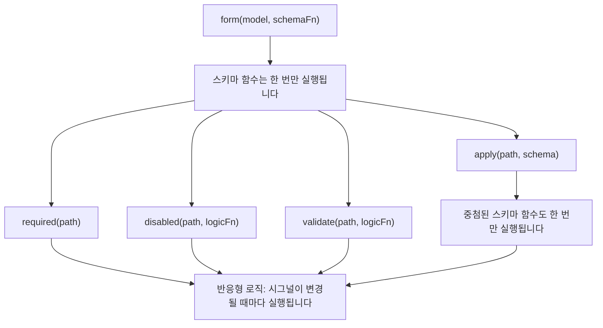

<!--
# Schemas and schema composability
-->

# 스키마, 스키마 결합

<!--
Signal Forms uses a two-layer architecture to separate _how your form is structured_ from _how it behaves at runtime_.

When you pass a schema function to `form()`, that function _runs once_ during form creation. Its job is to set up the form's logic tree by declaring which fields have validation, which fields are disabled, and which fields depend on other fields. This is the **structural layer** of your form.

Inside a schema function, you call rule functions such as `disabled()` and `validate()`. These rule functions accept reactive logic that recomputes whenever the signals they reference change. Conditional rules like `disabled()` and `required()` accept optional configuration, including a `when` function that activates the rule. Together, these form the **behavioral layer** of your form during runtime.

```ts
contactForm = form(this.contactModel, (schemaPath) => {
  // Schema function: runs ONCE during form creation
  required(schemaPath.name);
  disabled(schemaPath.couponCode, {when: ({valueOf}) => valueOf(schemaPath.total) < 50});
  //  ^^^ Reactive logic: recomputes when total changes
});
```

```mermaid
graph TD
    A["form(model, schemaFn)"] -> B["Schema function runs ONCE"]
    B -> C["required(path)"]
    B -> D["disabled(path, logicFn)"]
    B -> E["validate(path, logicFn)"]
    B -> F["apply(path, schema)"]
    C -> G["Reactive: recomputes on signal change"]
    D -> G
    E -> G
    F -> B2["Nested schema function runs ONCE"]
    B2 -> G
```

This distinction is important when you compose schemas because functions like `apply()`, `applyWhen()`, and `schema()` all operate at the structural layer. Schemas control _which_ rules exist and _whether_ they're active, while rule functions define _what_ those rules evaluate.
-->

시그널 폼은 _폼이 어떻게 구성되는지_ 와 _어떻게 실행되는지_ 두 계층을 분리하는 구조로 설계되었습니다.

스키마 함수를 `form()` 인자로 전달하면, 스키마 함수는 폼을 생성하면서 _한 번만_ 실행됩니다.
스키마 함수의 역할은 어떤 필드가 어떤 유효성 검사를 해야 하는지, 어떤 필드가 비활성화되는지, 어떤 필드가 다른 필드에 영향을 받는지 등 폼의 로직 트리를 구성하는 것입니다.
이 계층이 폼의 **구조 계층(structural layer)** 입니다.

스키마 함수 안으로 들어가면, `disabled()`나 `validate()`와 같은 규칙 함수를 실행할 수 있습니다.
이런 규칙 함수들은 참조 필드의 값이 변경되었을 때마다 다시 실행되는 반응형 로직을 인자로 받습니다.
`disabled()`나 `required()`와 같은 조건부 규칙은 옵션을 지정할 수 있기 때문에, 해당 조건을 지정하기 위해 `when` 함수를 추가할 수도 있습니다.
이렇게 규칙을 지정하는 것은 폼이 실행시점에 어떻게 동작할 지 **동작 계층(behavioral layer)** 을 지정하는 것입니다.

```ts
contactForm = form(this.contactModel, (schemaPath) => {
  // 스키마 함수: 폼을 생성할 때 한 번 실행됩니다.
  required(schemaPath.name);
  disabled(schemaPath.couponCode, {when: ({valueOf}) => valueOf(schemaPath.total) < 50});
  //  ^^^ 반응형 로직: total 값이 변경될 때마다 다시 계산합니다.
});
```



스키마를 구성할 때 이런 구분은 중요합니다.
`apply()`, `applyWhen()`, `schema()`와 같은 함수는 모두 구조 계층에서 동작하기 때문입니다.
스키마는 _어떤_ 규칙이 존재하는지, 규칙이 활성화되었는지 _여부_ 를 조작하는 한편, 규칙 함수는 해당 규칙이 *무엇*을 평가하는지 정의합니다.

<!--
## Create reusable schemas with `schema()`
-->

## 스키마 재사용하기: `schema()`

<!--
When multiple forms share the same rules for a common data shape, you can use the `schema()` function to extract those rules into a reusable schema.

```ts
import {schema, required, minLength} from '@angular/forms/signals';

const nameSchema = schema<{first: string; last: string}>((name) => {
  required(name.first);
  required(name.last);
  minLength(name.first, 2);
  minLength(name.last, 2);
});
```

The `schema()` function wraps a function and converts it into a reusable `Schema<T>` object. Like any schema function, it _runs once_ per form, but the object itself can be shared across as many forms as you need.

TIP: If rules only appear in one place, an inline schema function works just as well. Use `schema()` when you want to reuse the same schema across multiple forms or apply the same schema to multiple paths. Reusable `Schema` objects are cached per form compilation.
-->

폼이 여러개인데 다루는 데이터 모양이 같고 유효성 검사 규칙도 같다면, 스키마를 재사용하기 위해 `schema()` 함수를 사용할 수 있습니다.

```ts
import {schema, required, minLength} from '@angular/forms/signals';

const nameSchema = schema<{first: string; last: string}>((name) => {
  required(name.first);
  required(name.last);
  minLength(name.first, 2);
  minLength(name.last, 2);
});
```

`schema()` 함수는 함수를 래핑(wrap)해서 재사용 가능한 `Schema<T>` 객체로 변환합니다.
이렇게 만든 `Schema<T>` 객체는 여러 폼에 사용할 수 있으며, 보통 스키마 함수와 마찬가지로 폼마다 _한 번씩_ 실행됩니다.

팁: 규칙이 한 곳에만 존재하는 경우, 인라인 스키마 함수를 사용해도 동일한 효과를 얻을 수 있습니다.
한 스키마를 여러 폼에 사용하거나, 여러 경로에 동일한 스키마를 적용하려면 `schema()` 함수를 사용하세요.
`Schema` 객체는 폼이 컴파일 될 때마다 캐싱됩니다.

<!--
### Using the schema with `apply()`
-->

### 스키마 적용하기: `apply()`

<!--
You can apply a reusable schema to a specific path in a form by using the `apply()` function. When you call `apply()`, the schema receives a scoped path that only sees the fields within that sub-path:

```ts
import {apply} from '@angular/forms/signals';

profileForm = form(this.profileModel, (schemaPath) => {
  apply(schemaPath.name, nameSchema);
});

registrationForm = form(this.registrationModel, (schemaPath) => {
  apply(schemaPath.name, nameSchema);
});
```
-->

`apply()` 함수를 사용하면 폼의 특정 경로에 스키마를 적용할 수 있습니다.
`apply()`를 사용할 때 스키마가 적용될 내부 필드의 경로와 스키마를 전달하면 됩니다:

```ts
import {apply} from '@angular/forms/signals';

profileForm = form(this.profileModel, (schemaPath) => {
  apply(schemaPath.name, nameSchema);
});

registrationForm = form(this.registrationModel, (schemaPath) => {
  apply(schemaPath.name, nameSchema);
});
```

<!--
## Conditional schemas with `applyWhen()`
-->

## 조건부 스키마 적용: `applyWhen()`

<!--
NOTE: The [Adding form logic guide](guide/forms/signals/form-logic) introduced `applyWhen()` for conditional rules with inline logic. This section covers how to compose `applyWhen()` with reusable schemas.

Some rules should only apply under certain conditions. For example, a zip code field might require validation only when the selected country is the United States.

The `applyWhen()` function applies a schema conditionally based on reactive state. It accepts three arguments:

1. A path to apply the schema to
1. A reactive logic function that returns `true` when the schema should be active
1. A schema or schema function containing the conditional rules

```ts
import {form, applyWhen, required, pattern} from '@angular/forms/signals';

addressForm = form(this.addressModel, (schemaPath) => {
  applyWhen(
    schemaPath,
    ({valueOf}) => valueOf(schemaPath.country) === 'US',
    (schemaPath) => {
      required(schemaPath.zipCode);
      pattern(schemaPath.zipCode, /^\d{5}(-\d{4})?$/);
    },
  );
});
```

The logic function receives a `FieldContext`, which provides access to `value`, `valueOf`, `stateOf`, and other reactive helpers. Because it's reactive, the condition is re-evaluated whenever the signals it reads change. When the condition becomes `false`, the rules inside the schema deactivate. When it becomes `true` again, they reactivate.

The schema itself is still structural — the schema function runs once during form creation. The condition controls whether those rules are _active_, not whether they _exist_.

Inside the conditional schema, use the scoped path parameter passed to that schema function. Paths from an outer schema are not valid inside a nested schema.
-->

참고: [폼 로직 추가하기](guide/forms/signals/form-logic) 문서에서는 인라인 로직을 사용하는 조건부 규칙을 다루면서 `applyWhen()`을 소개했습니다.
이번 섹션에서는 스키마를 재사용하면서 `applyWhen()`을 사용해 봅시다.

어떤 규칙은 특정 조건에서만 적용되어야 하는 경우가 있습니다.
예를 들면, 우편번호 필드는 사용자가 미국을 골랐을 때만 필요할 수 있습니다.

`applyWhen()` 함수는 상태에 반응하는 방식으로 스키마를 조건부로 적용합니다.
이 함수는 인자를 3개 받습니다:

1. 스키마가 적용될 경로
1. 스키마가 적용되는 조건이면 `true`를 반환하는 반응형 로직 함수
1. 조건부 규칙을 포함하는 스키마나 스키마 함수

```ts
import {form, applyWhen, required, pattern} from '@angular/forms/signals';

addressForm = form(this.addressModel, (schemaPath) => {
  applyWhen(
    schemaPath,
    ({valueOf}) => valueOf(schemaPath.country) === 'US',
    (schemaPath) => {
      required(schemaPath.zipCode);
      pattern(schemaPath.zipCode, /^\d{5}(-\d{4})?$/);
    },
  );
});
```

로직 함수는 `FieldContext`를 인자로 받는데, 이 인자를 통해 `value`, `valueOf`, `stateOf` 등과 같은 반응형 헬퍼를 활용할 수 있습니다.
이 헬퍼 함수들은 반응형으로 동작하기 때문에, 참조하는 시그널이 변경되면 조건을 다시 평가합니다.
조건 함수가 `false` 값을 반환하면 스키마에 포함된 규칙은 비활성화됩니다.
그리고 조건 함수가 `true`를 반환하면 스키마가 활성화됩니다.

스키마는 그 자체로 구조 역할을 하며, 폼이 생성될 때 한 번 실행됩니다.
결국 규칙이 _활성화_ 되는지 여부는 시그널이 제어하며, 규칙이 있다는 것 _자체는_ 중요하지 않습니다.

조건부 스키마 안에서는 해당 범위의 경로와 스키마 함수를 인자로 사용합니다.
스키마 안에서는 현재 스키마 밖에 있는 스키마를 참조할 수 없습니다.

<!--
### Combining `applyWhen()` with reusable schemas
-->

### 스키마 재사용 조합하기: `applyWhen()`

<!--
Since `applyWhen()` accepts a `Schema` object, you can pair it with `schema()` to conditionally apply reusable schemas:

```ts
const usZipCodeSchema = schema<{zipCode: string}>((address) => {
  required(address.zipCode);
  pattern(address.zipCode, /^\d{5}(-\d{4})?$/);
});

const caPostalCodeSchema = schema<{postalCode: string}>((address) => {
  required(address.postalCode);
  pattern(address.postalCode, /^[A-Z]\d[A-Z] \d[A-Z]\d$/);
});

shippingForm = form(this.shippingModel, (schemaPath) => {
  applyWhen(
    schemaPath.address,
    ({valueOf}) => valueOf(schemaPath.country) === 'US',
    usZipCodeSchema,
  );
  applyWhen(
    schemaPath.address,
    ({valueOf}) => valueOf(schemaPath.country) === 'CA',
    caPostalCodeSchema,
  );
});
```

NOTE: The logic function accesses `valueOf(schemaPath.country)` even though the path argument is `schemaPath.address`. This is because the `valueOf` helper can access any field in the form, not just fields within the scoped path.

This pattern keeps validation logic modular — each country's address rules live in their own schema, and the form selects which one to activate based on the user's choice.
-->

`applyWhen()` 함수는 `Schema` 객체를 인자로 받기 때문에 `schema()` 함수와 함께 사용해서 스키마를 재사용하면서 조건부로 적용할 수 있습니다:

```ts
const usZipCodeSchema = schema<{zipCode: string}>((address) => {
  required(address.zipCode);
  pattern(address.zipCode, /^\d{5}(-\d{4})?$/);
});

const caPostalCodeSchema = schema<{postalCode: string}>((address) => {
  required(address.postalCode);
  pattern(address.postalCode, /^[A-Z]\d[A-Z] \d[A-Z]\d$/);
});

shippingForm = form(this.shippingModel, (schemaPath) => {
  applyWhen(
    schemaPath.address,
    ({valueOf}) => valueOf(schemaPath.country) === 'US',
    usZipCodeSchema,
  );
  applyWhen(
    schemaPath.address,
    ({valueOf}) => valueOf(schemaPath.country) === 'CA',
    caPostalCodeSchema,
  );
});
```

참고: 경로 인자가 `schemaPath.address`지만, 로직 함수는 `valueOf(schemaPath.country)`에 접근합니다.
왜냐하면 `valueOf` 헬퍼 함수는 지정된 필드 뿐만 아니라 폼 내부의 모든 필드에 접근할 수 있기 때문딥니다.

이 패턴은 유효성 검사 로직을 모듈화하는 것입니다.
각 국가의 주소 규칙은 별도 스키마에 존재하며, 사용자가 어떤 국가를 선택하면 해당 스키마가 어떤 규칙을 활성화 할 지 결정합니다.

<!--
## Type-narrowing with `applyWhenValue()`
-->

## 타입 좁히기: `applyWhenValue()`

<!--
The `applyWhenValue()` function simplifies conditions that only need to check the field's value. Instead of receiving a `FieldContext`, the condition function receives the field's raw value directly.

```ts {header: "applyWhen — logic function receives FieldContext"}
applyWhen(schemaPath.payment, ({value}) => value().type === 'credit-card', creditCardSchema);
```

```ts {header: "applyWhenValue — condition receives the value directly"}
applyWhenValue(schemaPath.payment, (payment) => payment.type === 'credit-card', creditCardSchema);
```

The main advantage of `applyWhenValue()` is TypeScript type guard support. When the condition function is a type guard, the schema's type parameter narrows to the guarded type. This is especially useful for discriminated unions, where each variant has different fields that need different rules.

```ts
import {form, applyWhenValue, required} from '@angular/forms/signals';

interface CreditCard {
  type: 'credit-card';
  cardNumber: string;
  expiry: string;
  cvv: string;
}

interface BankTransfer {
  type: 'bank-transfer';
  accountNumber: string;
  routingNumber: string;
}

type PaymentMethod = CreditCard | BankTransfer;

function isCreditCard(value: PaymentMethod): value is CreditCard {
  return value.type === 'credit-card';
}

function isBankTransfer(value: PaymentMethod): value is BankTransfer {
  return value.type === 'bank-transfer';
}

paymentForm = form(this.paymentModel, (schemaPath) => {
  applyWhenValue(schemaPath, isCreditCard, (payment) => {
    // TypeScript knows payment is scoped to CreditCard
    required(payment.cardNumber);
    required(payment.expiry);
    required(payment.cvv);
  });

  applyWhenValue(schemaPath, isBankTransfer, (payment) => {
    // TypeScript knows payment is scoped to BankTransfer
    required(payment.accountNumber);
    required(payment.routingNumber);
  });
});
```

Without the type guard, TypeScript would not know which fields are available inside each schema function. The type narrowing ensures that accessing `payment.cardNumber` is type-safe in the credit card branch and `payment.accountNumber` is type-safe in the bank transfer branch.
-->

`applyWhenValue(0` 함수는 특정 필드의 값만 검사하는 방식으로 조건을 단순화합니다.
그래서 `FieldContext`를 인자로 받는 대신, 필드의 값을 직접 받아서 평가하는 함수를 인자로 받습니다.

```ts {header: "applyWhen — 로직 함수는 FieldContext를 인자로 받습니다"}
applyWhen(schemaPath.payment, ({value}) => value().type === 'credit-card', creditCardSchema);
```

```ts {header: "applyWhenValue — 조건 함수는 인자로 필드 값을 직접 받습니다"}
applyWhenValue(schemaPath.payment, (payment) => payment.type === 'credit-card', creditCardSchema);
```

`applyWhenValue()`는 TypeScript 타입 가드로 사용할 수 있다는 점이 가장 큰 장점입니다.
조건 함수가 타입 가드로 사용되면, 스키마의 타입 인자는 해당 가드 타입으로 좁혀집니다.
이 구조는 유니언 타입을 특정 타입으로 좁혀서 원하는 규칙만 지정하려고 할 때 특히 유용합니다.

```ts
import {form, applyWhenValue, required} from '@angular/forms/signals';

interface CreditCard {
  type: 'credit-card';
  cardNumber: string;
  expiry: string;
  cvv: string;
}

interface BankTransfer {
  type: 'bank-transfer';
  accountNumber: string;
  routingNumber: string;
}

type PaymentMethod = CreditCard | BankTransfer;

function isCreditCard(value: PaymentMethod): value is CreditCard {
  return value.type === 'credit-card';
}

function isBankTransfer(value: PaymentMethod): value is BankTransfer {
  return value.type === 'bank-transfer';
}

paymentForm = form(this.paymentModel, (schemaPath) => {
  applyWhenValue(schemaPath, isCreditCard, (payment) => {
    // TypeScript는 payment가 CreditCard 타입이라고 인식합니다.
    required(payment.cardNumber);
    required(payment.expiry);
    required(payment.cvv);
  });

  applyWhenValue(schemaPath, isBankTransfer, (payment) => {
    // TypeScript는 payment가 BankTransfer 타입라고 인식합니다.
    required(payment.accountNumber);
    required(payment.routingNumber);
  });
});
```

타입 가드를 사용하지 않으면 TypeScript는 스키마 함수 안에 어떤 필드가 있는지 알 수 없습니다.
그래서 타입을 좁혀야 신용 카드 로직에서는 `payment.cardNumber`에 접근할 수 있으며 이체 로직에서 `payment.accountNumber`에 안전하게 접근할 수 있습니다.

<!--
## Array items with `applyEach()`
-->

## 배열 다루기: `applyEach()`

<!--
When a form contains an array of objects, you often need the same rules applied to every item. The `applyEach()` function applies a schema to each item in an array field, regardless of how many items exist.

```ts
import {form, applyEach, required, min} from '@angular/forms/signals';

type LineItem = {name: string; quantity: number};

orderForm = form(this.orderModel, (schemaPath) => {
  required(schemaPath.title);

  applyEach(schemaPath.items, (item) => {
    required(item.name);
    min(item.quantity, 1);
  });
});
```

The schema function passed to `applyEach()` receives a `SchemaPathTree` scoped to a single array item. Rules declared inside apply to every item in the array, including items added after form creation.
-->

폼에 객체 배열이 존재하는 경우에는, 개별 항목마다 같은 룰을 적용해야 하는 경우가 많습니다.
이런 경우에는 `applyEach()` 함수를 사용해서 배열 필드의 항목 개수 제한 없이 개별 항목에 스키마를 적용할 수 있습니다.

```ts
import {form, applyEach, required, min} from '@angular/forms/signals';

type LineItem = {name: string; quantity: number};

orderForm = form(this.orderModel, (schemaPath) => {
  required(schemaPath.title);

  applyEach(schemaPath.items, (item) => {
    required(item.name);
    min(item.quantity, 1);
  });
});
```

`applyEach()` 함수에 전달되는 스키마 함수는 배열의 개별 항목을 `SchemaPathTree` 인자로 받습니다.
스키마 함수 안에 정의된 규칙은 배열의 개별 항목마다 적용되며, 이는 폼 생성 이후에 배열에 항목이 추가되는 경우에도 적용됩니다.

<!--
### Combining `applyEach()` with reusable schemas
-->

### 배열에 스키마 활용하기: `applyEach()`

<!--
Since `applyEach()` accepts a `Schema` object, you can extract item-level rules into a reusable schema and share them across forms:

```ts
const lineItemSchema = schema<LineItem>((item) => {
  required(item.name);
  min(item.quantity, 1);
});

orderForm = form(this.orderModel, (schemaPath) => {
  required(schemaPath.title);
  applyEach(schemaPath.items, lineItemSchema);
});

invoiceForm = form(this.invoiceModel, (schemaPath) => {
  required(schemaPath.invoiceNumber);
  applyEach(schemaPath.lineItems, lineItemSchema);
});
```

TIP: For more on validating array items, including custom error messages per field, see the [Validation guide](guide/forms/signals/validation).
-->

`applyEach()` 함수는 `Schema` 객체를 인자로 받기 때문에, 배열의 개별 항목에 적용될 규칙을 스키마로 만들어서 폼에 적용할 수 있습니다:

```ts
const lineItemSchema = schema<LineItem>((item) => {
  required(item.name);
  min(item.quantity, 1);
});

orderForm = form(this.orderModel, (schemaPath) => {
  required(schemaPath.title);
  applyEach(schemaPath.items, lineItemSchema);
});

invoiceForm = form(this.invoiceModel, (schemaPath) => {
  required(schemaPath.invoiceNumber);
  applyEach(schemaPath.lineItems, lineItemSchema);
});
```

팁: 커스텀 에러 메시지를 활용하는 등 배열 항목에 유효성 검사를 더 적용하려면 [유효성 검사 가이드](guide/forms/signals/validation) 문서를 참고하세요.

<!--
## Next steps
-->

## 다음 단계

<!--
To learn more about Signal Forms, check out these related guides:

- [Adding form logic](guide/forms/signals/form-logic) - Learn how to add conditional logic, dynamic behavior, and metadata to your forms
- [Validation](guide/forms/signals/validation) - Learn about validation rules and error handling
- [Async operations](guide/forms/signals/async-operations) - Learn how to handle form submission and async validation
-->

시그널 폼에 대해 더 알아보세요:

- [폼 로직 추가하기](guide/forms/signals/form-logic) - 폼에 조건부 로직, 동적 동작, 메타데이터를 추가해 보세요.
- [유효성 검사](guide/forms/signals/validation) - 유효성 검사 규칙과 에러 처리 방법을 안내합니다.
- [비동기 동작](guide/forms/signals/async-operations) - 폼 제출과 비동기 유효성 검사를 안내합니다.
