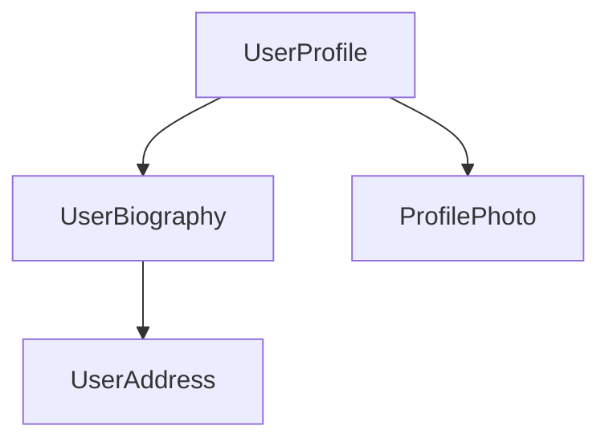

<!--
<docs-decorative-header title="Components" imgSrc="adev/src/assets/images/components.svg"> <!- markdownlint-disable-line ->
The fundamental building block for creating applications in Angular.
</docs-decorative-header>
-->
<docs-decorative-header
  title="컴포넌트"
  imgSrc="adev/src/assets/images/components.svg">

Angular 애플리케이션을 구성하는 기본 단위입니다.

</docs-decorative-header>

<!--
Components are the main building blocks of Angular applications. Each component represents a part of a larger web page. Organizing an application into components helps provide structure to your project, clearly separating code into specific parts that are easy to maintain and grow over time.
-->
컴포넌트(Component)는 Angular 애플리케이션을 구성하는 기본 단위이며, 거대한 웹 페이지의 일부분을 구성합니다.
컴포넌트는 특정 기능을 담당하도록 구분되어 있기 때문에, 컴포넌트를 모아서 만든 애플리케이션은 시간이 지나 규모가 커져도 관리하기 쉽습니다.

<!--
## Defining a component
-->
## 컴포넌트 정의하기

<!--
Every component has a few main parts:

1. A `@Component`[decorator](https://www.typescriptlang.org/docs/handbook/decorators.html) that contains some configuration used by Angular.
2. An HTML template that controls what renders into the DOM.
3. A [CSS selector](https://developer.mozilla.org/docs/Learn/CSS/Building_blocks/Selectors) that defines how the component is used in HTML.
4. A TypeScript class with behaviors, such as handling user input or making requests to a server.

Here is a simplified example of a `UserProfile` component.

```angular-ts
// user-profile.ts
@Component({
  selector: 'user-profile',
  template: `
    <h1>User profile</h1>
    <p>This is the user profile page</p>
  `,
})
export class UserProfile { /* Your component code goes here */ }
```

The `@Component` decorator also optionally accepts a `styles` property for any CSS you want to apply to your template:

```angular-ts
// user-profile.ts
@Component({
  selector: 'user-profile',
  template: `
    <h1>User profile</h1>
    <p>This is the user profile page</p>
  `,
  styles: `h1 { font-size: 3em; } `,
})
export class UserProfile { /* Your component code goes here */ }
```
-->
컴포넌트를 구성하는 요소들은 이렇습니다:

1. `@Component`[데코레이터](https://www.typescriptlang.org/docs/handbook/decorators.html) - Angular가 인식할 수 있는 설정값을 지정합니다.
2. HTML 템플릿 - 렌더러가 DOM으로 렌더링하는 HTML입니다.
3. [CSS 셀렉터](https://developer.mozilla.org/docs/Learn/CSS/Building_blocks/Selectors) - 컴포넌트를 HTML 문서에 사용하기 위해 지정하는 구분자입니다.
4. TypeScript 클래스 - 사용자의 입력값을 처리하거나 서버로 요청을 보내는 등 컴포넌트의 동작을 정의합니다.

간단하게 만든 `UserProfile` 컴포넌트를 확인해 봅시다.

```angular-ts
// user-profile.ts
@Component({
  selector: 'user-profile',
  template: `
    <h1>User profile</h1>
    <p>This is the user profile page</p>
  `,
})
export class UserProfile { /* 컴포넌트 코드는 여기에 들어갑니다. */ }
```

`@Component` 데코레이터에는 템플릿에 CSS 스타일을 지정하기 위해 `styles` 프로퍼티를 추가할 수 있습니다:

```angular-ts
// user-profile.ts
@Component({
  selector: 'user-profile',
  template: `
    <h1>User profile</h1>
    <p>This is the user profile page</p>
  `,
  styles: `h1 { font-size: 3em; } `,
})
export class UserProfile { /* 컴포넌트 코드는 여기에 들어갑니다. */ }
```


<!--
### Separating HTML and CSS into separate files
-->
### HTML과 CSS는 개별 파일로 구성합니다.

<!--
You can define a component's HTML and CSS in separate files using `templateUrl` and `styleUrl`:

```angular-ts
// user-profile.ts
@Component({
  selector: 'user-profile',
  templateUrl: 'user-profile.html',
  styleUrl: 'user-profile.css',
})
export class UserProfile {
  // Component behavior is defined in here
}
```

```angular-html
<!- user-profile.html ->
<h1>Use profile</h1>
<p>This is the user profile page</p>
```

```css
/* user-profile.css */
h1 {
  font-size: 3em;
}
```
-->
컴포넌트의 HTML과 CSS는 개별 파일로 구성해서 `templateUrl`과 `styleUrl`로 연결합니다:

```angular-ts
// user-profile.ts
@Component({
  selector: 'user-profile',
  templateUrl: 'user-profile.html',
  styleUrl: 'user-profile.css',
})
export class UserProfile {
  // 컴포넌트의 동작은 여기에 구현합니다.
}
```

```angular-html
<!-- user-profile.html -->
<h1>Use profile</h1>
<p>This is the user profile page</p>
```

```css
/* user-profile.css */
h1 {
  font-size: 3em;
}
```


<!--
## Using components
-->
## 컴포넌트 사용하기

<!--
You build an application by composing multiple components together. For example, if you are building a user profile page, you might break the page up into several components like this:
-->
Angular 애플리케이션은 여러 컴포넌트를 조합해서 만듭니다.
사용자 프로필 화면을 예로 들면, 이렇게 구현하는 식입니다:



<!--
Here, the `UserProfile` component uses several other components to produce the final page.

To import and use a component, you need to:
1. In your component's TypeScript file, add an `import` statement for the component you want to use.
2. In your `@Component` decorator, add an entry to the `imports` array for the component you want to use.
3. In your component's template, add an element that matches the selector of the component you want to use.

Here's an example of a `UserProfile` component importing a `ProfilePhoto` component:

```angular-ts
// user-profile.ts
import {ProfilePhoto} from 'profile-photo.ts';

@Component({
  selector: 'user-profile',
  imports: [ProfilePhoto],
  template: `
    <h1>User profile</h1>
    <profile-photo />
    <p>This is the user profile page</p>
  `,
})
export class UserProfile {
  // Component behavior is defined in here
}
```

TIP: Want to know more about Angular components? See the [In-depth Components guide](guide/components) for the full details.
-->
여기에서 `UserProfile` 컴포넌트는 화면을 구성하기 위해 다른 컴포넌트들을 활용합니다.

컴포넌트를 불러와서 사용하려면:
1. 컴포넌트 TypeScript 파일에 `import` 구문을 추가하고 사용하려는 컴포넌트를 불러옵니다.
2. `@Component` 데코레이터에 `imports` 배열을 추가하고 사용하려는 컴포넌트를 이 배열에 추가합니다.
3. 컴포넌트 템플릿에 사용하려는 컴포넌트 셀렉터를 엘리먼트로 추가합니다.

그래서 `UserProfile` 컴포넌트 안에 `ProfilePhoto` 컴포넌트를 사용하려면 이렇게 구현하면 됩니다:

```angular-ts
// user-profile.ts
import {ProfilePhoto} from 'profile-photo.ts';

@Component({
  selector: 'user-profile',
  imports: [ProfilePhoto],
  template: `
    <h1>User profile</h1>
    <profile-photo />
    <p>This is the user profile page</p>
  `,
})
export class UserProfile {
  // 컴포넌트의 동작은 여기에 구현합니다.
}
```

팁: Angular 컴포넌트를 자세하게 알아보고 싶은가요? 그러면 [컴포넌트 심화 가이드](guide/components) 문서를 참고하세요.


<!--
## Next Step
-->
## 다음 단계

<!--
Now that you know how components work in Angular, it's time to learn how we add and manage dynamic data in our application.

<docs-pill-row>
  <docs-pill title="Reactivity with signals" href="essentials/signals" />
  <docs-pill title="In-depth components guide" href="guide/components" />
</docs-pill-row>
-->
Angular에서 컴포넌트가 어떤 역할을 하는지 알아봤습니다.
이제 동적 데이터를 다루는 방법을 알아봅시다.

<docs-pill-row>
  <docs-pill title="시그널 반응성" href="essentials/signals" />
  <docs-pill title="컴포넌트 심화 가이드" href="guide/components" />
</docs-pill-row>
